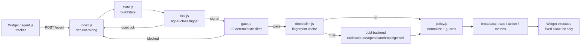

# SARA — Smart Autonomous Retail Assistant

A shopping assistant that lives inside the storefront page, watches how a
shopper actually behaves, and decides on its own whether to help and how.

Built for AI Tinkerers Dhaka's "Agents, Everywhere: Beyond the Chatbox"
(12 Sep 2026).

## What it is

SARA watches a shopper's in-page behavior — dwell time, scroll depth, rage
clicks, cart views/updates, searches, back-nav — and on every signal decides
whether to act, and how: pulse or outline an element (`highlight`), dim
everything but one thing (`spotlight`), send a short message, or do nothing
(`noop`). It acts directly ON the page — no chat window, no typing required
from the shopper.

`noop` is a first-class, traced decision, not silence by omission: every
tick produces a `{signals, hypothesis, decision, confidence, why}` trace
entry, whether or not anything visible happens. Staying quiet during normal
browsing is what makes the agent trustworthy enough to act at all when it
does speak up.

## Why not a chatbot

- A chat window asks the shopper to notice it, open it, and describe their
  own problem in words. SARA notices the problem first, from behavior alone.
- Acting on the page (highlight, scroll, spotlight) is a stronger, faster
  signal than a text bubble competing for attention in a corner.
- A chatbot that never gets used produces no evidence either way. Every
  SARA tick — including every `noop` — is a traced decision, so restraint
  is measurable and auditable, not just assumed.

## Run in 60 seconds

```
git clone <this repo> && cd SARA
make setup
make dev
```

Opens the agent (`AGENT_MODE=stub`, no LLM key needed) on `:4000` and the
demo storefront on `:3000`. Sit ~5s on a product page — a launcher button
appears bottom-right with an unseen-suggestion badge; open it to see "what
I noticed." The trace panel (separate, collapsed by default — signals →
hypothesis → decision → why) is the engineering-facing proof this is a real
decision, not a hardcoded rule.

Stub mode implements one hardcoded rule (sizing hesitation) so the wiring
can be checked with no key. For real judgment, either set an LLM backend
(`AGENT_MODE=llm LLM_BACKEND=claude|anthropic|openai|gemini|codex`, one env
var each per `.env.example`) or use the recorded-replay demo below — no key
needed either way:

```
AGENT_MODE=cached AGENT_DEBUG=1 node agent/index.js
```

Open the demo store and click a fixture in the trace panel's "Demo" row —
each replays a real recorded decision end to end (page changes, message,
restraint). Full recipe, retakes, shareable direct links, tunnels:
[`docs/OPS.md`](docs/OPS.md).

## Embed on any store

```html
<script src="https://YOUR-AGENT/agent.js"
        data-server="https://YOUR-AGENT" data-panel="true"
        data-site="my-site" data-targets="auto" data-facts="both" defer></script>
```

| Attribute | Default | Meaning |
|---|---|---|
| `data-server` | script's own origin | Where events/WS go |
| `data-panel` | off | `"true"` shows the trace panel |
| `data-site` | `""` | Free-text label, no behavioral effect |
| `data-targets` | `"auto"` | `"auto"` auto-tags the ~40 largest visible interactive elements; `"manual"` only tags elements you mark with `data-agent-target` yourself |
| `data-facts` | `"both"` | `keys \| snippets \| both \| off` — zero-wiring page-facts extraction (cart total, delivery threshold, stock, size selection); see [`agent/FACTS.md`](agent/FACTS.md) |

**Cart bridge:** a page that can't add a JSON API route can still expose
its cart by setting `window.__agentCart = {total, items:[{name, variant,
quantity, price}]}` on load, on route change, and on a short poll fallback
— `agent.js`'s `readCart()` checks this first. See
[`docs/NEXTCART.md`](docs/NEXTCART.md) for a worked example bridging a
Server-Actions cart with no client-fetchable API.

## Architecture



Deeper walk (request lifecycle, cost funnel, concurrency model, sequence
diagram): [`docs/ARCHITECTURE.md`](docs/ARCHITECTURE.md).

## Decision pipeline

**State → tick.** Every `POST /event` updates session state immediately
(`state.js` builds `page`, `visibleTargets`, `facts`, `cart`, `dwell`,
`lastIntervention`, `recent`) and replies right away — the widget never
waits on a decision. `tick.js` then decides whether this event is even
worth asking a decider about: any non-dwell event, or a dwell event that
crosses a dwell-bucket boundary per subject; a dwell that stays in the same
bucket is a "quiet tick" — no decider call at all.

**Gate L0.** `gate.js` blocks obvious `noop` cases before spending a model
call — a fresh checkout page with no friction signal, a dwell before its
own subject has actually dwelled, anything inside the post-intervention
cooldown, a cart already past the free-delivery threshold, and more.

**LLM decide.** What survives gate+tick goes through a fingerprint cache
(sha256 of the exact prompt sent to the model — a hit only happens on a
byte-identical situation) and, on a miss, one of five backends
(`codex | claude | openai | anthropic | gemini`) via `agent/prompts/decide.md`
+ the state JSON. The response is validated against `agent/prompts/schema.json`
before being trusted at all; any failure (timeout, bad JSON, auth, rate
limit) becomes a noop, never a thrown error.

**Policy guards.** `policy.js` is the untrusted-decider-output boundary:
`normalize()` rebuilds the action to the exact contract shape regardless of
what came back, then `applyPolicy()` runs the guard chain — allow-list,
merchant allowed-actions, visible-target check, deny-targets,
min-confidence, cooldown, never-same-target, nudge budget. Any violation
downgrades to `noop` with the reason appended to `trace.why`.

**Broadcast.** The server builds the WebSocket messages field-by-field
(never spreads a decider/policy object — `kind` can never be model- or
attacker-controlled): `trace` and `action` on every event, `metrics` after
every event. The widget executes only the fixed allow-list via
`classList`/`style`/`textContent` — no `eval`, no `innerHTML` from server
strings, no auto-click/fill/navigate.

## Cost & safety

Deterministic gates run before every model call: `gate.js` + `tick.js`
reject obvious/quiet cases with zero model spend, a fingerprint cache
reuses byte-identical decisions across shoppers, and
`AGENT_MAX_MODEL_CALLS_PER_MIN` (default 6) hard-caps calls per session in
any rolling 60s window regardless of reason. A 30s cooldown after any
non-noop action and a never-same-target rule stop repeat nagging. Actions
are allow-listed (`highlight | spotlight | message | noop` only) and
message length is capped. A stale-context guard denies a decision if the
shopper's product/cart/page moved on during the model's 10–20s call.
Merchants own the exact wording via card templates
(`agent/prompts/templates.json`) — the model only picks which template +
short slot values grounded against `offers`/`product`/`business`/`facts`,
never free-invented text.

Measured cost funnel (`qwen2.5:3b` on local Ollama, CPU, 3 fixtures, 35
ticks total; gpt-5-nano list price for the dollar column; raw snapshots in
`agent/metrics-runs/`):

| Layer | Calls/session | $/1M sessions (gpt-5-nano) |
|---|---|---|
| Naive — call the model on every tick | 11.67 (measured) | $1,143 (measured) |
| + gate.js + tick.js | 3.00 (measured) | $294 (measured) |
| + fingerprint cache, cold | 2.33 (measured) | $237 (measured) |
| At scale, warm shared cache | ~0.5–1.5 (estimated) | ~$50–150 (estimated) |

Full guard reference: [`agent/POLICY.md`](agent/POLICY.md).

## Storefronts

- **`demo-store/`** — the reference Next.js storefront built alongside the
  agent: listing, product page (size chart, variants), cart, checkout, plus
  `/sessions` research pages for reviewing and labeling recorded live
  sessions.
- **`storefront/`** — reserved for NextCart, a real Next.js 15 + MongoDB
  store (300 products across 10 categories, promo codes, 4-step checkout,
  mock login, admin) built independently and embedded as a second real
  storefront. See [`docs/NEXTCART.md`](docs/NEXTCART.md) for the
  integration runbook and [`storefront/README.md`](storefront/README.md).

## Tests

```
make test     # agent's fixture/unit suite (npm test)
make check    # syntax + policy probe + stub-mode fixture replay + route checks + demo-store typecheck
```

`scripts/check.sh` starts a stub-mode agent, replays every fixture under
`agent/sessions/`, and asserts the fixtures that are deterministic under
the stub decider (`sizing-hesitation`, `reader-above-fold`,
`reader-below-fold`, `missed-promo`, `similar-on-promo`) PASS; the rest
need `AGENT_MODE=llm`/`cached` and are reported informationally. It also
checks `/health`, `/agent.js`, `/demo.html`, and that `demo-store/lib`'s
store mirror matches `agent/store`. CI (`.github/workflows/check.yml`) runs
the same policy probe + `AGENT_MODE=cached` fixture replay (no API key
needed) plus a demo-store typecheck/build on every push.

## Known gaps

- **CLI-backend latency.** `claude`/`codex` decisions take ~10–20s
  (measured via CLI shell-out, not an API call) — the on-camera demo
  fallback (`AGENT_MODE=cached`) exists because of this. An API-key backend
  (`openai`/`anthropic`) is materially faster but not yet measured
  end-to-end on this project.
- **`anthropic` and `gemini` backends are unverified against a real key.**
  Only the auth-failure/noop path has been exercised; the Gemini model id
  (`gemini-2.5-flash-lite`) hasn't been confirmed against a live
  `models.list()`.
- **In-memory session store, no eviction beyond an LRU cap.**
  `AGENT_MAX_SESSIONS` bounds total memory, but per-session maps
  (`actedTargets`, dwell buckets) grow for the life of a session with no
  TTL sweep — fine for a demo, not for a real multi-day deployment.
  Replay's cooldown is wall-clock, so a replay run can legitimately
  disagree with the live session it's replaying (by design, not a bug).
- **Stub mode passes 5/14 fixtures by design.** The stub decider only
  implements a handful of deterministic rules; the rest need
  `AGENT_MODE=llm`/`cached` for real judgment.

## Team

SARA team — AI Tinkerers Dhaka, 12 Sep 2026.
