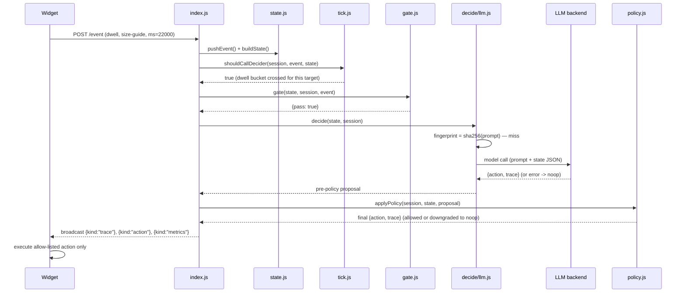

# Architecture

Deeper walk than the README. File references are exact paths in this repo.

## Request lifecycle, step by step

1. **Widget emits an event.** `demo-store/components/AgentWidget.tsx` (storefront)
   or `agent/public/agent.js` (any other page) sends `POST /event` — one of
   the 8 event types in `agent/contracts.js` (`page_view`, `dwell`,
   `scroll_depth`, `rage_click`, `cart_view`, `cart_update`, `search`,
   `back_nav`).
2. **`index.js` validates, then updates state immediately.** Session id
   checked against `SESSION_ID_RE` (`/^[A-Za-z0-9_-]{1,64}$/`), event shape
   checked (`validateMeta()`, lenient — unknown keys ok, wrong types just
   warn). `processEventCore()` then pushes the event, evicts LRU sessions,
   and bumps metrics SYNCHRONOUSLY, and the HTTP response goes out right
   away (`200 {ok, queued}`) — the widget never waits on a decision. The
   decision itself (steps 3-7 below) runs afterward, on one of two paths
   depending on mode — see "Concurrency model" below.
3. **`state.js` records the event and builds the decider's input.**
   `pushEvent()` appends to a 200-event ring buffer per session.
   `buildState()` derives: `page` (last `page_view`'s target), `visibleTargets`
   (that page_view's `meta.targets`), `facts` (filtered page-facts, see
   `agent/FACTS.md`), `cart` (last `cart_view`/`cart_update`), `dwell`
   (`pageMs` + `perTarget` map, only counting dwell since the latest
   `page_view`), `lastIntervention` (`{target, agoMs}` or `null`), and
   `recent` (last 20 events, compacted). This is the exact shape every
   decider (stub/llm/cached) receives.
4. **`tick.js` decides whether to call the decider at all** (llm mode only —
   stub/cached always call, see "Cached mode" below).
   `shouldCallDecider()` fires on any non-dwell event, or a dwell event that
   crosses a dwell-bucket boundary (`0-5s | 5-20s | 20-60s | 60s+`, from
   `agent/buckets.js`) **per dwell subject** (page vs. a specific target
   tracked independently) — a dwell event that stays in the same bucket as
   the one before it is a "quiet tick": the server replies with the
   last-known trace shape, no decider call.
5. **`gate.js` — Layer 0, deterministic, llm mode only.** Blocks obvious
   `noop` cases before spending a model call: `/checkout` with no
   `rage_click`/`back_nav` in the last 3 events; a dwell event before its own
   subject has actually dwelled 5s; any event inside the 30s cooldown after a
   non-noop intervention; `cart_update` when the cart is already past the
   free-delivery threshold; a non-empty `search` on a listing page.
6. **`decide/llm.js` — Layer 2, fingerprint cache.** Cache key = **sha256 of
   the exact prompt string sent to the model** (system prompt +
   `JSON.stringify(state)` + the trailing "Decide." line) — not a
   hand-picked subset of state fields, so a cache hit can only happen when
   the model would have seen byte-identical input. TTL 10 min
   (`LLM_CACHE_TTL_MS`), 500-entry cap, insertion-order eviction. A hit
   returns the cached `{action, trace}` with `trace.why` prefixed
   `"(cached) "`.
7. **The actual model call — Layer 3.** `decide/llm.js` dispatches to
   `decide/backends/{codex,claude,openai,anthropic,gemini}.js` via a small
   registry (per-backend default model/timeout, overridable by
   `LLM_MODEL`/`LLM_TIMEOUT_MS`). Prompt = `agent/prompts/decide.md` (system
   prompt) + the `buildState()` JSON. Response validated against
   `agent/prompts/schema.json`'s shape (`validateProposalShape()`) before
   it's trusted at all. Any failure (timeout, bad JSON, auth, rate limit,
   connection) → noop proposal, `trace.why: "llm error: <reason>"`, never
   throws past this point.
8. **`policy.js` — the untrusted-decider-output boundary.** `normalize()`
   runs first on every path (allow/deny/throw): rebuilds `action`/`trace` to
   exactly the contract shape, coercing/clamping every field, regardless of
   what the decider handed back. `applyPolicy()` then runs the guard chain
   (see `agent/POLICY.md` for the full 9-step order): allow-list, merchant
   allowed-actions, shape, visible-target check, deny-targets,
   min-confidence, 30s cooldown, never-same-target, nudge budget. Any
   violation → noop, `trace.why` gets `" (guard: <reason>; proposed
   <decision>)"` appended.
9. **Broadcast.** `index.js` builds the WS messages field-by-field (never by
   spreading a decider/policy object — `kind` can never be attacker/model
   controlled): `{kind:"trace", ...}` and `{kind:"action", ...}` on every
   event, `{kind:"metrics", ...}` after every event, `{kind:"demo", state,
   fixture, events}` around a demo-panel playback run (see [`docs/OPS.md`](OPS.md)).
10. **Widget executes.** Only the fixed allow-list (`highlight | scroll_to |
    message | spotlight | noop`), only via `classList`/`style`/`textContent`
    toggles — no `eval`, no `innerHTML` from server strings, no
    auto-click/fill/navigate.

## Cost funnel — measured call counts per session

Same 3-fixture, 35-tick run referenced in the README, `qwen2.5:3b` via local
Ollama (raw JSON in `agent/metrics-runs/`):

| Stage | What survives | Calls/session |
|---|---|---|
| Every tick (naive, no gate/tick) | 35 ticks | 11.67 |
| After `tick.js` (signal-class trigger) + `gate.js` (deterministic filter) | 9 decider calls | 3.00 |
| After the fingerprint cache, cold | 7 real model calls (1 cache hit) | 2.33 |
| After the fingerprint cache, warm (same fixtures replayed — test artifact) | 0 real model calls | 0.00 |

Gate+tick alone is a 74% reduction in model calls before any caching, from
zero-cost deterministic rules. See `agent/NOTES.md` "Cost design" for the
full recipe to reproduce this (`cost-compare.js --label <name>`, two server
processes needed to compare cache-off vs cache-on since `LLM_CACHE` is read
once at process start).

## Cached / recording mode

`AGENT_MODE=cached` (`agent/decide/cached.js`) replays a pre-recorded
decision trace by **event index** — recording index `i` must equal
`session.events.length` at call time, which is why cached mode calls the
decider on every single event (bypassing `tick.js`'s signal-class trigger
entirely) rather than only on signal changes. What's recorded
(`AGENT_RECORD=1`) is the decider's **pre-policy proposal**; `policy.js`
still re-runs identically on playback, with one exception —
`applyPolicy(..., {skipCooldown: true})` skips the wall-clock 30s cooldown
only, because replay's `--speed` compression can put two calls that were
legitimately >30s apart during recording <30s apart on fast playback.
Allow-list/target/shape guards and never-same-target still apply during
replay. This mode is a recording of a specific past decision, not live
reasoning — see README's "Known limits".

## Concurrency model

State updates (`processEventCore()`: pushEvent, LRU eviction, metrics) are
always synchronous and immediate — `POST /event` never waits on a decision.
Decisions themselves (`decideAndBroadcast()`) run on one of two paths,
chosen by mode:

- **Strict per-event serial** (cached mode / `AGENT_RECORD=1`) —
  `runSerialized()`/`processEventSerial()` in `index.js` chain each
  session's decision onto one promise, one decision per event, in arrival
  order. Required because `decide/cached.js` indexes its recording by
  `session.events.length` — coalescing or skipping an event would desync
  playback from the recording. No per-session cap: this path is only ever
  driven by the demo player / `replay.js`, both of which pace themselves
  (await each event before sending the next) rather than firing an
  unthrottled burst.
- **Coalesced** (stub / llm mode — real/live traffic) — at most one decision
  in flight per session, plus at most one *pending*. An event that arrives
  while a decision is already running for its session doesn't get a queued
  decision of its own; it marks the session `pending` (latest state wins —
  the pending event replaces any earlier one), and exactly one more
  decision runs, against the now-current state, the instant the in-flight
  one finishes. A burst of events (e.g. dwell heartbeats every few seconds
  while a live decider call takes 10-20s) never backs up a per-session
  queue — there is no queue to exceed, and no event is ever rejected. See
  `agent/OPS.md`'s "Decision coalescing" for the metrics
  (`decisionsStarted`/`coalesced`/`pendingRuns`) this path exposes. This
  replaced an earlier per-session serialized-queue design
  (`AGENT_MAX_QUEUE_PER_SESSION`) that called the decider once per event and
  rejected events past a queue-depth cap once a live decider's per-call
  latency made the queue back up faster than it could drain — see
  `agent/NOTES.md` for the incident that motivated the change.
- **Global in-flight cap** — `AGENT_MAX_INFLIGHT` (default 32,
  `agent/inflight.js`), process-wide across all sessions **and**
  `/health/agent`'s self-test (shared counter — the self-test can't bypass
  the same backpressure real traffic is subject to). Beyond it, a decision
  that's ready to call the decider WAITS (polling every 50ms) for capacity
  instead of skipping — never a dropped/noop'd decision, just a delayed one.
- **Per-session in-flight guard** (`decide/llm.js`) — a second, independent
  guard: if a call for a given session is already running, a new `decide()`
  for that session short-circuits to noop (`why: "decision in progress"`)
  instead of queuing a second slow call behind the first. Exists mainly for
  callers that invoke `decide()` directly, outside `index.js`'s own
  one-in-flight-per-session coalescing scheduler (e.g. `/health/agent`'s
  self-test, which always targets a fixed synthetic session id).
- **LRU session eviction** — `AGENT_MAX_SESSIONS` (default 5000,
  `state.js`'s `evictLRUSessions()`). Beyond the cap, least-recently-active
  sessions are dropped and their WebSockets closed with code `1001`.

## Sequence diagram — one `dwell` event, llm mode, cache miss

## See also

- [`agent/NOTES.md`](../agent/NOTES.md) — module map, backend detail, full
  cost-design recipe, known limits
- [`agent/OPS.md`](../agent/OPS.md) — endpoints, logging, load test, incident checklist
- [`agent/POLICY.md`](../agent/POLICY.md) — every merchant guard knob
- [`agent/FACTS.md`](../agent/FACTS.md) — zero-wiring page-facts extraction
