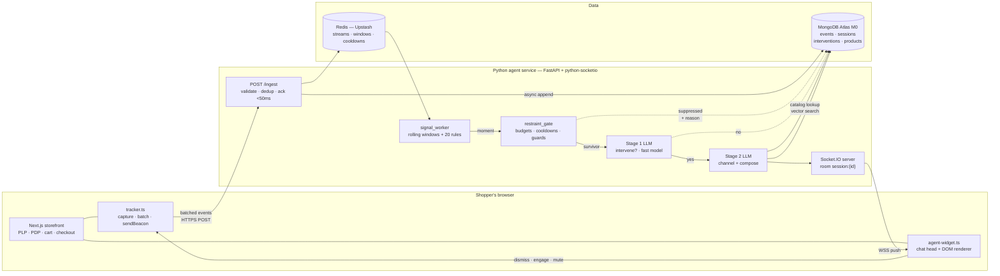
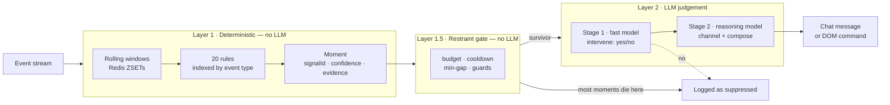
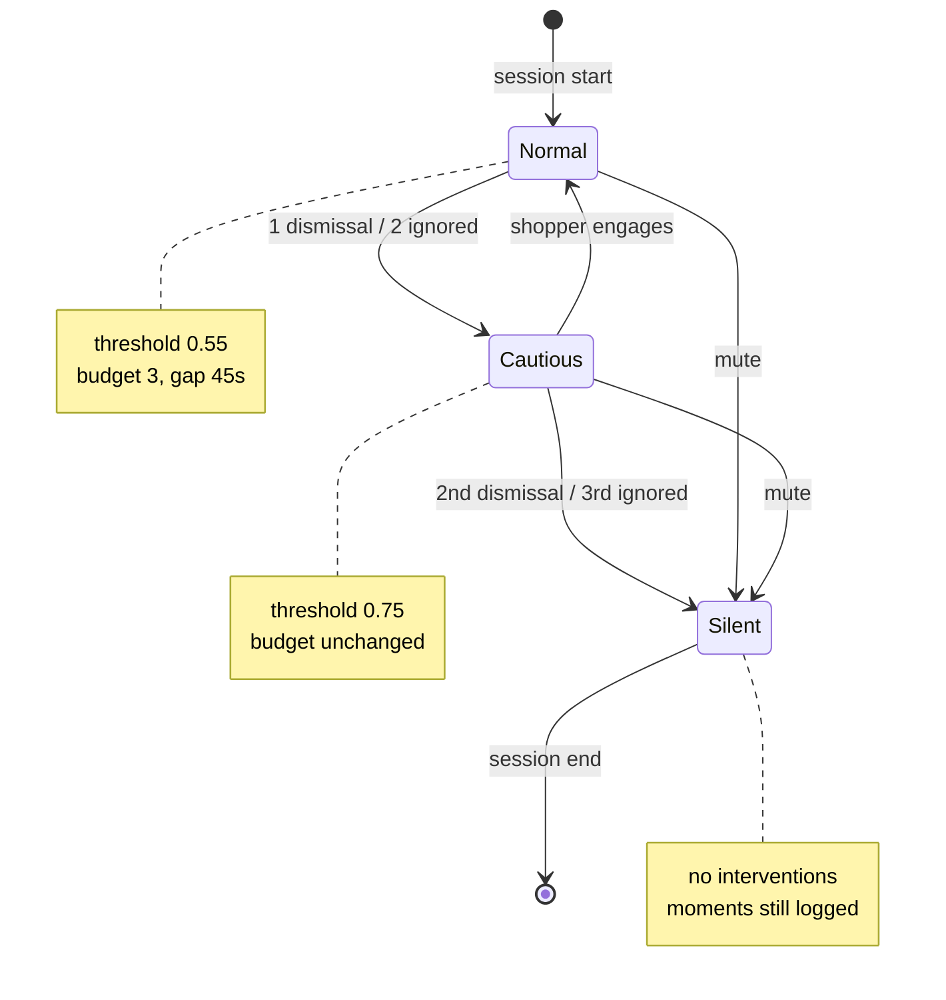
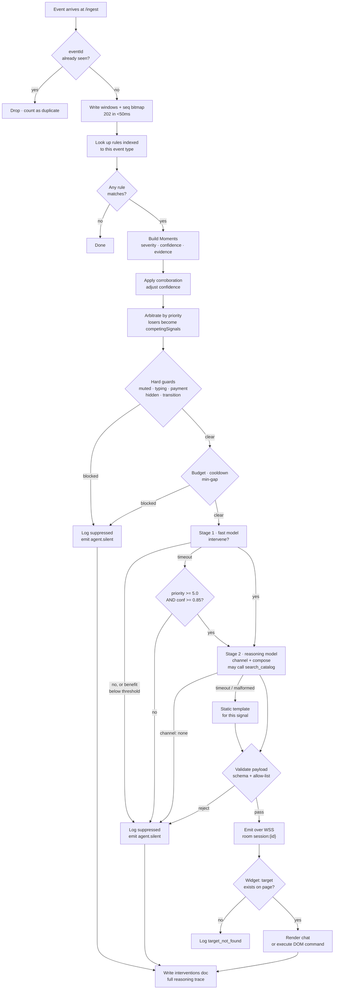
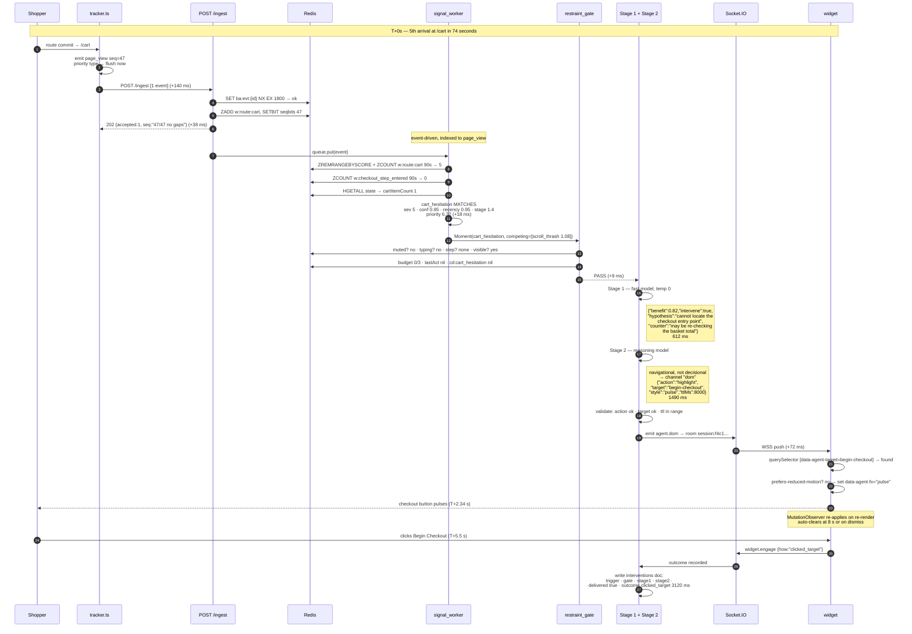

# The Behavioral In-Page Agent — Master Technical Specification

**Project codename:** `behavioral-agent`
**Document owner:** team lead (backend)
**Team size:** 3
**Event:** "Agents, Everywhere: Bots, Channels & More" — AI Tinkerers + OpenAI, Saturday 12 September 2026
**Build window:** 11:15 – 15:30 local (4 h 15 m)
**Document status:** authoritative build spec. If this document and someone's memory disagree, this document wins.

> **How to read this.** You do not need any prior knowledge of this project, the event, or e-commerce analytics. Every term is defined the first time it appears, and there is a glossary in §12. Sections are numbered so you can reference them in chat during the build ("see §7.4"). Every threshold in this document is a real, committed number — nowhere does it say "tune later". Where a number comes from a published industry standard, that standard is named. Where the number is ours, it says so plainly and gives the reasoning.

---

## Table of contents

1. [What this project is](#1-what-this-project-is)
   - 1.1 The pitch
   - 1.2 The problem
   - 1.3 Who the users are
   - 1.4 What already exists, and why this is not that
   - 1.5 Why an agent instead of rules
2. [The event and the constraints](#2-the-event-and-the-constraints)
   - 2.1 The format
   - 2.2 What is actually judged
   - 2.3 The rubric
   - 2.4 The rules on prep vs. live build
   - 2.5 Design decisions traced to rubric criteria
3. [System architecture](#3-system-architecture)
   - 3.1 The loop in one paragraph
   - 3.2 Architecture diagram
   - 3.3 Component reference
   - 3.4 Repository layout
   - 3.5 Running it — the five-minute quickstart
   - 3.6 Latency budget
4. [Data model](#4-data-model)
   - 4.1 The raw event envelope
   - 4.2 Event type catalog
   - 4.3 Redis key layout and TTLs
   - 4.4 MongoDB collections
   - 4.5 WebSocket message types
   - 4.6 The DOM command vocabulary
5. [Event integrity](#5-event-integrity)
   - 5.1 The delivery guarantee we choose
   - 5.2 Client-side capture and flushing
   - 5.3 Server-side deduplication
   - 5.4 Sequence-gap detection
   - 5.5 SPA-specific hazards
   - 5.6 The integrity panel
6. [The signal catalog — 20 signals](#6-the-signal-catalog--20-signals)
   - 6.0 How to read this section · tiers · the 20-vs-4 framing · 6.0.1 why *these* signals ship
   - 6.1–6.8 The six families
   - 6.9 Mobile-specific detection notes
7. [The analysis engine](#7-the-analysis-engine)
   - 7.1 The two-layer split
   - 7.2 Rolling-window mechanics
   - 7.3 Scoring, arbitration, the priority floor, worked examples
   - 7.4 The moment object
   - 7.5 The restraint layer · 7.5.5 four holes and how each is closed
   - 7.6 The LLM prompt architecture
   - 7.7 The decision-to-stay-silent path
   - 7.8 Worked example, end to end
   - 7.9 Calibrating the constants
8. [What we bring vs. what we build live](#8-what-we-bring-vs-what-we-build-live)
9. [Hour-by-hour run of show](#9-hour-by-hour-run-of-show)
10. [The 2-minute video script](#10-the-2-minute-video-script)
11. [Risk register](#11-risk-register)
12. [Glossary](#12-glossary)
13. [Review log](#13-review-log) — *internal; not for the repo*

---

# 1. What this project is

## 1.1 The pitch

**A shopping assistant that lives inside the store page instead of inside a chat box — and that can change the page itself.** A lightweight tracker streams the live browsing session to a Python agent service. A deterministic rule engine watches a rolling window of that session and raises *moments* — precisely defined behavioural patterns like "this shopper has bounced back to the cart five times in ninety seconds and never started checkout." An LLM agent then decides three things: **whether** to step in at all, **which channel** to use, and **what to do**. Its channels are not just "send a message". It can also emit a structured command that the page executes on itself — pulse the checkout button, spotlight the size selector, scroll a buried shipping-policy block into view, annotate a control with one line of text. The most important thing it can decide is to **stay silent**, and it does that most of the time.

## 1.2 The problem

Two mature categories of software exist side by side and never talk to each other.

**Category one — analytics that watches and never acts.** Microsoft Clarity, Hotjar, FullStory, LogRocket, and PostHog all capture the session in extraordinary detail. They detect rage clicks, dead clicks, hesitation, scroll depth, and abandonment. Then they write it into a dashboard that a product manager reads next Tuesday. The shopper who was struggling has already left. The intelligence is real, the latency to action is days.

**Category two — intervention that acts and never understands.** Exit-intent popup tools (OptiMonk, Justuno, Privy, Wisepops) and proactive chat tools (Intercom, Drift, Gorgias, Tidio) fire on a fixed trigger and deliver a fixed payload. "If the cursor leaves the viewport, show coupon modal #3." They act in real time, but the decision is a hard-coded `if`. Every shopper who trips the trigger gets the same thing, whether they were about to buy, comparing two sizes, or looking for the returns policy.

The gap between them is the whole project: **real-time behavioural understanding connected to real-time, situation-appropriate action, with the page itself as one of the action surfaces.**

There is also a hard commercial number underneath this. The Baymard Institute's ongoing aggregation of e-commerce abandonment studies puts average documented cart-abandonment at roughly **70%** (their published figure across ~50 studies is 70.22%), with **"extra costs too high — shipping, tax, fees" the most frequently cited reason at ~48%** among shoppers who abandon for reasons other than "just browsing". Whatever the precise figure in any given year, the shape is not disputed: the majority of shoppers who reach a cart do not complete, and a large share of that loss is *informational friction* — something they could not find, could not understand, or did not trust — rather than a genuine decision not to buy. Informational friction is exactly what an agent that can see the session and can change the page is positioned to fix.

## 1.3 Who the users are

| User | Sees | Cares about |
|---|---|---|
| **The shopper** (primary) | The storefront, plus a small chat-head widget and any page changes the agent makes | Getting to the thing they wanted with less effort. Not being nagged. |
| **The merchant** (secondary, out of scope for v1) | Nothing in v1 — the `interventions` audit log is the seed of a future merchant view | Conversion, and not annoying customers |
| **The judge** (the one who actually scores us) | A GitHub repo, a written description, and a 2-minute video | Whether the agent is real, whether the idea is new, whether the engineering is sound, whether it is useful |

The third row is not a joke. §2 explains why the judge is a first-class user of this project and why several design decisions exist to serve them.

## 1.4 What already exists, and why this is not that

| Product / category | What it does | What it does **not** do | Distance from us |
|---|---|---|---|
| **Microsoft Clarity, Hotjar, FullStory, LogRocket, PostHog** | Session recording + heatmaps. Detect rage clicks, dead clicks, hesitation, scroll depth with high fidelity. | Never act. Output is a retrospective dashboard. | Same *sensing* layer. Zero *acting* layer. |
| **OptiMonk, Justuno, Privy, Wisepops** (exit-intent / on-site messaging) | Fire an overlay on a fixed trigger. | No reasoning. Fixed trigger → fixed payload. Cannot compose. Cannot choose to stay quiet. | Same *timing* instinct. No intelligence. |
| **Nosto, Dynamic Yield, Monetate** (personalization engines) | Swap merchandising content and recommendations in real time based on segment + behaviour. | Do not converse. Do not point at UI controls. Optimise *what is shown*, not *what the shopper is stuck on*. | Adjacent. Different job. |
| **Intercom, Drift, Qualified, Gorgias, Tidio** (proactive chat) | Behavioural rule opens a chat window; an LLM then handles the conversation. | The *trigger* is still a rule, and the only channel is chat. The agent cannot touch the page. | Closest on conversation. |
| **Rep AI** (Shopify app) | Markets itself explicitly as "Behavioral AI" — a large signal set, good timing, engages shoppers who look like they are leaving. Reports conversion and revenue lift. | **Chat only.** The output of all that behavioural understanding is a message in a bubble. | **The closest competitor on the sensing + chat axis. Assume a judge knows this exists.** |
| **WalkMe, Pendo, Appcues** (digital adoption platforms) | Overlay a live page with spotlights, tooltips, hotspots, element-anchored guidance — with no change to the host application's code. | Author-defined step-by-step flows. Rule-driven, not agent-driven. Built for SaaS onboarding, not commerce. Nobody's LLM is choosing the step. | **The closest competitor on the page-manipulation axis.** |

**The honest statement of novelty, which goes in the README verbatim:**

> Detecting hesitation and opening a chat is table stakes in 2026 — Rep AI, Gorgias and others ship it. Overlaying a live page with spotlights and tooltips is table stakes too — WalkMe and Pendo have done it for a decade. What does not exist as a shipped product is **a single LLM agent that reasons over a live session and treats changing the page as a first-class action it chooses**, alongside conversation, alongside silence. The chat is the familiar half. The page is the new surface.

That framing matters for scoring (§2.5) and it matters for integrity — overclaiming "nobody has ever tracked hesitation" to a judge who has heard of Hotjar is a fast way to lose credibility on all four criteria.

## 1.5 Why an agent instead of rules

The obvious objection: *if the detection layer is deterministic rules, what is the LLM actually for?* Answer — the rules detect **that** something is happening. Everything after that is judgement, and judgement is where rules collapse:

1. **Should we act at all?** Five cart visits in ninety seconds means one thing for a first-time visitor with a £400 basket and something else for a returning customer who is clearly editing quantities. A rule cannot weigh that. It fires or it doesn't.
2. **Which channel?** A shopper who cannot *find* the checkout button needs the button pointed at — a message is noise. A shopper who cannot *decide* between two sizes needs a sentence about fit — highlighting something is noise. Same friction score, opposite correct action. Channel selection is the single clearest justification for the LLM in this system.
3. **What to say, in this shop, about this product?** Composed against the live catalog, the actual item in the cart, the actual search terms. A rule can only pick from a pre-written list.
4. **The restraint decision.** The hardest and most valuable output is *no output*. A rule-based system that fires on every trip of a threshold is precisely the popup software everyone has learned to close on reflex.

And symmetrically, §7.1 argues at length why the *detection* must **not** be an LLM job. Sending a raw event stream to a model and asking "is this shopper struggling?" is slower, more expensive, non-deterministic, and untestable. The two-layer split — deterministic detection, LLM judgement — is the central architectural claim of this project.

---

# 2. The event and the constraints

## 2.1 The format

- Global hackathon run simultaneously in roughly 50 cities. Hosted by AI Tinkerers with OpenAI as marquee sponsor.
- **Build window: 11:15 – 15:30 local. 4 hours 15 minutes. This is the only build time.**
- A local show-and-tell runs 15:30 – 16:30. It is informal and **not judged**. There is no stage demo, no live Q&A with judges, and no opportunity to explain anything in person.
- Judging is **global and asynchronous** — after submissions close everywhere, judges score every project from written and recorded material.

## 2.2 What is actually judged

Five artefacts, and nothing else:

1. Project **title**
2. Written **description**
3. Public **GitHub repository**
4. A **2-minute video**
5. A **social post** tagging the sponsors

**A live URL is not required and judges will not run the code.** This has three consequences that shape the entire plan:

- **The video is the product.** Whatever is not in the two minutes effectively does not exist. §10 is a shot-by-shot script, and §9 reserves real time to record it.
- **The repository is the evidence.** Judges read code and README. Architecture legibility, a clear "built live vs. reused" table, and a documented signal catalog all score directly under criteria 3 and 4 — even for signals we never implement. This is *why* §6 specifies twenty signals when only four ship.
- **There is no recovery from an on-camera failure.** A live demo that stutters can be talked over. A recorded one cannot. Every reliability decision in this document descends from that sentence.

## 2.3 The rubric

Four criteria, each scored **1–5**. Maximum **20**.

> Reproduced from the organiser's scoring guide as captured on 2026-09-11. Re-read the official copy before submitting in case of edits.

| # | Criterion | What it measures | What a **5** looks like |
|---|---|---|---|
| **1** | **Core Requirements & Functionality** | Is there a working agent operating inside a real environment, and does the core workflow run end to end? | Robust, reliable, fully functional. The core loop works every time. |
| **2** | **Innovation & Theme Alignment** | Is this a compelling *new place* or *new interaction* for an agent? Does the environment materially improve the agent? | Reveals a surprising new agent pattern **whose central value could not be reproduced in a standalone chat box.** |
| **3** | **Technical Execution & Integration** | Code, architecture, reliability, tool use, data handling, depth of integration with the environment. | Exceptional engineering, robust orchestration, thoughtful failure handling, deeply integrated with the environment. |
| **4** | **Usefulness & Agentic Experience** | Clear user value. Intuitive, effective, appropriate to its environment. Meaningful actions with user control. | Delivers substantial value through an experience designed for its environment; uses context intelligently while remaining clear and controllable. |

**Read criterion 2's five-descriptor again.** "Could not be reproduced in a standalone chat box" is the sentence that selects this project over every other idea we considered. A chat box cannot make the checkout button pulse. It cannot scroll the shipping policy into view. The page-manipulation channel is not a nice extra — **it is the single load-bearing element of our criterion-2 score**, and §9's cut list protects it above everything else.

**Target: 17–20. Realistic landing zone if the plan in §9 is executed: 16–18.** Criterion 2 is the one that can plausibly hit 5, and only if the video leads with a page change. Criteria 1 and 3 are won by narrow scope executed flawlessly; both punish half-finished breadth explicitly ("parts run but the core workflow is incomplete"). Criterion 4 is won by the restraint layer and the user controls in §7.5.

**The arithmetic of the target is worth stating plainly, because it drives every scope decision below.** A 17 requires three 4s and a 5, or two 5s and two 4s. There is no route to 17 that survives a broken core loop — a 2 on criterion 1 caps the total at 17 even with perfect scores everywhere else, and a 2 on criterion 1 is what a half-finished sixth signal buys you. **Scope discipline is not caution here; it is the only arithmetic that reaches the target.** §13 records the honest per-criterion estimate after review.

## 2.4 The rules on prep vs. live build

- **Core functionality must be built during the window.**
- **Explicitly allowed to bring:** your own boilerplate and scaffolding, seed data, accounts, deployment configuration, prior libraries.
- **Explicitly disallowed:** extending a pre-existing project; arriving with the thing already built.
- The team must be able to **explain what was built live and what was reused**. §8.3 is that table, pre-written, ready to paste into the README.
- Using AI coding assistants during the build is allowed — it is an AI hackathon. Pre-generating the entire project beforehand is not.

**Practical policy for this team:** build a throwaway rehearsal prototype at home to learn the shape and de-risk the unknowns. Bring the *reusable* pieces the rules permit — the storefront scaffold, seed catalog, CSS animation classes, deployment config, draft prompt text. Then write the actual product live, with real git history inside the window. Do not bring a finished repo and retype it; commit timestamps are visible, and it undercuts criteria 1 and 3 even if nobody notices.

## 2.5 Design decisions traced to rubric criteria

Every non-obvious choice in this document exists for a reason that maps to a score.

| Decision | Section | Criterion served | Why |
|---|---|---|---|
| Deterministic rules detect; LLM judges | §7.1 | 3 | Testable, sub-millisecond, cheap. Reads as engineering, not as prompt-and-pray. |
| Closed DOM command vocabulary, agent never touches `document` | §4.6 | 3, 4 | Safety boundary, and a clean architectural story a judge can read in one file. |
| Page manipulation as a chosen channel | §4.6, §7.6 | **2** | The thing a chat box cannot do. |
| Restraint layer with budgets and cooldowns | §7.5 | 2, 3, 4 | "Decides not to act" scores on three criteria at once. |
| Silent decisions logged and shown on screen | §7.7 | 3, 4 | Makes restraint *visible* on camera. Invisible restraint scores zero. |
| `eventId` dedup + `seq` gap detection | §5.3, §5.4 | 3 | "Thoughtful data handling" made concrete and demonstrable. |
| The `47/47 · no gaps` panel | §5.6 | 3 | Answers the obvious judge question inside the video, without narration. |
| 20 signals specified, 3 shipped | §6 | 2, 3 | Depth of thinking is visible in the repo at near-zero build cost. Honesty about which shipped protects criterion 1 (§6.0). |
| Dismiss / mute / "why am I seeing this?" | §7.5.4 | **4** | "Remaining clear and controllable" is literally in the 5-descriptor. |
| Always-visible AI disclosure on the widget | §7.5.4 | 4 | Same clause. |
| Hard freeze at 14:45 | §9 | 1 | Video quality is worth more than the last feature. |

---

# 3. System architecture

## 3.1 The loop in one paragraph

The shopper loads a page of the Next.js storefront. `tracker.ts` attaches listeners, assigns a `sessionId`, and begins emitting typed events with a monotonic `seq` counter, batched and POSTed to `/ingest` on the Python service. `/ingest` validates, deduplicates on `eventId`, acknowledges in under 50 ms, and appends to a Redis Stream plus a set of rolling-window sorted sets. A **signal worker** — event-driven, plus a 1 Hz ticker for the absence-based rules that are specified but not shipped (§7.2.4, §8.3.2) — evaluates the deterministic rule set (§6) against those windows. When a rule matches, it emits a `moment` carrying signal id, confidence, and a compact session summary. The **restraint gate** (§7.5) drops the moment outright if budgets, cooldowns or guards say no — no LLM call is made. Survivors go to **Stage 1**, a fast cheap model answering only `intervene: true|false` with a reason. If yes, **Stage 2**, a stronger model, chooses the channel and composes the payload — either a chat message (optionally with product cards drawn from Atlas Vector Search over the catalog) or a **DOM command** from a fixed vocabulary. The payload is pushed over a Socket.IO WebSocket to the room `session:{sessionId}`. The in-page widget renders a chat message, or validates the DOM command against an allow-list and executes it. Every decision — acted or suppressed — is written to the MongoDB `interventions` collection with its full reasoning trace.

## 3.2 Architecture diagram



## 3.3 Component reference

### 3.3.1 Next.js storefront

- **Runs on:** Vercel (free Hobby tier). Next.js 15, App Router, TypeScript, Tailwind.
- **Owns:** all shopper-facing UI — home, category listing pages (PLP), product detail pages (PDP), search results, cart, a four-step mock checkout (§3.3.1). Reads the catalog from MongoDB Atlas through Next.js server components / route handlers.
- **Inputs:** shopper interaction; catalog documents from Mongo.
- **Outputs:** rendered HTML; the `data-agent-target` attributes that the DOM command vocabulary addresses (§4.6.2).
- **Critical contract:** every element the agent is ever allowed to point at carries a stable `data-agent-target="<slug>"` attribute. Not a CSS class, not an id that a framework might mangle. This attribute is the *entire* coupling surface between the agent and the UI, and it is why SPA re-renders (§5.5) are survivable.
- **Checkout is mocked.** No payment processor, no real money, no real card fields. **Four steps: 1 address → 2 shipping method → 3 payment (inert, fake-card-number field, never transmitted) → 4 review.** This is deliberate: it gives us real form-friction signals with zero PCI surface and zero integration risk.
- **Why four steps and not three.** §7.5.2 defines a hard guard that the agent must never interrupt at the moment of payment. A three-step checkout with no payment step makes that guard guard nothing — the most important restraint rule in the system would be untestable and unshowable. Step 3 exists so that `state.checkoutStep == 3` is a real condition, so the guard can be demonstrated, and so `form_field` events carry a field the agent is forbidden from ever touching. **The guard is worth more than the step costs**, and the step is ten minutes of prepped scaffold (P1), not live-build time.
- **`/policies/shipping` and `/policies/returns`** exist as two static pages. `shipping_info_hunt` (§6.5) reads navigation to them; without them that rule references a route that does not exist.

### 3.3.2 `tracker.ts`

- **Runs in:** the browser, loaded by the storefront's root layout.
- **Owns:** session identity, the `seq` counter, event capture, batching, and flushing.
- **Inputs:** DOM events, Next.js router navigation events, the Page Visibility API.
- **Outputs:** `POST /ingest` batches (§4.1).
- **Deliberately dumb.** No detection logic lives here. The tracker's only job is to produce a faithful, ordered, gap-detectable stream. Any intelligence in the client is intelligence we cannot test server-side and cannot change without a redeploy.
- Full behaviour in §5.2.

### 3.3.3 `POST /ingest`

- **Runs on:** the Python service (FastAPI).
- **Owns:** the write path's correctness. Schema validation (Pydantic), `eventId` deduplication, stream append, rolling-window maintenance, `seq` bookkeeping.
- **Inputs:** an `IngestBatch` (§4.1).
- **Outputs:** `202 Accepted` with `{ "accepted": n, "duplicates": m, "seqStatus": {...} }`.
- **Hard rule: `/ingest` must return in under 50 ms and must never block on an LLM call, a Mongo write, or signal evaluation.** It writes to Redis and returns. Everything downstream is asynchronous. A slow ingest endpoint means dropped events on `pagehide`, which means gaps, which means the integrity panel we are showing on camera starts lying.
- **The 50 ms cap is only achievable with one pipelined Redis round trip per batch, and this must be built that way from the start.** A naive implementation issues `SET NX` (dedup) + `ZADD` (window) + `ZADD` (route window) + `SETBIT` (seq) + `HSET` (state) per event — five round trips × up to 50 events. Against Upstash from a non-co-located service, a single round trip is realistically **15–40 ms**, so the naive version is measured in seconds, not milliseconds. **Batch every command for the whole `IngestBatch` into one `pipeline()` and `execute()` once.** Dedup results come back in the same reply and duplicates are filtered *after* the pipeline rather than before it — writing a duplicate event's window entry is harmless, because the window is keyed by `eventId` and a re-`ZADD` of the same member is idempotent by construction.
- **Region matters more than code here.** Put the Upstash instance in the region closest to wherever the Python service runs on the day. If the service is running on a laptop behind `cloudflared`, that is the laptop's region, not Vercel's. Ten minutes of attention to this at 11:20 is worth more than any optimisation later.

### 3.3.4 Redis (Upstash)

- **Runs on:** Upstash free tier (256 MB, serverless, REST + TCP). Chosen over a self-hosted Redis because it needs zero operational attention on the day.
- **Owns:** all hot session state — event stream, rolling windows, dedup keys, cooldowns, budgets, the socket-room mapping.
- **Nothing in Redis is durable and nothing needs to be.** If Redis is wiped mid-demo, sessions restart cleanly; the audit log in Mongo is unaffected. This is stated in the README as a deliberate durability boundary.
- Key layout in §4.3.

### 3.3.5 `signal_worker`

- **Runs on:** the Python service, as an `asyncio` task started in the FastAPI lifespan hook. Not a separate process — one deployable is one fewer thing to fail on the day.
- **Owns:** the rolling-window state machine and the 20 deterministic rules.
- **Inputs:** new events (via an in-process `asyncio.Queue` fed by `/ingest`) **and** a 1 Hz ticker.
- **Outputs:** `Moment` objects (§7.3).
- **The ticker is not optional.** Several signals — `checkout_step_stall`, `attention_lapse`, `form_field_abandon` — fire on the *absence* of events. A purely event-driven worker can never detect them, because there is no event to drive it. This is the most commonly missed detail in this class of system.

### 3.3.6 The intervention agent (two-stage LLM)

- **Runs on:** the Python service.
- **Stage 1** — a fast, cheap model. One question: given this moment and this session summary, should we intervene? Returns strict JSON. Target p95 under 700 ms.
- **Stage 2** — a stronger model. Chooses the channel, composes the payload, may call one tool (`search_catalog`). Target p95 under 1600 ms.
- Model selection: use the OpenAI models supplied by the sponsor credits, with OpenRouter as the fallback provider for Stage 1's cheap tier. **Pin exact model ids in `config.py` on the day** — do not hard-code them across the codebase, and do not assume a model name from memory. Both stages must degrade safely (§7.6.4).
- Full prompt architecture in §7.6.

### 3.3.7 Socket.IO server

- **Runs on:** the Python service. `python-socketio` in ASGI mode, mounted into the FastAPI app at `/socket.io`.
- **Owns:** the push channel. One room per session, named `session:{sessionId}`.
- **Why a WebSocket and not polling:** the agent acts *asynchronously and unprompted*. The client is not asking a question — there is no request to respond to. Server-initiated push is the requirement, and Socket.IO gives us bidirectional messaging, automatic reconnection with backoff, and rooms in one library. Server-Sent Events plus a POST channel is a valid simpler alternative; we choose Socket.IO because reconnection is handled for us and the same connection carries the widget's `dismiss` / `engage` events back.
- **Must be `wss://`.** An HTTPS storefront on Vercel cannot open a plaintext `ws://` connection — the browser blocks it as mixed content. Whatever hosts the Python service must terminate TLS. `cloudflared tunnel` does this for free and is our demo-day default (§11).

### 3.3.8 The in-page widget (`agent-widget.ts`)

- **Runs in:** the browser. Rendered by the storefront root layout, styled inside a **Shadow DOM** root so storefront CSS and widget CSS cannot fight.
- **Owns:** the chat head UI, the DOM command renderer, the user controls, and the safety allow-list.
- **Inputs:** Socket.IO messages.
- **Outputs:** rendered chat; executed DOM commands; `widget.dismiss` / `widget.engage` / `widget.mute` events back over the socket.
- **The security boundary lives here, not in the prompt.** The widget maintains a hard-coded allow-list of command actions (§4.6.1) and rejects anything else, logging the rejection. If the LLM hallucinates `{"action": "submit_form"}`, the widget drops it. **We never rely on the model to stay inside the vocabulary; we enforce it in trusted code.** This is a strong criterion-3 talking point and takes about fifteen lines.

### 3.3.9 MongoDB Atlas M0

- **Runs on:** Atlas free shared tier.
- **Owns:** the catalog (`products`, with vector embeddings for search), the durable append-only `events` log, session rollups, and the `interventions` audit log.
- Collections in §4.4.

## 3.4 Repository layout

```
behavioral-agent/
├── README.md                     # pitch, architecture, built-live-vs-reused table (§8.3)
├── docs/
│   ├── SIGNALS.md                # §6 lifted verbatim — the 20-signal catalog
│   ├── ARCHITECTURE.md           # §3 + §7 diagrams
│   └── DECISIONS.md              # short ADRs: why rules not LLM, why WS, why closed vocab
├── storefront/                   # Next.js 15 app
│   ├── app/
│   │   ├── (shop)/page.tsx                 # home
│   │   ├── (shop)/c/[slug]/page.tsx        # PLP
│   │   ├── (shop)/p/[slug]/page.tsx        # PDP
│   │   ├── (shop)/search/page.tsx
│   │   ├── (shop)/cart/page.tsx
│   │   ├── (shop)/checkout/[step]/page.tsx  # 4 steps; step 3 = inert payment
│   │   └── (shop)/policies/[slug]/page.tsx  # shipping, returns
│   ├── lib/tracker/
│   │   ├── tracker.ts            # capture, batch, flush
│   │   ├── session.ts            # sessionId + seq, sessionStorage-backed
│   │   └── events.ts             # typed event constructors
│   ├── lib/agent-widget/
│   │   ├── widget.tsx            # chat head, Shadow DOM host
│   │   ├── socket.ts             # Socket.IO client, reconnect
│   │   ├── dom-commands.ts       # allow-list + executors
│   │   └── controls.tsx          # dismiss / mute / why-am-I-seeing-this
│   ├── styles/agent.css          # .agent-pulse .agent-spotlight .agent-backdrop (PREPPED)
│   └── seed/products.json        # 60 products, 6 categories (PREPPED)
└── agent/                        # Python service
    ├── main.py                   # FastAPI app + socketio ASGI mount + lifespan
    ├── config.py                 # ALL tunables and model ids in one file
    ├── ingest.py                 # POST /ingest, dedup, seq bookkeeping
    ├── windows.py                # Redis rolling-window primitives
    ├── signals/
    │   ├── base.py               # Signal ABC, registry, event-type index
    │   ├── cart.py  discovery.py  evaluation.py
    │   ├── friction.py  attention.py  session.py
    ├── worker.py                 # signal_worker: event-driven (ticker specified, not shipped)
    ├── restraint.py              # budgets, cooldowns, guards
    ├── agent/
    │   ├── stage1.py  stage2.py
    │   ├── prompts.py            # both system prompts (DRAFTED IN PREP)
    │   └── tools.py              # search_catalog via Atlas Vector Search
    ├── push.py                   # socket emit helpers
    ├── audit.py                  # interventions collection writes
    └── tests/
        ├── fixtures/*.json       # recorded event sequences per signal
        └── test_signals.py       # table-driven: fixture in → expected moment out
```

**`agent/tests/` is not optional and is not padding.** Table-driven signal tests are the cheapest possible criterion-3 evidence: a judge reading `test_signals.py` sees that detection is deterministic and verified. Each test is a recorded event fixture and an expected outcome — ten minutes to write the harness, two minutes per signal after that.

## 3.5 Running it — the five-minute quickstart

A stranger should be able to go from `git clone` to a pulsing checkout button without asking anyone a question. This is that path.

```bash
git clone <repo> && cd behavioral-agent
cp .env.example .env          # fill in the six values below
docker compose up             # storefront :3000, agent :8000, redis :6379
# in a second terminal, expose the agent over TLS for the browser:
cloudflared tunnel --url http://localhost:8000
# put the printed https:// URL into NEXT_PUBLIC_AGENT_URL in .env, restart storefront
python agent/seed.py          # loads 60 products + embeddings into Atlas
```

**The six environment variables that matter.** Everything else has a working default in `config.py`.

| Variable | Used by | Notes |
|---|---|---|
| `MONGODB_URI` | agent, storefront | Atlas M0 connection string. |
| `REDIS_URL` | agent | Upstash URL, **or** `redis://redis:6379` for the container in `docker-compose.yml`. Swapping to local is the R9 fallback and takes 30 seconds. |
| `OPENAI_API_KEY` | agent | Both stages. |
| `OPENROUTER_API_KEY` | agent | Optional. Stage 1 fallback provider (§7.6.5). |
| `NEXT_PUBLIC_AGENT_URL` | storefront | **Must be `https://`** — an HTTPS storefront cannot open a `ws://` socket (§3.3.7). |
| `SHADOW_MODE` | agent | `true` runs the full pipeline and logs decisions without emitting to the browser (§7.9.1). |

**To see the hero moment:** open the storefront, add any product to the cart, then navigate cart → product → cart five times within about ninety seconds without clicking Begin Checkout. The button pulses. Append `?debug=1` to any URL to show the decision panel (§5.6).

**To see the agent decline:** trigger it a second time within the same session. Nothing visible happens, and the panel logs why.

## 3.6 Latency budget

The end-to-end target is **triggering behaviour → intervention visible on screen in under 2.5 s (p95)**.

The justification is Jakob Nielsen's long-standing response-time limits (popularised in *Usability Engineering*, 1993, drawing on Miller 1968 and Card et al. 1991): **0.1 s** feels instantaneous, **1 s** keeps the user's flow of thought uninterrupted, and **10 s** is the limit of keeping attention at all. Our intervention is not a response to a user action — the shopper is not waiting for it — so the 1 s bar does not strictly apply. But if the gap between the triggering behaviour and the intervention exceeds roughly three seconds, the shopper has already moved on and the intervention reads as random rather than responsive. **2.5 s is our chosen budget; reasoning: comfortably inside Nielsen's 10 s attention limit, while staying short enough that the causal link between what the shopper just did and what the agent just did is still legible to them — and to a viewer watching the video.**

| Hop | Typical | p95 | Notes |
|---|---|---|---|
| Behaviour → tracker emits event | 5 ms | 10 ms | Synchronous listener |
| Tracker batch flush | **0 ms** | 250 ms | **0 for every signal-starting event type** — `page_view`, `add_to_cart`, `search`, `checkout_step_entered` flush immediately (§5.2.2). The 250 ms p95 applies only to low-priority events, which no demo-tier rule depends on. |
| Network to `/ingest` | 90 ms | 150 ms | |
| `/ingest` validate + dedup + Redis write | 25 ms | 50 ms | **One pipelined Redis round trip** — see §3.3.3. |
| Signal worker evaluation | 12 ms | 20 ms | Incremental, only rules indexed to this event type (§7.2) |
| Restraint gate | 6 ms | 10 ms | One pipelined Redis read |
| Stage 1 LLM | 610 ms | 700 ms | Fast tier; 1200 ms hard timeout |
| Stage 2 LLM | 1490 ms | 1600 ms | Reasoning tier; 3000 ms hard timeout |
| Socket push → widget render | 70 ms | 100 ms | |
| **Total** | **~2.31 s** | **~2.89 s** | |

**Two honest notes about this table, both of which a judge who builds systems will look for.**

First, **p95s do not add.** The right-hand column sums to 2.89 s, but that is the sum of independent 95th percentiles, which corresponds to a far higher percentile of the end-to-end distribution than 95%. It is a *worst-plausible-case* column, not a p95 of the total. The honest statement is the one we make in the README: **typical end-to-end is ~2.3 s, and the two LLM calls are 91% of it.** Everything we control is 200 ms; everything we do not control is two seconds.

Second, that ratio is why the **hard timeouts and static templates (§7.6.4) are the real latency mitigation, not micro-optimisation of the pipeline.** Shaving 10 ms off the window query is worthless. Capping Stage 2 at 3000 ms and having a pre-written command ready when it blows is worth the entire demo. When Stage 1 exceeds its 1200 ms timeout we fall through to the deterministic fallback rather than waiting. **Latency failures degrade into *less clever* behaviour, never into *no* behaviour and never into a hang.**

---

# 4. Data model

## 4.1 The raw event envelope

Every event the tracker produces has the same outer shape. This uniformity is what makes dedup, gap detection, and the rule engine simple.

```typescript
// storefront/lib/tracker/events.ts

/** Monotonic, per-session. Starts at 1. Persisted in sessionStorage. */
type Seq = number;

interface AgentEvent {
  /** UUIDv4 minted client-side via crypto.randomUUID(). The idempotency key. */
  eventId: string;
  /** UUIDv4, minted once per browser session, persisted in sessionStorage. */
  sessionId: string;
  /** Stable across sessions if the visitor has been here before. localStorage. */
  visitorId: string;
  /** Monotonic counter within the session. Gap detection depends on this. */
  seq: Seq;
  /** Client wall-clock, epoch ms. Untrusted — see note below. */
  ts: number;
  /** Discriminator. See §4.2. */
  type: EventType;
  /** Route at the moment of the event, e.g. "/p/aurora-runner-mid". */
  route: string;
  /** Type-specific fields. */
  payload: Record<string, unknown>;
}

interface IngestBatch {
  sessionId: string;
  visitorId: string;
  /** Ordered by seq ascending. Max 50 per batch. */
  events: AgentEvent[];
  /** Set true when this batch was flushed by sendBeacon on pagehide. */
  final?: boolean;
}
```

**On timestamps.** `ts` is client wall-clock and is therefore untrusted — clock skew, clock changes, and deliberate tampering are all possible. The server stamps its own `serverTs` on receipt and **all rule windows are evaluated against `serverTs`, never `ts`.** Client `ts` is retained only for diagnostics and for computing intra-batch deltas (where skew cancels out). Getting this wrong produces a rule engine that a shopper with a wrong system clock can trivially confuse, and it is the kind of detail a judge reading `ingest.py` will notice.

## 4.2 Event type catalog

Seventeen event types cover all twenty signals. Keeping this list closed and small is what keeps `signals/` readable.

**Only six of these are needed by the three demo-tier signals**: `page_view`, `page_exit`, `click`, `add_to_cart`, `search`, `search_result_click`. Build those six first and completely; the remaining eleven are what the stretch and catalog tiers would need. This ordering matters — §8.3 budgets `tracker.ts` as one 40-minute block, and the six-event core is 20 minutes of it.

| `type` | Fires when | Key `payload` fields |
|---|---|---|
| `page_view` | A route commit completes (never on prefetch — §5.5) | `pageType` (`home`\|`plp`\|`pdp`\|`search`\|`cart`\|`checkout`), `productId?`, `categorySlug?`, `query?`, `referrerRoute` |
| `page_exit` | Leaving a route (SPA nav or unload) | `dwellMs`, `maxScrollPct` |
| `click` | Any click / tap in the document | `x`, `y`, `targetSel`, `agentTarget?`, `interactive` (bool), `tag` |
| `scroll` | Throttled to 200 ms while scrolling | `scrollPct`, `direction` (`up`\|`down`), `velocityPxPerSec` |
| `element_view` | A watched element meets the viewability rule (§6, `cta_scroll_past`) | `agentTarget`, `visibleMs` |
| `add_to_cart` | ATC succeeds | `productId`, `variantId`, `qty`, `price` |
| `remove_from_cart` | Item removed | `productId`, `qty`, `price` |
| `cart_qty_change` | Quantity stepper used | `productId`, `from`, `to` |
| `checkout_step_entered` | A checkout step route commits | `step` (1\|2\|3) |
| `checkout_step_completed` | Step's continue button succeeds | `step` |
| `search` | Search submitted | `query`, `resultCount` |
| `search_result_click` | A result clicked | `query`, `productId`, `position` |
| `variant_select` | Size/colour/option chosen on a PDP | `productId`, `axis` (`size`\|`color`\|…), `value`, `inStock` |
| `media_interact` | Gallery next/prev, zoom open, pinch-zoom | `productId`, `action` (`next`\|`prev`\|`zoom_open`\|`pinch`), `index` |
| `form_field` | Focus, blur, change, or validation error on a checkout field | `field`, `action` (`focus`\|`blur`\|`change`\|`error`), `errorCode?`, `attemptNo` |
| `mouse_exit_top` | Cursor crosses the top viewport edge above a velocity threshold | `velocityPxPerSec` |
| `visibility_change` | `document.visibilityState` changes | `to` (`visible`\|`hidden`), `hiddenDurationMs?` (set on the `visible` transition, computed client-side from the matching `hidden`) |

Plus four client→server control events on the socket, not the ingest path: `widget.dismiss`, `widget.engage`, `widget.mute`, `widget.why` (§4.5).

**Two implementation notes that are not optional:**

- **`element_view` requires an `IntersectionObserver`**, not a scroll handler. One observer with `threshold: 0.5` over every `[data-agent-target]` element, plus a 1-second timer started on entry and cancelled on exit; `visibleMs` accumulates across entries within a single page visit. This is the mechanism behind the viewability rule used by `review_deep_read` and `cta_scroll_past` (§6.5, §6.7). Both are catalog tier, so **this observer is not needed for the demo build** — but a stranger reading the event table would otherwise have no idea how `element_view` is produced.
- **`visibility_change` is what makes `attention_lapse` arm B possible** (§6.7). Without it there is no `hiddenDurationMs` anywhere in the system and that arm is undetectable. It is also the same listener that drives the lifecycle flush (§5.2.3), so it costs nothing extra.

## 4.3 Redis key layout and TTLs

All keys are namespaced `ba:` (behavioral agent) so a shared Upstash instance stays legible.

| Key | Type | Purpose | TTL |
|---|---|---|---|
| `ba:evt:{eventId}` | String `"1"` | Dedup marker. Written with `SET … NX EX 1800`. | 1800 s |
| `ba:s:{sid}:stream` | Stream | Ordered event log for the session. `XADD … MAXLEN ~ 500`. Read by the worker via consumer group `sigworker`. | 1800 s |
| `ba:s:{sid}:w:{eventType}` | Sorted set | **The rolling-window primitive.** Member = `eventId`, score = `serverTs` (epoch ms). | 1800 s |
| `ba:s:{sid}:w:route:{pageType}` | Sorted set | Route-scoped window, e.g. all `/cart` views. Same shape. | 1800 s |
| `ba:s:{sid}:state` | Hash | Denormalised counters and last-values. **Complete field list — every field any rule in §6 reads:** `lastRoute`, `pageType` (current), `prevPageType`, `cartValue`, `cartItemCount`, `atcCount`, `searchCount`, `lastEventTs`, `checkoutStep`, `checkoutStepEnteredAt`, `shippingCost`, `shippingShownAt`, `discountApplied`, `isReturningVisitor`, `device`, `viewportWidth`, `startedAt`, `focusedField`, `lastKeystrokeTs`. | 1800 s |
| `ba:s:{sid}:seq` | Hash | `maxSeq`, `received` (count). Used with the bitmap below. | 1800 s |
| `ba:s:{sid}:seqbits` | String (bitmap) | `SETBIT` at offset `seq`. `BITCOUNT` gives received count. Gap = `maxSeq - BITCOUNT`. | 1800 s |
| `ba:v:{vid}:cd:{signalId}` | String | Per-signal cooldown. `SET … NX EX <cooldownSec>`. **Visitor-scoped — see §7.5.5.** | per signal |
| `ba:v:{vid}:budget` | String (int) | Interventions **delivered** (not merely decided) this visitor-window. `INCR` on `widget.rendered`. | 1800 s sliding |
| `ba:v:{vid}:inflight` | String (int) | Reservation counter, capped at 1. Serialises concurrent moments and prevents budget burn on undelivered payloads (§7.5.5). | 10 s |
| `ba:v:{vid}:dismissals` | String (int) | Dismiss count. Drives threshold escalation (§7.5.3). | 1800 s sliding |
| `ba:v:{vid}:muted` | String `"1"` | Set when the shopper mutes. Hard stop, all tabs. | 1800 s sliding |
| `ba:v:{vid}:lastAct` | String (epoch ms) | Timestamp of last delivered intervention. Enforces min-gap. | 1800 s sliding |
| `ba:v:{vid}:recent` | Sorted set | Product ids viewed in prior sessions, score = ts. Feeds `returning_visitor_resume`. | 30 d |

**Note the `s:` / `v:` split, which is load-bearing.** Everything describing *what the shopper did* is session-scoped (`ba:s:`), because behaviour in one tab is a genuinely separate story from behaviour in another. Everything describing *what we have said to them* is visitor-scoped (`ba:v:`), because the shopper is one person however many tabs they have open. Getting this backwards multiplies the intervention budget by the tab count (§7.5.5).

**Why 1800 s (30 minutes) everywhere.** This matches the de-facto industry session-timeout convention: Google Analytics has used a 30-minute inactivity window as its default session boundary for many years, across both Universal Analytics and GA4, and most session-replay tooling follows suit. Adopting the same boundary means our notion of "a session" matches what any analytics-literate reader expects, and it makes the memory ceiling predictable.

**The rolling-window read pattern**, used by nearly every rule:

```python
# agent/windows.py
async def window_count(r, key: str, window_ms: int, now_ms: int) -> int:
    """Count members of a window ZSET within the last `window_ms`."""
    cutoff = now_ms - window_ms
    pipe = r.pipeline()
    pipe.zremrangebyscore(key, "-inf", f"({cutoff}")   # age out, keeps ZSETs bounded
    pipe.zcount(key, cutoff, "+inf")
    _, n = await pipe.execute()
    return n
```

Ageing out on read rather than on a sweep job means windows self-maintain with no background reaper, and memory stays proportional to *active* sessions rather than to total sessions.

## 4.4 MongoDB collections

### `products`
```json
{
  "_id": "aurora-runner-mid",
  "title": "Aurora Runner Mid",
  "category": "running-shoes",
  "price": 129.00,
  "currency": "GBP",
  "variants": [
    { "variantId": "aurora-runner-mid-uk8-black", "axis": {"size":"UK 8","color":"Black"}, "stock": 4 }
  ],
  "description": "…",
  "attributes": { "waterproof": false, "dropMm": 8, "weightG": 285 },
  "shipping": { "dispatchDays": 1, "freeOver": 50 },
  "embedding": [0.0123, -0.0455, "… 1536 floats …"]
}
```
Atlas Vector Search index `products_vec` on `embedding`, cosine similarity. Backing tool: `search_catalog(query: str, k: int = 3)` (§7.6.3).

### `events` (append-only)
```json
{
  "_id": "0f2c8e1a-…",           // == eventId. Natural idempotency: duplicate insert throws E11000.
  "sessionId": "…", "visitorId": "…", "seq": 47,
  "ts": 1757580000123,            // client, untrusted
  "serverTs": 1757580000210,      // authoritative
  "type": "page_view", "route": "/cart",
  "payload": { "pageType": "cart", "referrerRoute": "/p/aurora-runner-mid" }
}
```
Using `eventId` as `_id` means MongoDB enforces idempotency for us at the storage layer — a duplicate write raises a duplicate-key error we swallow. No extra index, no extra check. Written asynchronously off the ingest hot path.

### `sessions`
```json
{
  "_id": "sess-…", "visitorId": "…",
  "startedAt": "2026-09-12T13:04:11.000Z", "lastSeenAt": "…",
  "device": "desktop", "userAgent": "…",
  "eventCount": 47, "maxSeq": 47, "gapCount": 0,
  "routesVisited": ["/", "/c/running-shoes", "/p/aurora-runner-mid", "/cart"],
  "cartValue": 129.00,
  "signalsFired": [ {"signalId":"cart_hesitation","at":"…","confidence":0.95} ],
  "interventionsDelivered": 1, "interventionsSuppressed": 4,
  "outcome": "checkout_started"
}
```

### `interventions` — the audit log, and the most rubric-relevant collection
```json
{
  "_id": "iv-…", "sessionId": "…", "at": "2026-09-12T13:06:02.410Z",
  "trigger": {
    "signalId": "cart_hesitation",
    "confidence": 0.95,
    "priority": 6.32,
    "evidence": { "cartViews": 5, "windowMs": 90000, "checkoutStepEntered": false },
    "competingSignals": [ {"signalId":"scroll_thrash","priority":1.08} ]
  },
  "gate": { "passed": true, "budgetUsed": 0, "secondsSinceLast": null, "guardsChecked": ["typing","payment_step","muted","page_settle"] },
  "stage1": { "model": "<fast-tier>", "latencyMs": 612, "intervene": true, "benefit": 0.82,
              "hypothesis": "Cannot locate the checkout entry point.",
              "counter": "Could be re-checking the basket total before committing.",
              "reason": "5 returns in 74s with 0 checkout starts and no quantity edits." },
  "stage2": { "model": "<reasoning-tier>", "latencyMs": 1490,
              "channel": "dom",
              "command": { "action": "highlight", "target": "begin-checkout", "style": "pulse", "ttlMs": 8000 },
              "rationale": "Navigational friction, not decision friction. Point at the control rather than open a conversation." },
  "delivered": true,
  "outcome": { "shopperAction": "clicked_target", "withinMs": 3120 }
}
```

A **suppressed** decision writes the same document with `delivered: false`, `gate.passed: false` or `stage1.intervene: false`, and the reason. **Suppressions are first-class records, not absences.** This is what makes §7.7's silent-decision panel possible, and it is the difference between "our agent shows restraint" (a claim) and "here are 4 logged decisions not to interrupt" (evidence).

## 4.5 WebSocket message types

Namespace `/agent`. On connect the client emits `session.hello`; the server joins it to room `session:{sessionId}`.

**Server → client**

```typescript
type ServerMessage =
  | { t: "agent.chat";    id: string; text: string;
      quickReplies?: string[];
      products?: Array<{ productId: string; title: string; price: number; image: string; href: string }>;
      signalId: string; ttlMs?: number }
  | { t: "agent.dom";     id: string; command: DomCommand; signalId: string }
  | { t: "agent.clear";   id?: string }                       // retract everything, or one id
  | { t: "agent.silent";  signalId: string; reason: string }  // demo panel only; no UI change
  | { t: "debug.state";   window: SessionWindowSummary }      // demo panel only
```

**Client → server**

```typescript
type ClientMessage =
  | { t: "session.hello";   sessionId: string; visitorId: string; route: string; device: "desktop"|"mobile" }
  | { t: "widget.engage";   id: string; how: "clicked_target"|"opened_chat"|"clicked_quick_reply"|"clicked_product" }
  | { t: "widget.dismiss";  id: string }
  | { t: "widget.mute";     scope: "session" }
  | { t: "widget.rendered"; id: string; route: string }  // render confirmed — converts the budget reservation (§7.5.5)
  | { t: "widget.why";      id: string }   // "why am I seeing this?" — server replies with the plain-language trigger
```

`agent.silent` is worth a sentence. It carries no user-visible effect. It exists purely so the demo panel can display "the agent considered intervening and chose not to, because …" in real time. Restraint that nobody can see scores nothing (§2.5).

## 4.6 The DOM command vocabulary

This is the mechanism that makes the project a criterion-2 candidate, so it gets the strictest design.

**The invariant: the LLM never touches the DOM. It emits a structured command from a closed vocabulary; trusted in-page code interprets it.** The model's output is data, validated against a schema and an allow-list before anything happens. This is the same boundary principle as a database query builder versus string-concatenated SQL, and it should be described that way in the README.

### 4.6.1 The allowed actions

```typescript
type DomCommand =
  | { action: "highlight";   target: AgentTarget; style: "pulse"|"glow"|"outline"; ttlMs: number }
  | { action: "spotlight";   target: AgentTarget; ttlMs: number; dim?: number }   // dim 0..0.7
  | { action: "scroll_to";   target: AgentTarget; block?: "center"|"start" }
  | { action: "annotate";    target: AgentTarget; text: string; placement: "top"|"bottom"|"left"|"right"; ttlMs: number }
  | { action: "badge";       target: AgentTarget; text: string; ttlMs: number }   // ≤ 24 chars
  | { action: "reveal";      target: AgentTarget }                                 // expand an accordion/section
  | { action: "clear";       target?: AgentTarget };
```

Seven verbs. Every one of them is **additive and reversible** — it adds a class, an overlay, or a scroll position, and undoes itself after `ttlMs` or on dismiss.

**The deny-list, enforced in `dom-commands.ts` and stated in the system prompt:**

| Never | Why |
|---|---|
| `click`, `submit`, `navigate` | Taking an action on the shopper's behalf without consent. An agent that clicks "Buy" is a liability, not a feature. Criterion 4 explicitly rewards *user control*. |
| `setValue`, `fill` | Same, plus it touches form data. |
| `remove`, `hide`, `replaceText` | Destructive and unfalsifiable — a shopper cannot tell what was hidden from them. |
| Any raw HTML, CSS, or JS string | Closing the injection surface entirely. `annotate.text` is inserted with `textContent`, never `innerHTML`. |

The validator is roughly fifteen lines and rejects on: unknown `action`, unknown `target` slug, `ttlMs` outside 1000–15000, `text` over 90 characters, `dim` over 0.7. **Rejections are logged to the console and emitted back over the socket into the audit log**, which means a hallucinating model produces a *visible, recorded* rejection rather than an incident.

### 4.6.2 Targets

`AgentTarget` is a closed union of slugs, mirrored in TypeScript and in the Stage-2 prompt. The agent may only name a slug from this list; the widget resolves it via `document.querySelector('[data-agent-target="<slug>"]')`.

| Slug | Element | Present on |
|---|---|---|
| `begin-checkout` | The primary checkout CTA | `/cart` |
| `add-to-cart` | The PDP add-to-cart button | `/p/*` |
| `size-selector` | The size/variant control group | `/p/*` |
| `shipping-info` | The delivery/returns accordion | `/p/*` |
| `price-block` | Price + any offer text | `/p/*` |
| `reviews-section` | Reviews container | `/p/*` |
| `search-input` | Search field | all |
| `filter-panel` | PLP facets | `/c/*` |
| `coupon-field` | Discount code input | `/cart`, `/checkout/*` |
| `checkout-continue` | Step continue button | `/checkout/*` |
| `cart-line-{n}` | Nth cart line item | `/cart` |
| `reviews-next` | Reviews pagination control | `/p/*` |
| `reviews-filter` | Reviews filter control | `/p/*` |
| `size-guide` | Size-guide opener | `/p/*` |

**Fifteen slugs.** The last three are addressable but are only *read* by catalog-tier signals (`review_deep_read` §6.5, `variant_churn` §6.5); they exist in the markup from prep (P2) so the tracker can report clicks on them, at a cost of three HTML attributes.

**The tracker reports `agentTarget` on a click for any element carrying `data-agent-target`, and the agent may address any slug in this table — the two sets are deliberately identical.** Keeping them identical means there is exactly one list to maintain and no way for a rule to observe an element the agent cannot point at, or vice versa.

If a target is absent from the current route, the widget drops the command and reports `target_not_found` to the audit log rather than throwing. This is a real case — the agent decides while the shopper is navigating, and by the time the command lands the page may have changed.

### 4.6.3 Rendering and re-application

Three concrete hazards, each with a decided fix:

1. **SPA re-render wipes the effect.** React re-renders the cart after a quantity change and the `.agent-pulse` class disappears. **Fix:** a `MutationObserver` on `document.body` re-applies any command whose `ttlMs` has not expired, matching on the stable `data-agent-target` attribute rather than a node reference. The active-command list is the source of truth; the DOM is a projection of it.
2. **CSS specificity wars.** Storefront styles override our highlight. **Fix:** the widget's own UI lives in a Shadow DOM root; the *effect* classes must live in the light DOM (they decorate storefront elements), so they are shipped in `storefront/styles/agent.css` — prepped before the event — with a single low-specificity-safe pattern (`[data-agent-fx="pulse"] { … }` plus `@keyframes`). Because the storefront is ours, there is no third-party CSS to fight.
3. **Motion accessibility.** A pulsing button is exactly the kind of moving content WCAG cares about. **Fix:** every animation is wrapped in `@media (prefers-reduced-motion: no-preference)`; under `reduce`, `pulse` degrades to a static outline with no animation.

   **On WCAG 2.2.2 (Pause, Stop, Hide), stated correctly.** The success criterion applies to content that moves, blinks or scrolls, starts automatically, **lasts more than five seconds**, and is presented alongside other content — and it requires a mechanism to pause, stop or hide it. Two consequences the original draft got wrong:
   - "Auto-expires within 15 s" is **not** the compliance argument. A 15-second animation is well over the five-second threshold, so auto-expiry does not exempt anything.
   - What actually satisfies 2.2.2 here is the **dismiss control** (§7.5.4), which is the "hide" mechanism, present on every effect.
   - **We additionally set the default `ttlMs` for animated styles (`pulse`, `glow`) to 5000, which puts the common case under the five-second threshold entirely** and makes the criterion inapplicable rather than merely satisfied. `outline` is static, does not move, and is out of scope for 2.2.2 at any duration. The 15 000 ms ceiling in the validator remains, but no demo-tier command uses it.

   Getting this right costs one constant and earns a defensible accessibility claim; getting it wrong means a confidently-worded false statement about a checkable standard sitting in a public repo.

Because `agent.css` is prepped, the live build only has to toggle an attribute. That is the difference between a rock-solid on-camera effect and debugging keyframes at 15:10.

---

# 5. Event integrity

## 5.1 The delivery guarantee we choose

**At-least-once delivery with idempotent processing.** Not exactly-once.

Exactly-once across a browser-to-server boundary is not achievable in any honest sense: the client cannot know whether a request that timed out was processed, so it must either retry (risking duplicates) or not (risking loss). We choose retry, and make duplicates harmless. Every event carries a client-minted `eventId`; the server drops any `eventId` it has already seen (§5.3); MongoDB uses `eventId` as `_id` so the storage layer enforces the same invariant independently.

Stating this explicitly in the README — *"we chose at-least-once with idempotent processing, and here is why exactly-once is not on the table"* — is worth real points under criterion 3's "thoughtful data handling". Claiming exactly-once would cost points with any judge who knows the territory.

## 5.2 Client-side capture and flushing

### 5.2.1 Session identity

```typescript
// storefront/lib/tracker/session.ts
const sessionId = sessionStorage.getItem("ba_sid") ?? crypto.randomUUID();
const visitorId = localStorage.getItem("ba_vid") ?? crypto.randomUUID();
let seq = Number(sessionStorage.getItem("ba_seq") ?? 0);
```

`sessionStorage` for the session (dies with the tab, which is the correct lifetime), `localStorage` for the visitor (survives, which is what `returning_visitor_resume` needs). `seq` is persisted alongside so a page *reload* — which destroys JS memory but not `sessionStorage` — continues the sequence rather than restarting it and creating a phantom gap.

### 5.2.2 Batching policy

Flush when **any** of these is true:

| Trigger | Value | Reasoning |
|---|---|---|
| Time | every **2000 ms** | Bounds worst-case detection delay at 2 s while keeping request count low. Our chosen value. |
| Size | **10 events** | Prevents a scroll burst from sitting in the buffer. Our chosen value. |
| Priority | **immediately** on `add_to_cart`, `checkout_step_entered`, `search`, `page_view` | These are the events that start or advance rules; waiting 2 s on them wastes most of the latency budget (§3.6). |
| Lifecycle | on `visibilitychange → hidden` and on `pagehide` | The only reliable end-of-session hooks. |

### 5.2.3 The lifecycle flush

```typescript
function flushFinal() {
  const batch = JSON.stringify({ sessionId, visitorId, events: buffer.splice(0), final: true });
  const blob = new Blob([batch], { type: "application/json" });
  if (!navigator.sendBeacon(INGEST_URL, blob)) {
    fetch(INGEST_URL, { method: "POST", body: batch, keepalive: true,
                        headers: { "content-type": "application/json" } });
  }
}
document.addEventListener("visibilitychange", () => {
  if (document.visibilityState === "hidden") flushFinal();
});
window.addEventListener("pagehide", flushFinal);
```

**Why `sendBeacon` and not `fetch`.** A normal `fetch` issued during page teardown is routinely cancelled by the browser. `navigator.sendBeacon` hands the payload to the browser, which guarantees to send it *after* the page is gone. `fetch(..., {keepalive: true})` is the documented fallback for the rare case `sendBeacon` returns `false` (queue full, payload over the ~64 KB limit).

**Why `visibilitychange` and `pagehide`, and never `unload`/`beforeunload`.** This follows the Page Lifecycle API guidance published by the Chrome team: `unload` and `beforeunload` are unreliable — they frequently do not fire on mobile when the OS kills a backgrounded tab, and registering them disqualifies the page from the back/forward cache, degrading real user performance. `visibilitychange → hidden` is the last event guaranteed to fire in every termination path. This is a genuine standard, not a preference.

Because the flush is idempotent (§5.3), the common case where **both** `visibilitychange` and `pagehide` fire is harmless — the second flush finds an empty buffer, and any true overlap is deduplicated server-side.

## 5.3 Server-side deduplication

```python
# agent/ingest.py
async def dedupe(r, event_id: str) -> bool:
    """True if this is the first time we've seen event_id."""
    return await r.set(f"ba:evt:{event_id}", "1", nx=True, ex=1800) is not None
```

One round trip. `NX` makes it atomic — no check-then-set race between concurrent workers. The 1800 s TTL matches the session boundary (§4.3): after a session is over, a duplicate cannot meaningfully arrive.

Second, independent layer: `events._id == eventId` in MongoDB. A duplicate insert raises `E11000 duplicate key`, which `audit.py` catches and ignores. Two independent mechanisms enforcing the same invariant, at different layers — belt and braces, and cheap.

## 5.4 Sequence-gap detection

Dedup answers "did we process this twice?". It says nothing about **"are we missing anything?"** — and that is the question a judge will silently ask when we claim the agent understands the session. `seq` answers it.

The client increments `seq` once per event, per session. The server maintains a bitmap:

```python
# agent/ingest.py
async def record_seq(r, sid: str, seq: int) -> None:
    pipe = r.pipeline()
    pipe.setbit(f"ba:s:{sid}:seqbits", seq, 1)
    pipe.hset(f"ba:s:{sid}:seq", mapping={"maxSeq": seq})   # guarded by HGET/max in real impl
    await pipe.execute()

async def seq_status(r, sid: str) -> dict:
    pipe = r.pipeline()
    pipe.bitcount(f"ba:s:{sid}:seqbits")
    pipe.hget(f"ba:s:{sid}:seq", "maxSeq")
    received, max_seq = await pipe.execute()
    max_seq = int(max_seq or 0)
    return {"received": received, "expected": max_seq, "missing": max_seq - received}
```

A bitmap rather than a set: 1000 events cost 125 bytes, `BITCOUNT` is O(n) over a tiny string, and there is no per-member overhead. Redis bitmaps are the natural fit for dense integer membership.

**`seq` and `eventId` are answering different questions and both are needed.** `eventId` detects *duplication* (something arrived twice). `seq` detects *loss* (something never arrived). Neither implies the other. Explaining that distinction in the README is a compact demonstration of understanding.

## 5.5 SPA-specific hazards

Next.js App Router introduces four traps that silently corrupt the event stream. Each has a decided fix.

| Hazard | What breaks | Fix |
|---|---|---|
| **Client-side navigation does not fire `pagehide`.** Moving from `/c/shoes` to `/p/aurora` never triggers an unload. | `page_exit` never fires; dwell time is never computed; the buffer is not flushed at route boundaries. | Subscribe to route changes with `usePathname()` in a client component; on change, emit `page_exit` for the old route (with computed `dwellMs`, `maxScrollPct`) then `page_view` for the new one, and force a flush. `pagehide` remains registered for real tab close / reload only. |
| **`<Link>` prefetch.** Next.js prefetches linked routes on hover/viewport entry. A naive fetch-observer or router-event listener logs a `page_view` for a page the shopper never opened. | Phantom `page_view`s. `category_loop` and `pdp_ping_pong` fire on hovers. **This one silently poisons the highest-value signals.** | Emit `page_view` **only** from the committed-navigation hook (`usePathname` change). Never from router events, never from network observation. Prefetch changes no pathname, so it is structurally incapable of producing an event. |
| **React StrictMode double-invokes effects in development.** | Every `page_view` duplicated in dev; local rule testing produces nonsense. | The `useRef` guard in the tracker hook, plus — more robustly — server-side dedup already catches it, because both invocations reuse the same event object and `eventId` only if constructed once. Construct the event *outside* the effect body, or accept the dev-only noise and rely on §5.3. Verified by a test fixture. |
| **Back/forward cache restore.** A bfcache restore fires `pageshow` with `event.persisted === true`; JS state resumes mid-session. | Session appears to jump; `seq` continues correctly but the window has a hole in wall-clock time. | Listen for `pageshow` with `persisted`, emit a `page_view` for the restored route, and let the rolling windows age out the stale entries naturally (§4.3) — no special handling needed because windows are time-scored, not count-scored. |

## 5.6 The integrity panel

The demo overlay (toggled with a keyboard shortcut, off by default, `?debug=1`) renders a compact strip:

```
session f4c1…  ·  events 47/47 · no gaps  ·  dedup 2  ·  window 90s
gate: budget 1/3 · last 19s ago · guards ok
moments  raised 6  ·  gated 3  ·  vetoed 1  ·  delivered 2
```

**The per-signal confidence bars were cut (§8.3.2).** The three lines above are the ones that appear in the video and they are the ones worth the build minutes: the integrity strip answers *"are you missing events?"*, the gate line answers *"is it enforcing its own budget?"*, and the funnel line answers *"how often does it decide not to speak?"* — which is the restraint claim rendered as a number.

**Why this exists.** In a 2-minute video with no live Q&A, a judge scoring criterion 3 has exactly one way to find out whether our pipeline is real or a `setTimeout`: what they can see. `47/47 · no gaps` answers "how do you know you are not missing events?" in four characters of screen space, with no narration spent. It costs about twenty minutes to build (the data is already in `seq_status()`) and it converts an invisible engineering property into visible evidence.

The panel also renders the **live signal bars** and the **suppressed decisions** (§7.7), which is how restraint becomes watchable.

---

# 6. The signal catalog — 20 signals

## 6.0 How to read this section

A **signal** is a named, precisely defined behavioural pattern that a deterministic rule can detect from the event stream. It is *not* an intervention. A signal firing means "something worth a moment's thought just happened"; whether anything reaches the shopper is decided later, by the restraint gate and the two LLM stages (§7).

**Every signal is specified with the same eleven fields**, so they can be implemented from this document without further discussion:

| Field | Meaning |
|---|---|
| **ID / name** | `snake_case` identifier used in code, Redis keys, and the audit log. |
| **What it means** | The shopper psychology. What the human is actually feeling. This matters because it is what Stage 2 reasons about. |
| **Raw events required** | Exact `type` values from §4.2 the tracker must emit for this rule to work. |
| **Detection rule** | A deterministic, testable condition with real numbers. Written in a pseudo-query form; `W(x, Ns)` means "count of events matching `x` in the trailing N seconds, scored by `serverTs`". |
| **Why these thresholds** | Named industry standard where a real one exists; explicitly marked as *our chosen value* with reasoning where it does not. |
| **Tier / confidence** | Tier 1 = facts we own (~100% reliable). Tier 2 = reliable heuristic. Tier 3 = noisy/inferential. Plus the numeric `confidence` weight 0.0–1.0 passed into the priority formula (§7.3). |
| **False-positive traps** | The innocent behaviour that produces an identical event pattern, and the clause in the rule that excludes it. |
| **Suppression / guards** | Conditions under which the signal must not fire at all. |
| **Suggested response** | `chat`, `dom`, or `silent` — the prior we give Stage 2. Stage 2 may override; this is guidance, not a switch statement. |
| **Demo-worthiness** | Whether it appears on camera, and how hard it is to trigger on cue. |
| **Build cost** | Honest minutes, for a developer who already has the window primitives. |

### The tier system

Signal reliability is not uniform, and pretending otherwise is how these systems earn their reputation for being annoying. Three tiers:

- **Tier 1 — facts we own.** Route commits, clicks on *our* elements, cart contents, submitted searches, checkout steps. We are not inferring anything; we emitted the event ourselves from our own code. Confidence 0.90–1.00.
- **Tier 2 — reliable heuristics.** Rage clicks, dead clicks, dwell, scroll patterns, variant churn. The events are facts, but the *meaning* is inferred. Well-established inference with known failure modes. Confidence 0.55–0.85.
- **Tier 3 — noisy inference.** Mouse-movement-based intent, "confusion", exit intent, attention. Real correlation, poor precision on any individual session. Confidence 0.25–0.55.

**Two of the three demo-tier signals are Tier 1, and the third is a deliberate, argued exception.** That is not an accident — it is the single most important scope decision in this document. A Tier 3 signal that misfires on camera costs more than a Tier 3 signal that never ships gains.

The exception is `rage_click` (Tier 2 · 0.80). It ships despite not being Tier 1 for one reason: **it is the only signal in the catalog that can be triggered on cue in one second with no session history**, which makes it the video's insurance policy if the hero moment fails mid-recording (§11 R3). We are trading a small amount of precision for a large amount of recoverability, and that trade is made knowingly rather than by oversight. **No other Tier 2 or Tier 3 signal ships.**

### Triggering signals vs. modifiers

Not all twenty signals are allowed to *cause* an intervention. Two are **modifier-only**: they adjust another signal's confidence (§7.3.3) and can never win arbitration or reach an LLM, no matter what they score.

| Signal | Why modifier-only |
|---|---|
| `scroll_thrash` (§6.7) | Tier 3 · 0.45. Trackpad and touch momentum produce direction reversals nobody intended. We do not believe it enough to act on it, and saying so is more honest than shipping a trigger we would not trust. |
| `attention_lapse` **arm A** (§6.7) | Arm A means *nobody is looking at the screen.* A signal whose meaning is "the user is absent" must never be the reason we speak to them. Arm B (tab-away and return) is a normal triggering signal. |

This is enforced structurally — `Signal.can_trigger = False` -- not by relying on the priority score to keep them down. **A score-based exclusion is a bug waiting to happen the first time someone retunes a weight; a flag is a guarantee.** So the honest count is **18 triggering signals and 2 modifiers**, and the README says exactly that.

### Demo tier vs. catalog tier

| Tier | Meaning | Count |
|---|---|---|
| **★ Demo tier** | Fully implemented, tested with a recorded fixture, rehearsed on camera. | **3** |
| **◇ Stretch tier** | Implemented only if the 14:15 checkpoint (§9) is green. Promoted in the order given in §6.0.1. | **5** |
| **○ Catalog tier** | Specified here and in `docs/SIGNALS.md`, with the rule written out. Not implemented. | **12** |

### The 20-specified / 4-implemented question, settled

This is the most likely place for a judge to conclude we are padding, so the framing has to be deliberate and it has to be **identical in all three places it appears** — this section, the README table (§8.4), and the video (§10.2, the 1:26 beat).

**The failure mode we are avoiding:** a judge reads "20 behavioural signals" in the README, opens `agent/signals/`, counts four, and marks criterion 1 down for overclaiming and criterion 3 down for dishonesty. That single misreading costs more than the twenty signals gain.

**The rule that prevents it: never state a signal count without stating the implemented count in the same sentence.** Not in a footnote, not in the next paragraph — the same sentence. Written that way, the number stops being a claim about the *software* and becomes a claim about the *design work*, which is true, checkable, and what we actually want credit for.

**The canonical sentence. Use it verbatim in the README, the project description, and the video narration:**

> *Three signals are implemented and tested. Seventeen more are specified in `docs/SIGNALS.md` with detection rules, thresholds, confidence tiers and false-positive analysis — designed, not built, because the build window was four hours.*

**Why publish the sixteen at all.** Criterion 3 assesses data handling and depth of integration; criterion 2 assesses whether we found a genuinely new pattern. Both are judgements about whether we *understand the problem space*, and a catalog that names the false-positive trap and the guard condition for every rule demonstrates that in a way four working rules cannot. It costs an hour of writing that is already done in this document. **The honesty is not a hedge — it is the thing that converts the catalog from a liability into evidence.**

**If the stretch tier ships**, change "four" to the real number in all three places before recording. Do not leave a pre-written number in the README because it was pre-written. **The lead owns this check at 14:45.**

### 6.0.1 Why *these* signals ship — the selection re-argued from scratch

Demo-tier selection is the highest-leverage decision in this document, so it is argued here rather than asserted. **The test is not "which signal is most valuable to a shop?" — it is "which four minutes of video buy the most rubric points?"** Those are different questions and conflating them is how a team ships the commercially-sensible thing and scores 14.

Every candidate scored against what actually pays:

| Candidate | Ch. 2: could a chat box do this? | Ch. 4 value | Video cost | Build | Verdict |
|---|---|---|---|---|---|
| `cart_hesitation` → pulse checkout | **No. Structurally impossible.** | High | 8 s | 20 m | **★ HERO** |
| `search_struggle` → RAG answer | Yes, easily | **Very high** | 18 s | 15 m | **★ Ships** |
| `rage_click` → acknowledge breakage | Yes | Medium | 0 s (backup) | 25 m | **★ Ships (insurance)** |
| `cta_scroll_past` → scroll + glow | **No. Structurally impossible.** | Medium | 12 s | 30 m + IO plumbing | ◇ Stretch |
| `category_loop` → chat + RAG | Yes | Medium | 15 s | 20 m | ◇ **Demoted to stretch** |
| `shipping_cost_shock` → free-ship threshold | Yes | **Highest commercially** | 28 s | 25 m | ○ Catalog |
| `form_validation_loop` → fix our own error | Partly | High | 12 s | 20 m | ◇ Stretch |

**Three conclusions, each of which changed the plan.**

**1. `category_loop` is demoted from demo tier to stretch.** It is redundant: it occupies the same "chat message plus catalog search on a discovery page" slot as `search_struggle`, and `search_struggle` does it better — in `search_struggle` the shopper has *literally typed their intent* and our own search has *visibly failed them*, which is a sharper, more legible story than "they clicked three categories". Shipping both spends 20 minutes and 15 seconds of video to say the same thing twice. **The demo tier is now three signals**, and the 20 minutes go straight into the schedule slack that §9 was missing.

**2. `shipping_cost_shock` was correctly cut, and the reason is criterion 2, not runtime.** The writer cut it on video budget alone and flagged the trade as possibly wrong. Re-examined, the cut is right but for a better reason: **its intervention is a chat message stating a true fact about delivery cost, which is exactly what a chat box does.** It is the most commercially compelling signal in the catalog and the *least* theme-differentiating one. Leading with it would invite precisely the judgement we cannot afford — "this is a well-built proactive chat widget" — which caps criterion 2 at 3. It stays catalog tier and stays the first line of the README's future-work section, where its commercial weight does useful work without costing us the positioning.

**3. The genuine near-miss is `cta_scroll_past`, not `shipping_cost_shock`.** It is the *only other signal in the catalog whose response a chat box structurally cannot reproduce* — scroll the buried control into view and glow it. On pure criterion-2 logic it belongs in the demo tier. It stays out for two concrete reasons: it needs `IntersectionObserver` plumbing and CTA-position bookkeeping that nothing else in the demo build needs (30 minutes, and the fiddliest 30 in the catalog), and a second DOM beat would make the video repetitive where `search_struggle` makes it *broader*. **It is the first stretch item promoted if 14:15 is green**, and if it ships it goes in the video ahead of anything else.

**The resulting portfolio is deliberate, and each slot does a different job:**

| Slot | Signal | The job it does |
|---|---|---|
| **The differentiator** | `cart_hesitation` → DOM | Proves the thing only this project can do. Criterion 2. |
| **The capability** | `search_struggle` → chat + RAG | Proves the agent is useful, not just well-timed. Criterion 4. Answers "is this a popup with better timing?" |
| **The insurance** | `rage_click` | Triggerable in one second with no setup, if a take dies. Criterion 1 protection. |
| **The restraint** | *no extra signal needed* | Comes free from the gate suppressing repeat `cart_hesitation` moments (§10.2). Criteria 2, 3 and 4 at once. |

**Note the fourth row, because it is a correction to the original video script.** Restraint does not require building a signal whose purpose is to be suppressed. The suppressions are produced by the signals we already built, hitting the cooldown and min-gap rules during ordinary browsing. **Showing a suppressed `review_deep_read` — a signal that is catalog tier and does not exist in the code — would have meant staging a panel line for the camera that no code path can produce. That is fabrication, it is checkable against the repo, and it would have cost more than the beat is worth.** §10.2 is rewritten accordingly.

## 6.1 Family taxonomy

```mermaid
flowchart TD
  ROOT["20 behavioural signals"]
  A["A · Cart &amp; Checkout Friction<br/>4 signals"]
  B["B · Discovery &amp; Navigation<br/>3 signals"]
  C["C · Product Evaluation<br/>4 signals"]
  D["D · Interaction Friction<br/>4 signals"]
  E["E · Attention &amp; Reading<br/>3 signals"]
  F["F · Session &amp; Exit<br/>2 signals"]
  ROOT --> A & B & C & D & E & F
  A --> A1["cart_hesitation ★"] & A2["checkout_step_stall ◇"] & A3["coupon_hunt ○"] & A4["shipping_cost_shock ○"]
  B --> B1["category_loop ◇"] & B2["search_struggle ★"] & B3["pdp_ping_pong ◇"]
  C --> C1["variant_churn ○"] & C2["image_zoom_obsession ○"] & C3["review_deep_read ○"] & C4["shipping_info_hunt ○"]
  D --> D1["rage_click ★"] & D2["dead_click ○"] & D3["form_validation_loop ◇"] & D4["form_field_abandon ○"]
  E --> E1["scroll_thrash mod"] & E2["cta_scroll_past ◇"] & E3["attention_lapse ○"]
  F --> F1["exit_intent ○"] & F2["returning_visitor_resume ○"]
```



## 6.2 Summary comparison table

| # | ID | Family | Tier | Conf. | Severity | Ship | Build |
|---|---|---|---|---|---|---|---|
| 1 | `cart_hesitation` | A · Cart & Checkout | 1 | 0.95 | 5 | **★ demo** | 20 m |
| 2 | `checkout_step_stall` | A | 1 | 0.90 | 5 | ◇ stretch | 25 m |
| 3 | `coupon_hunt` | A | 1 | 0.85 | 4 | ○ catalog | 15 m |
| 4 | `shipping_cost_shock` | A | 1 | 0.80 | 5 | ○ catalog | 25 m |
| 5 | `category_loop` | B · Discovery | 1 | 0.90 | 4 | ◇ stretch | 20 m |
| 6 | `search_struggle` | B | 1 | 0.95 | 4 | **★ demo** | 15 m |
| 7 | `pdp_ping_pong` | B | 1 | 0.85 | 4 | ◇ stretch | 25 m |
| 8 | `variant_churn` | C · Evaluation | 1 | 0.85 | 4 | ○ catalog | 20 m |
| 9 | `image_zoom_obsession` | C | 2 | 0.65 | 2 | ○ catalog | 20 m |
| 10 | `review_deep_read` | C | 2 | 0.70 | 3 | ○ catalog | 25 m |
| 11 | `shipping_info_hunt` | C | 1 | 0.85 | 4 | ○ catalog | 15 m |
| 12 | `rage_click` | D · Friction | 2 | 0.80 | 5 | **★ demo** (insurance) | 25 m |
| 13 | `dead_click` | D | 2 | 0.70 | 4 | ○ catalog | 35 m |
| 14 | `form_validation_loop` | D | 1 | 0.95 | 5 | ◇ stretch | 20 m |
| 15 | `form_field_abandon` | D | 2 | 0.65 | 4 | ○ catalog | 20 m |
| 16 | `scroll_thrash` | E · Attention | 3 | 0.45 | — | ○ modifier-only | 25 m |
| 17 | `cta_scroll_past` | E | 2 | 0.75 | 3 | ◇ stretch (first promoted) | 30 m |
| 18 | `attention_lapse` | E | 2 | 0.60 | 3 | ○ catalog | 20 m |
| 19 | `exit_intent` | F · Session | 3 | 0.40 | 4 | ○ catalog | 15 m |
| 20 | `returning_visitor_resume` | F | 1 | 0.95 | 3 | ○ catalog | 30 m |

**Severity** is a static 1–5 rating of "how much money is on the line if this shopper leaves right now" — a checkout stall is worth more than gallery browsing. It feeds the priority formula in §7.3. A severity of — means the signal is modifier-only (§6.0) and never scores.

**Demo-tier build costs sum to 60 minutes** (`cart_hesitation` 20 + `search_struggle` 15 + `rage_click` 25). That is the number §9's schedule is built around, and the 20 minutes freed by demoting `category_loop` (§6.0.1) are not reallocated to features — they become schedule slack, which §9 did not previously have any of.

---

## 6.3 Family A — Cart & Checkout Friction

The highest-severity family. Every signal here involves a shopper who has already expressed purchase intent, which means the cost of losing them is the full basket value and the cost of a well-judged intervention is close to zero.

### ★ 1 · `cart_hesitation` — Cart Bounce Loop

| | |
|---|---|
| **What it means** | The shopper keeps returning to the cart without moving forward. Psychologically this is one of two things: they cannot *find* the way forward (navigational friction), or they are re-justifying the purchase to themselves (decision friction). Both look identical in the event stream; distinguishing them is exactly the judgement call we hand to the LLM (§7.6). |
| **Raw events** | `page_view` (pageType `cart`), `checkout_step_entered`, `cart_qty_change`, `remove_from_cart` |
| **Detection rule** | `W(page_view where pageType=cart, 90s) >= 5`<br>`AND W(checkout_step_entered, 90s) == 0`<br>`AND state.cartItemCount >= 1`<br>`AND W(cart_qty_change OR remove_from_cart, 90s) <= 1` |
| **Why these thresholds** | **Our chosen values.** No published standard defines a cart-bounce loop. Reasoning for each clause: **5 views** — one or two returns is normal navigation (add an item, come back, add another); by the fifth return inside a 90-second window the shopper is circling, not shopping. **90 s** — long enough to contain a genuine loop, short enough that five views inside it cannot be explained by a leisurely multi-item session. **`checkout_step_entered == 0`** is the clause that makes this a *hesitation* signal rather than a *traffic* signal; without it, a shopper who is progressing normally trips the rule. **`cart_qty_change <= 1`** excludes the shopper who is legitimately editing quantities — see traps. The commercial framing behind the severity rating is the Baymard Institute's aggregate finding that roughly 70% of carts are abandoned; this is the moment where that happens. |
| **Tier / confidence** | **Tier 1 · 0.95.** Every input is a fact we emitted ourselves. The only uncertainty is in the interpretation, not the observation. |
| **False-positive traps** | (a) *Multi-item shopper adding several products* — each add-to-cart bounces them back to the cart. Excluded by the `cart_qty_change OR remove_from_cart <= 1` clause and by counting only committed navigations. (b) *Quantity editor* — someone adjusting quantities across five reloads. Same clause. (c) *Prefetch phantom views* — structurally impossible, see §5.5. (d) *Back-button rapid-fire* — a shopper spamming back through history. Mitigated by requiring `referrerRoute` to vary across at least two distinct routes in the window. |
| **Guards** | Do not fire within 5 s of the session's first `page_view` (page-settle guard, §7.5.2). Do not fire if `state.checkoutStep >= 1` at any point in the session — once they have entered checkout, `checkout_step_stall` owns this shopper. Do not fire if cart is empty. |
| **Suggested response** | **`dom` — strongly.** The hypothesis with the highest prior is navigational: they cannot find or are not registering the checkout entry point. `{"action":"highlight","target":"begin-checkout","style":"pulse","ttlMs":8000}` answers that directly, and answers it without demanding the shopper read anything. A chat message here is worse: it adds a reading task to someone who is already overloaded. **This is the hero moment of the video** precisely because it is the clearest case where a chat box would have been the wrong tool. |
| **Demo-worthiness** | **Primary hero signal.** Trivially triggerable on cue — add an item, then bounce cart → PDP → cart five times in about forty seconds. Deterministic, no timing luck required. |
| **Build cost** | 20 min |

---

### ◇ 2 · `checkout_step_stall` — Stuck in the Funnel

| | |
|---|---|
| **What it means** | The shopper entered a checkout step and stopped. They are reading, hunting for information they need (a delivery date, a returns policy), second-guessing, or blocked by something the form is not explaining. This is the highest-value moment in the entire funnel — they have committed intent and they are stationary. |
| **Raw events** | `checkout_step_entered`, `checkout_step_completed`, `form_field`, `click`, `scroll` |
| **Detection rule** | `now - state.checkoutStepEnteredAt >= 45s`<br>`AND W(checkout_step_completed, since step entry) == 0`<br>`AND W(form_field where action=change, 30s) == 0`<br>`AND document.visibilityState == "visible"`<br>`AND W(any event, 20s) <= 2` |
| **Why these thresholds** | **45 s: our chosen value**, anchored on Nielsen's response-time limits — his third limit, **10 seconds**, is the point at which a user's attention to a dialogue is lost. Forty-five seconds is more than four times that: comfortably past "reading the form carefully" and into "not making progress". **`form_field change == 0` in 30 s** is the clause that separates *stalled* from *typing slowly* — a shopper filling in an address emits change events continuously, and interrupting them would be the worst possible intervention. **`visible`** excludes the shopper who tabbed away. **`any event <= 2` in 20 s** requires genuine stillness, not just absence of form input. |
| **Tier / confidence** | **Tier 1 · 0.90.** All inputs are ours. The 0.90 rather than 0.95 reflects the residual possibility that they are reading something legitimately long. |
| **False-positive traps** | (a) *Careful reader* — genuinely reading the shipping options. Partly excluded by the `any event <= 2` stillness clause (readers scroll). (b) *Interrupted human* — phone call, someone at the door. Not distinguishable from the event stream; this is the honest reason confidence is 0.90 and not higher, and the reason Stage 1 gets to veto. (c) *Slow typist* — excluded by the `form_field change` clause. |
| **Guards** | **Never fire on the payment step.** Interrupting anyone at the moment of payment is unacceptable regardless of how helpful the message would be — trust cost far exceeds conversion benefit. Never fire while a field has focus (§7.5.2 typing guard). Never fire more than once per checkout step. |
| **Suggested response** | **`chat`, short, specific, dismissible.** The correct move is offering the *information* they are probably stuck on — the shipping estimate, the returns window — not pointing at the continue button, which they can plainly see. Optionally paired with `{"action":"reveal","target":"shipping-info"}`. |
| **Demo-worthiness** | Good but slow — it needs a 45-second dead pause, which is expensive in a 120-second video. Would cost a quarter of the runtime. **Excluded from the video** and shipped only as a stretch. |
| **Build cost** | 25 min — the 1 Hz ticker (§3.3.5, §7.2.4) is the real work here and is shared with `attention_lapse` and `form_field_abandon`. **The ticker is cut from the live build (§8.3.2)**, so this signal cannot ship without first paying that cost. |

---

### ○ 3 · `coupon_hunt` — Discount Code Fixation

| | |
|---|---|
| **What it means** | The shopper focused the discount-code field, entered nothing (or entered something that failed), and moved on. This is the clearest price-sensitivity tell available: they believe a code exists and they do not have it. Left alone, a large fraction of these shoppers open a new tab to search for a coupon — and a meaningful share never return. |
| **Raw events** | `form_field` (field `coupon`, actions `focus`/`blur`/`error`), `click` on `[data-agent-target="coupon-field"]` |
| **Detection rule** | `W(form_field where field=coupon AND action=focus, 120s) >= 2`<br>`AND W(form_field where field=coupon AND action=change, 120s) == 0`<br>`OR`<br>`W(form_field where field=coupon AND action=error, 180s) >= 2` |
| **Why these thresholds** | **Our chosen values.** Two focus events with no input is a strong pattern — one focus is a mis-click; two is a shopper repeatedly considering and abandoning. The alternative arm (two failed codes) captures the shopper who *found* codes elsewhere and is burning through expired ones. **120 s** is roughly the span of a single cart-page consideration. Severity 4 rather than 5 because the shopper is still present and engaged. |
| **Tier / confidence** | **Tier 1 · 0.85.** Focus/blur on our own field is a fact. 0.85 rather than 0.95 because a focus event can be an accidental tab-stop. |
| **False-positive traps** | (a) *Keyboard navigation* — a shopper tabbing through the form focuses the coupon field incidentally. Excluded by requiring focus events **not** immediately preceded (within 400 ms) by a focus event on the adjacent field. (b) *Autofill* — a password manager touching the field. Excluded by requiring the focus to be user-initiated (`isTrusted`). |
| **Guards** | Do not fire if the cart already has a discount applied. Do not fire if a `coupon_hunt` intervention already happened this session. |
| **Suggested response** | **`chat`**, and this is a case where the *merchant policy* matters more than the agent's cleverness. If no code exists, the honest, trust-preserving response is to say so and state the actual value on offer ("no code needed — delivery is free over £50 and you're at £129"). Inventing a discount is out of scope and the Stage 2 prompt forbids it explicitly (§7.6.3). |
| **Demo-worthiness** | Weak on camera — the trigger is a subtle click on an empty field, and viewers will not read it as friction without narration. **Catalog only.** |
| **Build cost** | 15 min |

---

### ○ 4 · `shipping_cost_shock` — Unexpected Total

| | |
|---|---|
| **What it means** | Shipping cost or tax appeared, and the shopper immediately retreated or reduced their basket. This is the single most-cited cause of cart abandonment in e-commerce research — the Baymard Institute's aggregation of abandonment reasons places **"extra costs too high (shipping, tax, fees)" at the top at ~48%** among shoppers abandoning for reasons other than "just browsing". Verified against Baymard's published figures on 2026-09-11; re-check before quoting a precise number in the README. |
| **Raw events** | `checkout_step_entered` (step 2, where shipping is revealed), `cart_qty_change`, `remove_from_cart`, `page_view`, `page_exit` |
| **Detection rule** | `exists(checkout_step_entered where step=2 at T)`<br>`AND within 45s of T: (remove_from_cart OR (cart_qty_change where to < from) OR page_view where pageType in {cart, plp, home})`<br>`AND state.shippingCost > 0` |
| **Why these thresholds** | **45 s: our chosen value** — the reaction to a price reveal is fast; beyond about forty-five seconds the retreat is more plausibly a different decision. The causal shape (reveal → immediate retreat) is what makes this Tier 1 despite being an inference: we know exactly when we showed the number, and we know exactly what they did next. Severity 5 because this is the single largest documented abandonment cause. |
| **Tier / confidence** | **Tier 1 · 0.80.** Both the reveal and the retreat are our own events; the causal link is inferred but tightly time-bounded. |
| **False-positive traps** | (a) *Coincidental edit* — they always intended to drop one item. Unfalsifiable; accepted, and reflected in confidence 0.80. (b) *Free-shipping shopper* — excluded by `shippingCost > 0`. (c) *Going back to add more* — excluded by requiring a *reduction* or a retreat, not any navigation. |
| **Guards** | Never fabricate a discount to "save" the sale. Never fire if shipping was already displayed earlier in the session (no shock if it was not a surprise). |
| **Suggested response** | **`chat` + `dom`.** Two honest, non-fabricating moves: surface the free-shipping threshold if one is within reach and *true* (`"£11 more and delivery is free"`), or `{"action":"reveal","target":"shipping-info"}` to show the cheaper delivery option they may not have noticed. Both are information, not manipulation. |
| **Demo-worthiness** | Strong story, and it is the most *commercially* legible signal to a judge. But it requires walking through the full checkout on camera, which costs 25–30 s of a 120 s budget. **Catalog only**, but it is the first sentence of the README's "what's next". |
| **Build cost** | 25 min |

---

## 6.4 Family B — Discovery & Navigation

Signals from shoppers who have not yet chosen a product. Lower severity than Family A, but far more addressable — the agent's catalog search tool (§7.6.3) is genuinely useful here in a way it is not at checkout.

### ◇ 5 · `category_loop` — Browsing Without Landing

| | |
|---|---|
| **What it means** | The shopper is cycling through category pages without opening anything. They know roughly what they want but the category taxonomy is not matching their mental model — a classic information-architecture mismatch. They are, in effect, running a search by hand because they could not phrase it. |
| **Raw events** | `page_view` (pageType `plp` and `pdp`), `add_to_cart`, `search` |
| **Detection rule** | `W(page_view where pageType=plp, 120s) >= 3`<br>`AND distinct(categorySlug in those views) >= 2`<br>`AND count(page_view where pageType=pdp AND dwellMs > 8000, 120s) == 0`<br>`AND W(add_to_cart, 120s) == 0` |
| **Why these thresholds** | **Our chosen values, with one anchored borrowing.** **3 PLP views across ≥2 distinct categories in 120 s** — the distinct-category clause is what turns this from "browsing a category" into "looping"; someone paginating within one category is shopping normally. **The 8 000 ms PDP dwell floor** is the important number: it distinguishes *opening a product and reading it* from *opening and bouncing*. **This is our chosen value, loosely informed by — not derived from — Nielsen Norman Group's page-abandonment research**, which found that users most often leave a page within the first 10–20 seconds and that the departure hazard is highest at the very start of a visit. That finding is about *leaving a site*, not about how long a dwell must be before it counts as evaluation, so it does not license a specific floor; it only tells us the right order of magnitude is seconds rather than minutes. We chose 8 s to sit just inside that early-departure window. **Stating the inference chain rather than just citing the source is deliberate** — the honest version is checkable and the stretched version is not. Calibration procedure in §7.9. |
| **Tier / confidence** | **Tier 1 · 0.90.** Route commits and dwell are both ours. |
| **False-positive traps** | (a) *Genuine multi-category browser* — a gift shopper legitimately scanning several categories. This is the real one, and it is why `dwellMs > 8000` and `add_to_cart == 0` are both required; a gift shopper opens things. (b) *Prefetch* — structurally excluded (§5.5). (c) *Mis-click recovery* — landing on the wrong category and backing out twice. Excluded by requiring 3, not 2. |
| **Guards** | Do not fire if a `search` occurred in the last 30 s — the shopper is already trying the tool we would be recommending, so let them. Do not fire on the session's first 15 s. |
| **Suggested response** | **`chat`, with a real capability behind it.** `"Looking for something specific? Describe it and I'll find it."` — and when they answer, Stage 2 calls `search_catalog` and returns product cards. **The chat is only worth sending because there is a working tool behind it.** A chat that just says "can I help?" with no ability to help is the thing everyone hates about existing chat widgets, and a judge will read it as such. Optionally paired with `{"action":"highlight","target":"search-input","style":"glow","ttlMs":6000}`. |
| **Demo-worthiness** | **Demoted to stretch tier on review (§6.0.1).** It is easy to trigger, but it occupies the same "chat + catalog search on a discovery page" slot as `search_struggle`, which tells a sharper version of the same story — there the shopper has typed their intent and our own search has visibly failed. Shipping both spends 20 minutes and 15 s of video saying one thing twice. Build it only if 14:15 is green. |
| **Build cost** | 20 min (plus the `search_catalog` tool, costed separately in §8) |

---

### ★ 6 · `search_struggle` — Query Failure

| | |
|---|---|
| **What it means** | The shopper is telling us in plain language what they want, and our search is failing them. Either it returns nothing, or it returns things they do not click. This is the highest-signal, lowest-ambiguity friction in the entire catalog: **the shopper has literally written down their intent.** |
| **Raw events** | `search`, `search_result_click`, `page_view` |
| **Detection rule** | `W(search, 180s) >= 2`<br>`AND (`<br>`  count(search where resultCount == 0, 180s) >= 1`<br>`  OR W(search_result_click, 180s) / W(search, 180s) < 1.0`<br>`)` |
| **Why these thresholds** | **Our chosen values.** **2 searches** — a single refinement is normal search behaviour, not failure; the second one means the first did not work. **180 s** is wider than the other discovery windows because composing and re-composing a query genuinely takes longer than clicking through categories. **The click-through arm** (`clicks/searches < 1.0`) catches the harder case where search returns results but the wrong ones — zero-result is the easy failure, "twelve irrelevant results" is the common one. |
| **Tier / confidence** | **Tier 1 · 0.95.** The highest confidence in the catalog. We know the query text, we know the result count, we know whether they clicked. Nothing is inferred. |
| **False-positive traps** | (a) *Comparison shopper running several deliberate searches* — genuinely browsing multiple queries and clicking none because they are surveying. Partially excluded by the zero-result arm carrying higher weight. Accepted risk; the intervention is low-cost and directly relevant either way. (b) *Typo then correction* — the shopper self-corrects and succeeds. Excluded because the corrected search produces a `search_result_click`, pushing the ratio to 1.0 or above. |
| **Guards** | Do not fire if the last search produced a `search_result_click` within 10 s — they just succeeded. Do not fire more than once per session. |
| **Suggested response** | **`chat`, carrying the failed query text into the prompt.** This is the single best use of the LLM in the whole system: the shopper searched `"waterproof trail shoe wide fit"`, our keyword search returned nothing, and the agent runs `search_catalog` (vector search over descriptions and attributes) and returns three real products with a one-line reason for each. **The agent visibly succeeds where the site's own search failed** — an unambiguous, on-camera demonstration of value. |
| **Demo-worthiness** | **Demo signal #2, and arguably the most *persuasive* one** even though `cart_hesitation` is the most *novel*. Fully deterministic on cue: type a query the keyword search cannot handle, twice. |
| **Build cost** | 15 min for the rule. The `search_catalog` tool behind it is the real cost. |

---

### ◇ 7 · `pdp_ping_pong` — Comparison Deadlock

| | |
|---|---|
| **What it means** | The shopper is bouncing between two or three specific products — A → B → A, sometimes A → B → C → A. They have narrowed the field and cannot close. This is the most decision-ready shopper in the entire catalog: they are not looking for a product, they are looking for permission. |
| **Raw events** | `page_view` (pageType `pdp`, with `productId`) |
| **Detection rule** | Let `P` = ordered list of `productId` from `page_view where pageType=pdp` in the trailing `300s`.<br>`len(P) >= 4`<br>`AND distinct(P) <= 3`<br>`AND exists p: count(p in P) >= 2`<br>`AND P[-1] appeared earlier in P` *(the return is what makes it ping-pong)*<br>`AND W(add_to_cart, 300s) == 0` |
| **Why these thresholds** | **Our chosen values.** **≥4 views across ≤3 distinct products** is the structural definition of ping-pong — high view count, low variety. **The `P[-1] appeared earlier` clause** is what distinguishes a genuine return from a linear walk through four products. **300 s** is deliberately the widest window in the catalog: real comparison is slow, involves reading, and a 90-second window would miss almost all of it. |
| **Tier / confidence** | **Tier 1 · 0.85.** Route commits with product ids. 0.85 rather than 0.95 because "cannot decide" is an interpretation — they may be checking a spec they forgot. |
| **False-positive traps** | (a) *Re-checking one detail* — going back to confirm a measurement. Excluded by requiring ≥4 views, not 3. (b) *Variant browsing across separate PDPs* — if colours are separate URLs, a shopper picking a colour looks like ping-pong. **Fix at the data model level:** variants must be a control on one PDP, not separate routes (§3.3.1). This is a design constraint the storefront must honour, and it is worth writing down because getting it wrong silently breaks this signal. (c) *Prefetch* — structurally excluded. |
| **Guards** | Do not fire if `add_to_cart` occurred for any of the compared products. Do not fire if the products are in different categories (that is browsing, not comparing) — require `distinct(category) == 1`. |
| **Suggested response** | **`chat` with a genuine comparison** — the agent has both product documents and can state the actual differentiating attributes ("the Aurora is 40g lighter; the Cascade is waterproof — which matters more for you?"). Asking a clarifying question here is *correct* agent behaviour, not evasion: the shopper's blocker is a missing criterion, and the agent supplies it. |
| **Demo-worthiness** | Excellent story, moderate cost. Needs about 25 s of on-camera navigation to establish. **Stretch tier** — build only if the 14:15 checkpoint is green, and only after `cta_scroll_past`, which is promoted first (§6.0.1). Not in the video. |
| **Build cost** | 25 min |

---

## 6.5 Family C — Product Evaluation

Signals from a shopper who is on a single product page, working out whether to buy it. These are the richest signals psychologically and the weakest commercially in isolation — a shopper reading reviews is engaged, not stuck. The agent's default posture in this family is **silence**, and that is the point: a system that intervenes on engagement is a system that punishes interest.

### ○ 8 · `variant_churn` — Size and Colour Indecision

| | |
|---|---|
| **What it means** | Repeated switching between variants without adding to cart. Two distinct causes with different fixes: **fit anxiety** ("am I a UK 8 or a UK 9 in this brand?") or **availability frustration** (the combination they want is out of stock and they are hunting for one that is not). The stock status of the selected variants tells us which. |
| **Raw events** | `variant_select` (with `axis`, `value`, `inStock`), `add_to_cart` |
| **Detection rule** | `W(variant_select, 60s) >= 5`<br>`AND W(add_to_cart, 60s) == 0`<br>`AND distinct(value where axis = mode(axis)) >= 3`<br>*Sub-classification:* `oosRatio = count(variant_select where inStock=false) / count(variant_select)` — if `oosRatio >= 0.5`, the cause is availability; otherwise it is fit. |
| **Why these thresholds** | **Our chosen values.** **5 selections in 60 s** — a shopper picking a size makes one or two selections; five is churn. **≥3 distinct values on the dominant axis** excludes the shopper toggling between exactly two options (a normal, healthy comparison). **60 s** because variant selection is a fast, low-deliberation interaction. The `oosRatio` split is what makes the resulting intervention useful rather than generic, and it costs one counter. |
| **Tier / confidence** | **Tier 1 · 0.85.** Clicks on our own variant controls, with stock status we already have. |
| **False-positive traps** | (a) *Colour browsing for enjoyment* — flicking through colourways with no intent. Genuinely indistinguishable; accepted, and it is why severity is 4 and not 5. (b) *Mis-click on a dense size grid* — excluded by requiring 5. (c) *Screen-reader or keyboard navigation* traversing a radio group emits selection events. Excluded by requiring `isTrusted` pointer events, and by ignoring selections within 250 ms of each other (keyboard traversal is faster than human deliberation). |
| **Guards** | Do not fire if a size guide was opened in the last 30 s — they are already solving it. Do not fire while the add-to-cart button has focus. |
| **Suggested response** | **Branch on `oosRatio`.** Availability cause → `chat` with real alternatives from `search_catalog` filtered to in-stock, plus optionally `{"action":"badge","target":"size-selector","text":"3 sizes in stock"}`. Fit cause → `chat` offering the actual fit guidance from the product attributes, paired with `{"action":"reveal","target":"shipping-info"}` if free returns are the real answer. **The out-of-stock branch is the more valuable one**: an agent that says "that size is gone, but here are two similar shoes in your size" is doing something a human shop assistant would do and no popup ever does. |
| **Demo-worthiness** | Good — visually legible (you can see the size buttons being clicked) and quick to trigger. Runner-up for demo tier; **catalog only** because `cart_hesitation` occupies the same "DOM action" slot in the video and does it better. |
| **Build cost** | 20 min |

---

### ○ 9 · `image_zoom_obsession` — Visual Scrutiny

| | |
|---|---|
| **What it means** | The shopper is working the gallery hard — cycling images, opening zoom, on mobile pinch-zooming. They are looking for a detail the photography is not giving them: a texture, a seam, a scale reference, what the back looks like. This is **high engagement with an unmet information need**, which is a different thing from confusion. |
| **Raw events** | `media_interact` (`next`/`prev`/`zoom_open`/`pinch`) |
| **Detection rule** | `W(media_interact, 60s) >= 8`<br>`AND count(distinct index in those events) >= 4`<br>`AND (count(media_interact where action in {zoom_open, pinch}, 60s) >= 2)`<br>`AND W(add_to_cart, 60s) == 0` |
| **Why these thresholds** | **Our chosen values.** **8 interactions in 60 s** is a high bar deliberately — gallery browsing is normal and this signal must only fire on the extreme tail. **≥4 distinct image indices** excludes someone zooming repeatedly into a single image (that is one question, not a hunt). **≥2 zoom/pinch events** is the clause that makes it *scrutiny* rather than *skimming* — a shopper flicking through a carousel is not the same as one magnifying it. |
| **Tier / confidence** | **Tier 2 · 0.65.** The events are facts, but the interpretation — "there is a detail they cannot find" — is a genuine inference with plenty of innocent explanations. |
| **False-positive traps** | (a) *Enjoying the photography* — real, common, and indistinguishable. The dominant reason confidence is 0.65. (b) *Swipe momentum on mobile* — a single flick can register several carousel advances. Excluded by collapsing `next`/`prev` events within 300 ms of each other into one. (c) *Accidental pinch while scrolling* — excluded by requiring the pinch scale delta to exceed 1.2×. |
| **Guards** | Severity 2 means this signal almost never wins arbitration (§7.3) against anything else. It should stay silent unless it is the *only* thing happening — which is exactly the correct behaviour for a shopper who is simply interested. |
| **Suggested response** | **`chat`, but with a very high Stage-1 bar.** The only defensible intervention is one that supplies information the images cannot: dimensions, material, scale. `"Want the exact measurements, or a photo of the sole?"` If the product record has no such extra information to offer, **stay silent** — and the Stage 2 prompt is explicit that it must not intervene when it has nothing to add (§7.6.3). |
| **Demo-worthiness** | Poor on camera — indistinguishable from ordinary browsing to a viewer. **Catalog only.** |
| **Build cost** | 20 min |

---

### ○ 10 · `review_deep_read` — Social-Proof Seeking

| | |
|---|---|
| **What it means** | The shopper scrolled to reviews and is genuinely reading them — paginating, dwelling, possibly filtering. They are looking for reassurance from other buyers, most often about one specific worry (sizing, durability, whether the colour matches the photo). **This is a buying shopper, not a stuck one.** |
| **Raw events** | `element_view` (`agentTarget=reviews-section`), `scroll`, `click`, `page_exit` |
| **Detection rule** | `element_view(reviews-section).visibleMs >= 25000` within the current PDP visit<br>`AND W(scroll where direction=down, while reviews-section visible, 60s) >= 5`<br>`AND W(click where agentTarget in {reviews-next, reviews-filter}, 90s) >= 1` |
| **Why these thresholds** | **`visibleMs` is measured with a real standard.** An element counts as "in view" using the **IAB/MRC viewability threshold for display ads — at least 50% of the element's pixels in the viewport for at least one continuous second.** We reuse it because it is a published, defensible definition of "seen" and it saves us inventing one. The **25 s cumulative** figure is our chosen value: it is well past Nielsen Norman Group's ten-second engagement threshold and is roughly the time to read three or four reviews. The pagination-or-filter click is required because dwell alone can be a parked tab. |
| **Tier / confidence** | **Tier 2 · 0.70.** The viewability measurement is solid; the inference "they have a specific unanswered worry" is not. |
| **False-positive traps** | (a) *Reviews section left in view while the shopper does something else* — excluded by requiring active scroll and a pagination click. (b) *Reading reviews and being satisfied* — the most common case, and one where intervening is actively harmful. Handled by the guard below rather than by the rule. |
| **Guards** | **Do not fire while the shopper is still actively scrolling.** Require 6 s of scroll quiet first — interrupting someone mid-sentence is the worst possible timing. This is the clearest example in the catalog of a signal whose correct answer is usually silence. |
| **Suggested response** | **Usually `silent`.** When it does act, the only good move is to *summarise what the reviews say about the thing they are probably worried about* — the agent can read all reviews, the shopper can read four. `"Across 42 reviews, sizing comes up most: 9 of 12 mentions say order half a size up."` That is real, verifiable, unique-to-an-agent value and it is drawn from data we hold. It is also the highest-effort intervention in the catalog to build well. |
| **Demo-worthiness** | Strong *idea*, weak *demo* — a viewer cannot see "reading". **Catalog only**, but the review-summarisation capability is the single best line in the README's future-work section. |
| **Build cost** | 25 min for the rule, plus meaningful work for the summarisation |

---

### ○ 11 · `shipping_info_hunt` — Delivery Uncertainty

| | |
|---|---|
| **What it means** | The shopper is repeatedly opening the delivery/returns accordion, or bouncing between the PDP and a policy page. They have a logistics question — will it arrive in time, can I send it back — and the page is not answering it clearly. This blocks purchase completely and is trivially fixable. |
| **Raw events** | `click` (`agentTarget=shipping-info`), `page_view` (route matching `/policies/*`), `element_view` |
| **Detection rule** | `W(click where agentTarget=shipping-info, 120s) >= 2`<br>`OR (W(page_view where route matches /policies/(shipping\|returns), 180s) >= 1 AND state.lastPageType == "pdp")`<br>`AND W(add_to_cart, 120s) == 0` |
| **Why these thresholds** | **Our chosen values.** **Two accordion opens** — opening once is reading; opening twice means the first read did not answer the question, or they could not find the answer inside it. The policy-page arm catches the shopper who left the PDP entirely to hunt, which is a stronger version of the same behaviour. |
| **Tier / confidence** | **Tier 1 · 0.85.** Clicks on our own accordion and our own routes. |
| **False-positive traps** | (a) *Accordion toggle* — opening and closing counts as two clicks if we do not distinguish. **Fix: only count `open` transitions, not `close`.** Small implementation detail, entirely determines whether this signal works. (b) *Curious browser* — accepted; the intervention is pure information and harmless. |
| **Guards** | Do not fire if the product's shipping information is already displayed inline and expanded. |
| **Suggested response** | **`chat` with the concrete answer**, not a link. `"Dispatches tomorrow, arrives Tue 15 Sep to UK addresses. Free returns within 30 days."` — the agent has `products.shipping` and can compute the date. Optionally paired with `{"action":"reveal","target":"shipping-info"}`. **Answering the question beats pointing at where the answer lives**, and that distinction is the whole difference between an agent and a help link. |
| **Demo-worthiness** | Clean and fast, but it competes for the same "chat answers a question" slot as `search_struggle`, which is stronger. **Catalog only.** |
| **Build cost** | 15 min |

---

## 6.6 Family D — Interaction Friction

Signals where the *interface itself* is failing, not the shopper's decision-making. These are the closest to what session-replay tools already detect, which cuts both ways: the definitions are well-established and defensible, but a judge will recognise them and will not find them novel on their own. Their value here is that we *act* on them in real time.

### ★ 12 · `rage_click` — Frustration Burst

| | |
|---|---|
| **What it means** | Rapid repeated clicking in one small area. Universally understood to mean the shopper expected something to happen and it did not — a broken control, a slow response, or an element that looks clickable and is not. It is the most legible frustration signal that exists in web analytics. |
| **Raw events** | `click` (with `x`, `y`, `targetSel`, `interactive`) |
| **Detection rule** | `exists a set S of click events where:`<br>`  len(S) >= 3`<br>`  AND max(serverTs in S) - min(serverTs in S) <= 800ms`<br>`  AND max pairwise distance between (x,y) in S <= 30px`<br>`  AND all clicks in S share the same targetSel` |
| **Why these thresholds** | **The *shape* of this rule is a genuine industry standard**: every major session-replay product — Microsoft Clarity, Hotjar, FullStory, LogRocket — defines a rage click as three or more rapid clicks concentrated in a small area. **The exact window and radius are not standardised and differ per vendor** — no single published number exists, though practitioner and vendor documentation consistently describes a window somewhere in the **500–1000 ms** range on the same element. **Our chosen values are 3 clicks / 800 ms / 30 px radius**, which sits inside that commonly-described range. Reasoning: 800 ms is comfortably below the interval of deliberate repeated clicking (a quantity stepper pressed three times spans well over a second) and comfortably above a double-click; 30 px is roughly a cursor- or fingertip-sized target area, tight enough that three clicks on three adjacent list items do not merge into one burst. **The README says these are our values sitting inside an unstandardised industry range, not a cited standard** — a judge who checks and finds a fabricated citation loses trust in everything else in the repo. Calibration procedure in §7.9. |
| **Tier / confidence** | **Tier 2 · 0.80.** The clicks are facts; "frustration" is an inference, but an unusually reliable one with a decade of industry usage behind it. |
| **False-positive traps** | (a) **Quantity steppers, carousel arrows, and "load more"** — legitimate rapid repeated clicking on a real control. **Excluded by an explicit opt-out attribute: any element carrying `data-agent-repeatable` is ignored by this rule.** The storefront ships that attribute on the quantity stepper, the gallery arrows and the load-more button as part of the prepped scaffold (P2). This clause is mandatory; without it the cart page generates rage clicks constantly. (b) *Double-click habit* — excluded by requiring 3, not 2. (c) *Touch devices registering both `touchend` and `click`* — excluded by listening to `pointerdown` only, or by de-duplicating synthetic clicks within 50 ms. |
| **A dependency that had to be removed** | The original rule excluded false positives by requiring *"no DOM mutation from the click handler"* — which silently made this demo-tier signal depend on the `MutationObserver` machinery of `dead_click`, a **catalog-tier signal we are not building**. That would have blown the 25-minute estimate and hour 3 with it. The `data-agent-repeatable` opt-out is three HTML attributes and zero runtime cost, and it is strictly more reliable than mutation-sniffing because it encodes the author's intent instead of guessing it. **It also means a genuinely broken `<button>` — a real control whose handler throws — is still detected, which the mutation rule would have wrongly excluded.** |
| **Guards** | Do not fire twice on the same `targetSel` within 60 s. Do not fire on elements inside the agent widget itself (a shopper impatiently clicking our own chat head is our problem, not a shop problem). |
| **Suggested response** | **`chat`, and the tone is the whole thing.** Acknowledge, do not deflect: `"That doesn't seem to be doing anything — sorry. Want me to take you straight to the size guide?"` An agent that *notices the interface is broken and says so* reads as honest and is memorably different from software that pretends everything is fine. |
| **Demo-worthiness** | **Demo signal #3 and the video's designated insurance beat.** Trivially triggerable at any moment (click a deliberately dead element three times fast) with zero setup and zero dependency on session history. **This is our safety net: if the cart-hesitation hero moment fails on camera, this one is one second away from being triggered instead.** That property alone justifies building it. |
| **Build cost** | 25 min |

---

### ○ 13 · `dead_click` — Clicking Nothing

| | |
|---|---|
| **What it means** | The shopper clicked something that looks interactive and nothing happened. Affordance failure: a heading styled like a link, a product image that is not clickable, a price badge that looks like a button. Distinct from a rage click — this is one calm click that produced nothing, and it may not be repeated. |
| **Raw events** | `click` (with `interactive`, `targetSel`) |
| **Detection rule** | For a click at time `T` on element `E`:<br>`no navigation committed within 1000ms of T`<br>`AND no DOM mutation observed within the subtree of E's nearest positioned ancestor within 1000ms of T`<br>`AND no network request initiated within 1000ms of T`<br>`AND E.tagName not in {INPUT, TEXTAREA, SELECT, BUTTON, A}`<br>Signal fires when `W(dead_click, 60s) >= 2`. |
| **Why these thresholds** | **The definition shape is standard** — session-replay tools define a dead click as a click producing no observable page response within a short window. **The 1000 ms observation window is our chosen value**, reasoning: it is anchored on Nielsen's second response-time limit, **1 second, the point at which a user's flow of thought stays uninterrupted**. Anything the page was going to do in response to a click should have started inside that window; beyond it, the shopper has already perceived the click as ineffective. **Requiring 2 dead clicks in 60 s** is ours too: a single dead click is background noise on any site, and acting on one would be intolerable. |
| **Tier / confidence** | **Tier 2 · 0.70.** The mutation observation is genuinely tricky — see traps. |
| **False-positive traps** | (a) *Deliberate clicks on non-interactive whitespace* — clicking to dismiss a dropdown, clicking to defocus a field. Excluded by requiring the target to be a *content* element (text, image, badge), not `body` or a container. (b) **Async response slower than 1000 ms** — a genuinely slow handler looks dead. This is the hard one, and it is why confidence is 0.70. Partially mitigated by the network-request clause: if a request went out, the click was not dead even if the DOM had not changed yet. (c) *Text selection* — a click that starts a selection drag. Excluded by ignoring clicks where `window.getSelection().toString()` is non-empty. |
| **Mobile arm** | On touch devices the same rule detects **mis-taps** — a tap that lands adjacent to a real control rather than on it. No separate signal is needed; the detection is identical and only the *cause* differs. If the dead-click target is within 44 px of an element carrying a `data-agent-target`, classify the cause as `mistap` and pass that to Stage 2, which changes the right response from "explain" to "point at the real control". **On the 44 px figure:** we take it from **WCAG 2.1 Success Criterion 2.5.5 Target Size (Enhanced, AAA), which specifies a 44 × 44 CSS-pixel minimum.** That is a real, checkable standard and it is the one we cite. Note that the AA-level SC 2.5.8 in WCAG 2.2 sets a lower 24 × 24 px floor, and that platform guidance uses its own units (Apple 44 pt, Material 48 dp) which are not CSS pixels — **we cite WCAG rather than conflating the three.** Mis-tapping is a consequence of the speed–accuracy tradeoff that Fitts's Law formalises, but Fitts's Law models movement *time* as a function of distance and target width; it does not itself predict an error rate, so we do not cite it as though it does. |
| **Guards** | Never fire on elements inside the agent widget. Never fire during a page transition. |
| **Suggested response** | Cause `mistap` → **`dom`**: `{"action":"highlight","target":"<the nearby real control>","style":"outline","ttlMs":6000}`. Cause `affordance` → **`chat`**, briefly explaining what that element is and offering the thing they were probably reaching for. |
| **Demo-worthiness** | The mutation-observation implementation is genuinely fiddly and does not read on camera as clearly as a rage click. **Catalog only** — `rage_click` covers the same territory for a quarter of the implementation risk. |
| **Build cost** | 35 min — the most expensive signal in the catalog relative to its demo value, which is exactly why it is not shipping. |

---

### ◇ 14 · `form_validation_loop` — Fighting the Form

| | |
|---|---|
| **What it means** | The same field has rejected the shopper's input two or more times. They do not understand what format is wanted, or the validation is wrong. In checkout this is a hard blocker: they physically cannot proceed, and the failure is *our* fault, not theirs. |
| **Raw events** | `form_field` (`action=error` with `field`, `errorCode`, `attemptNo`) |
| **Detection rule** | `W(form_field where action=error AND field=F, 120s) >= 2` for any single field `F`<br>`AND W(checkout_step_completed, since first error) == 0` |
| **Why these thresholds** | **Our chosen values.** **Two errors on the same field** is the correct bar: one validation error is normal (everybody mistypes a postcode); two on the same field means the shopper corrected it and was rejected again, which means the message did not teach them what was wrong. Waiting for three would leave someone stuck for an unpleasantly long time. **Same-field scoping is essential** — two errors across two different fields is an ordinary form-filling session, not a loop. |
| **Tier / confidence** | **Tier 1 · 0.95.** Our own validation, our own error codes. Nothing inferred. Tied with `search_struggle` for the highest confidence in the catalog. |
| **False-positive traps** | (a) *Blur-triggered validation on an incomplete field* — validating on every blur produces spurious errors while the shopper is still tabbing around. **Fix at the storefront level: validate on submit or on blur-after-change, never on blur-after-focus.** Another case where a storefront design decision determines whether a signal is usable. (b) *Autofill mismatch* — a password manager filling a wrongly-formatted value. Genuine friction; not a false positive at all, and the agent's response is correct either way. |
| **Guards** | **Never intervene while the field has focus** — interrupting someone mid-typing is the single worst timing available (§7.5.2). Wait for blur or 3 s of keyboard quiet. Never fire on a payment field. |
| **Suggested response** | **`chat`, quoting the actual `errorCode`, plus `{"action":"annotate","target":"<field>","text":"…","placement":"bottom","ttlMs":10000}`.** The agent can say the specific thing the validation message failed to say: `"UK postcodes need a space — try SW1A 1AA."` **This is the clearest case in the catalog where the agent is fixing our own UX failure in real time**, which is a genuinely strong criterion-4 story. |
| **Demo-worthiness** | Very strong and fast to trigger — type a bad postcode twice. **Stretch tier.** It is the first thing added if hour 3 finishes early, and it would be the video's fifth beat if the video had a fifth beat. |
| **Build cost** | 20 min |

---

### ○ 15 · `form_field_abandon` — Stopped Mid-Form

| | |
|---|---|
| **What it means** | The shopper focused a field, typed something or nothing, and stopped — no blur, no submit, no further activity. They hit a question they cannot or will not answer: a phone number they do not want to give, a company field they do not understand, a required field they consider intrusive. |
| **Raw events** | `form_field` (`focus`, `change`, `blur`) |
| **Detection rule** | `exists form_field(action=focus, field=F) at T with no form_field(action=blur, field=F) after T`<br>`AND now - T >= 30s`<br>`AND W(any event, 25s) == 0`<br>`AND document.visibilityState == "visible"` |
| **Why these thresholds** | **30 s: our chosen value**, anchored on Nielsen's third response-time limit (10 s as the limit of held attention) at three times over — long past "thinking about the answer" and into "stopped". **Requiring total event silence for 25 s** rather than only form silence is what separates *abandoned* from *distracted-but-active*; a shopper who is scrolling is still working. **`visible`** is mandatory — this rule fires on absence, and a hidden tab produces absence trivially. |
| **Tier / confidence** | **Tier 2 · 0.65.** The absence of events is a fact, but its meaning is genuinely ambiguous — a phone call produces exactly this pattern. |
| **False-positive traps** | (a) *Real-world interruption* — indistinguishable, and the dominant reason for the low confidence. (b) *Reading something outside the browser* (a card, an address written down) — legitimate and common at checkout. Both argue for an extremely gentle response. (c) *Tab hidden* — explicitly excluded. |
| **Guards** | **Never on payment fields.** Never fire more than once per session. Requires the ticker (§3.3.5). |
| **Suggested response** | **`chat`, and only if the field is genuinely optional or genuinely explainable.** `"The company field is optional — you can skip it."` If the field is required and self-explanatory, **stay silent**: there is nothing to add, and the intervention would be pure noise. This is a signal whose correct output is silence most of the time, which is worth stating in the audit log for the demo panel. |
| **Demo-worthiness** | Requires a 30-second dead pause on camera. **Catalog only.** |
| **Build cost** | 20 min (shares the ticker with `checkout_step_stall`) |

---

## 6.7 Family E — Attention & Reading

The noisiest family and the one most likely to produce an annoying product if taken too seriously. Included for completeness and because two of them (`cta_scroll_past`, `attention_lapse`) are genuinely useful as **modifiers** that adjust another signal's confidence, even when they are too weak to trigger an intervention alone.

### ○ 16 · `scroll_thrash` — Hunting Up and Down  *(modifier-only)*

| | |
|---|---|
| **What it means** | Rapid repeated scroll-direction reversals over the same region. The shopper is looking for something on the page and not finding it, so they are sweeping — the physical equivalent of running a finger down a page twice. |
| **Raw events** | `scroll` (throttled 200 ms, with `direction`, `scrollPct`, `velocityPxPerSec`) |
| **Detection rule** | `count(direction changes in scroll events, 15s) >= 6`<br>`AND range(scrollPct in those events) <= 40`<br>`AND mean(velocityPxPerSec) >= 800`<br>`AND no click event in the window` |
| **Why these thresholds** | **All our chosen values; no standard exists for this.** **6 reversals in 15 s** — ordinary reading produces occasional reversals (re-reading a line); six in fifteen seconds is sweeping. **`range(scrollPct) <= 40`** is the clause that makes it *thrash* rather than *navigation*: the shopper is covering the same region repeatedly, not travelling through the page. **Velocity ≥ 800 px/s** excludes slow, careful re-reading, which is engagement rather than friction. |
| **Tier / confidence** | **Tier 3 · 0.45.** This is our least reliable signal and it is labelled as such. Scroll behaviour varies enormously by device, input method (trackpad momentum vs. mouse wheel vs. touch), and personal habit. |
| **False-positive traps** | (a) **Trackpad and touch momentum scrolling** produce direction reversals that no human intended. Partially mitigated by the velocity floor, but not solved — the honest reason this is Tier 3. (b) *Comparing two things on the same page* (a size chart against a product spec) is legitimate and looks identical. (c) *Fidgeting.* Real, common, meaningless. |
| **Guards** | **`can_trigger = False`. This signal is structurally forbidden from causing an intervention** (§6.0) — it is not merely unlikely to win arbitration, it is excluded from arbitration entirely. Its only job is as a confidence *modifier*: `scroll_thrash` co-occurring with `shipping_info_hunt` raises the latter's confidence, because it corroborates "looking for something specific". **The original draft relied on its low score to keep it quiet, which is a bug waiting for the first person who retunes a weight.** A flag is a guarantee; a score is a hope. Saying in the repo "we built this signal, we do not trust it, and here is the constraint that enforces that" is a stronger claim than pretending it is a trigger. |
| **Suggested response** | **`silent` on its own.** As a modifier, it strengthens whatever else is firing. |
| **Demo-worthiness** | None — invisible to a viewer and unreliable on cue. **Catalog only.** |
| **Build cost** | 25 min |

---

### ◇ 17 · `cta_scroll_past` — Missed the Button

| | |
|---|---|
| **What it means** | The shopper scrolled past the primary call-to-action without it ever meeting the viewability threshold long enough to have been *seen*, and then scrolled back up as if looking for it. Banner blindness or a genuinely poorly-placed control. This is the signal with the most direct and satisfying DOM response in the entire catalog. |
| **Raw events** | `element_view` (`agentTarget=add-to-cart` or `begin-checkout`), `scroll` |
| **Detection rule** | `exists scroll event where scrollPct > (position of CTA + 15)`<br>`AND no element_view(CTA) recorded with visibleMs >= 1000 in this page visit`<br>`AND within 20s: scroll events with direction=up returning to within 10pct of the CTA position`<br>`AND no click on the CTA` |
| **Why these thresholds** | **The viewability measurement uses a real published standard: the IAB/MRC display viewability threshold — 50% of the element's pixels in the viewport for at least 1 continuous second.** We reuse it deliberately rather than inventing one, both because it is defensible and because "was this thing actually seen?" is precisely the question it was written to answer. The **20 s return window** and **±10 pct proximity** are our chosen values, reasoning: a return to the same region within twenty seconds reads as searching for something specific, whereas a return two minutes later is ordinary re-navigation. |
| **Tier / confidence** | **Tier 2 · 0.75.** The viewability measurement via `IntersectionObserver` is genuinely reliable; the "they were looking for it" inference is the softer part. |
| **False-positive traps** | (a) *Fast scroll to the reviews, then back to the top* — a deliberate route, not a search. Excluded by requiring the return to land near the CTA specifically. (b) *Sticky CTA bars* — if the storefront has a sticky add-to-cart on mobile, the CTA is always in view and this signal cannot fire. **Correct and intended** — the problem it detects does not exist on that layout. Worth noting so nobody debugs it as a bug. |
| **Guards** | Do not fire if the CTA has ever met the viewability threshold in this page visit. Do not fire on `/cart` if `cart_hesitation` is already active — same shopper, same problem, and `cart_hesitation` is the stronger signal. |
| **Suggested response** | **`dom`, and it is the most obviously-correct DOM response in the catalog**: `{"action":"scroll_to","target":"add-to-cart","block":"center"}` followed by `{"action":"highlight","target":"add-to-cart","style":"glow","ttlMs":6000}`. They were looking for a thing; the agent brings the thing to them. No text required at all. **A chat box structurally cannot do this**, which is why it is worth writing down even though we are not building it. |
| **Demo-worthiness** | Would be excellent, but it needs `IntersectionObserver` plumbing and careful position bookkeeping to be reliable. **Catalog only** — it competes with `cart_hesitation` for the same DOM-highlight beat and costs 50% more to build. |
| **Build cost** | 30 min |

---

### ○ 18 · `attention_lapse` — Gone Quiet

| | |
|---|---|
| **What it means** | The shopper's attention has left. Two arms with the same underlying meaning and different mechanics: **arm A (idle)** — the tab is visible but nothing has happened for a long time; **arm B (tab-away)** — the tab was hidden and has now come back. Arm B is commercially interesting because on a PDP it very often means comparison shopping in another tab. |
| **Raw events** | Arm A: absence of all events (ticker-driven). Arm B: `page_view` with a preceding `visibilitychange`-derived hidden interval. |
| **Detection rule** | **Arm A:** `now - state.lastEventTs >= 60s AND document.visibilityState == "visible" AND state.pageType in {pdp, cart, checkout}`<br>**Arm B:** `hiddenDurationMs between 20000 and 600000 AND state.pageType == "pdp" AND same productId on return` |
| **Why these thresholds** | **Arm A's 60 s: our chosen value**, six times Nielsen's 10 s attention limit — unambiguous. Restricting it to `pdp`/`cart`/`checkout` matters: idling on a category page means nothing, idling in a cart means something. **Arm B's 20 s lower bound** excludes the shopper who flicked to another tab for two seconds; the **10-minute upper bound** is where we stop treating it as one continuous session, chosen to sit inside the 30-minute session boundary (§4.3) with margin. **The `same productId on return` clause is what makes arm B interesting** — coming back to the *same* product after a hidden interval is the classic price-comparison round trip. |
| **Tier / confidence** | **Tier 2 · 0.60.** Arm A is a solid fact with an ambiguous meaning. Arm B is a solid fact with a *more specific* likely meaning, which is why it is worth separating in the payload even though they share a signal id. |
| **False-positive traps** | (a) *Left the tab open and walked away* — arm A cannot distinguish this, and intervening at a screen nobody is looking at wastes a scarce intervention budget. Mitigated by requiring `visible` and by the low severity. (b) *Tabbed away for something unrelated* — email, a message. Arm B's `same productId` clause helps but does not eliminate it. |
| **Guards** | **Arm A is `can_trigger = False`** (§6.0). Arm A's meaning is *"nobody is looking at the screen"*, and a signal that means the user is absent must never be the reason we speak to them — it would spend a scarce budget slot on an empty chair. **The original scoring let arm A win arbitration** (severity 3 × confidence 0.60 × stage 1.2 ≈ 2.05 beats several legitimate signals), which was a genuine design bug, not a tuning problem. Arm A now only ever *suppresses* others, via the −0.20 corroboration entry in §7.3.3. **Arm B is a normal triggering signal.** Never fires on the checkout payment step. |
| **Suggested response** | Arm A → **`silent`** almost always; there is nobody there. Arm B → **`chat`, and the honest version is the good version**: acknowledge the comparison rather than pretending not to notice. `"Still deciding? Delivery is free and returns are 30 days — happy to compare specs with anything else you're looking at."` |
| **Demo-worthiness** | Arm A needs a 60-second pause. Arm B needs an off-screen tab switch, which is confusing to watch. **Catalog only.** |
| **Build cost** | 20 min (shares the ticker) |

---

## 6.8 Family F — Session & Exit

### ○ 19 · `exit_intent` — About to Leave

| | |
|---|---|
| **What it means** | The cursor moved rapidly toward the top edge of the viewport — toward the address bar, the tab strip, or the close button. The classic exit-intent heuristic that the entire popup industry is built on. |
| **Raw events** | `mouse_exit_top` |
| **Detection rule** | `mouseleave from document with clientY <= 5`<br>`AND velocityPxPerSec >= 1000 measured over the last 100ms of movement`<br>`AND session duration >= 20s`<br>`AND state.cartItemCount >= 1` |
| **Why these thresholds** | **Our chosen values.** **1000 px/s toward the top edge** — a fast deliberate movement, not a drift. **20 s minimum session** excludes the immediate bounce, where an intervention is both useless and maximally annoying. **`cartItemCount >= 1`** is the clause that makes this defensible at all: exit intent on a shopper with an empty cart has nothing to say and firing on it is exactly the behaviour that has trained every internet user to close overlays on reflex. |
| **Tier / confidence** | **Tier 3 · 0.40. The lowest confidence in the catalog, deliberately.** The mouse leaves the top of the viewport constantly for innocent reasons — reaching for a bookmark, switching tabs and coming back, moving to a second monitor. |
| **False-positive traps** | (a) *Reaching for a browser control and returning* — the dominant case, and unfixable from the event stream. (b) **Mobile has no cursor and therefore no exit intent at all.** There is no reliable mobile equivalent; the substitutes people use (scroll velocity, back-button prediction) are worse than useless. **State this plainly rather than shipping a bad mobile heuristic** — half of e-commerce traffic is mobile, and a signal that silently does nothing there is worth documenting as such. |
| **Guards** | Desktop only, enforced by `state.device == "desktop"`. Maximum once per session. **Never used to trigger a discount overlay** — the entire reason this signal has a bad reputation. |
| **Suggested response** | **`chat` at most, and quiet.** The only response that is not the thing everyone hates: offer to save the cart or send a link, not a coupon under time pressure. Honestly, `silent` is defensible for most sessions and the restraint gate will produce that outcome most of the time given the 0.40 confidence. |
| **Demo-worthiness** | **Deliberately excluded from the video.** Showing an exit-intent popup would actively damage our positioning — it is the single most recognisable pattern of the software category we are claiming to improve on. Building it and then showing the agent *declining* to use it would be a great beat, but it costs more runtime than it is worth. |
| **Build cost** | 15 min |

---

### ○ 20 · `returning_visitor_resume` — Picking Up Where They Left Off

| | |
|---|---|
| **What it means** | A visitor we have seen before is back, and is looking at (or near) something they looked at previously without buying. Continuity of intent across sessions — the shopper is still in the same decision, days later. |
| **Raw events** | `page_view` at session start, cross-referenced against `ba:v:{visitorId}:recent` (§4.3) |
| **Detection rule** | `state.isReturningVisitor == true`<br>`AND exists productId P in ba:v:{visitorId}:recent where lastSeen within 14 days`<br>`AND current session contains page_view(pdp, P) OR page_view(plp, category of P)`<br>`AND P was never added to cart in any session` |
| **Why these thresholds** | **14 days: our chosen value**, reasoning: long enough to span a genuine considered-purchase cycle for mid-priced goods, short enough that the reference does not feel stale or surveillant when surfaced. The `never added to cart` clause is what keeps this useful — if they bought it, referencing it is at best irrelevant and at worst creepy. |
| **Tier / confidence** | **Tier 1 · 0.95.** `localStorage` visitor id plus our own view history. The only failure mode is a shared device, and the guard below handles the consequence. |
| **False-positive traps** | (a) *Shared device* — a different human on the same browser. Real, and the reason the response must be soft and non-specific rather than "welcome back, still want the £129 shoes?". (b) *Cleared storage* — degrades to a new visitor. Harmless. |
| **Guards** | **This is the signal with the highest creepiness risk in the catalog, and it needs the strongest constraint: the agent may reference only what the shopper is looking at right now, never a surprising recall of an old session.** "Still looking at the Aurora?" is fine when they are on that page. "You looked at the Aurora last Tuesday" is not, even though we know it. Never fire on the first page view of a session — wait until they show current intent. |
| **Suggested response** | **`chat`, soft, and only if there is something genuinely new to say** — a price drop, restocked size, new colourway. If nothing has changed, **stay silent**; "welcome back" with no substance is noise wearing a personalisation costume. |
| **Demo-worthiness** | Requires a prior session, which means either a pre-seeded `visitorId` (which looks staged) or a second recording pass. **Catalog only.** |
| **Build cost** | 30 min |

---

## 6.9 Mobile-specific detection notes

Roughly half of e-commerce traffic is mobile, so a catalog that silently assumes a mouse is a catalog that half-works. Rather than a separate mobile signal family — which would duplicate rules — mobile differences are handled as **arms and caveats inside existing signals**. Consolidated here so nothing is lost:

| Signal | Mobile difference | Handling |
|---|---|---|
| `exit_intent` | **No equivalent exists.** No cursor, no viewport-edge event. | Disabled on mobile via `state.device`. Documented, not faked. |
| `dead_click` | Becomes **mis-tap** detection — near-misses on small targets, especially near screen edges. | The `mistap` cause classification (§6.6, signal 13): dead click within 44 px of a real `data-agent-target` → point at the real control instead of explaining. **44 px is cited from WCAG 2.1 SC 2.5.5 (Target Size, Enhanced), which is 44 × 44 CSS px** — not from platform guidance in pt/dp, and not from Fitts's Law, which models movement time rather than error rate. |
| `image_zoom_obsession` | Pinch-zoom replaces hover-zoom and is a *stronger* signal — it takes deliberate effort. | `media_interact` carries `action:"pinch"`; the rule counts pinch and `zoom_open` in the same clause. Scale-delta floor of 1.2× excludes accidental pinches during scroll. |
| `rage_click` | Touch devices fire both `touchend` and a synthetic `click`. | Listen to `pointerdown` only, or de-duplicate synthetic clicks within 50 ms. Without this, **every mobile tap is a double-click and the rage threshold is trivially tripped** — a silent, total corruption of the signal. |
| `scroll_thrash` | Momentum scrolling generates direction reversals nobody intended. | The 800 px/s velocity floor helps but does not solve it. Confidence is reduced by a further 0.15 on mobile, floor 0.30. |
| `cta_scroll_past` | Sticky bottom add-to-cart bars mean the CTA is permanently in view. | The signal correctly becomes unfirable. Intended, documented. |
| DOM commands | `spotlight` and `annotate` need viewport-aware placement on a 390 px-wide screen; an annotation placed `left` will overflow. | The widget clamps `placement` to `top`/`bottom` when `viewportWidth < 640`, ignoring the model's choice. **Enforced in trusted code, not requested in the prompt.** |

---

# 7. The analysis engine

## 7.1 The two-layer split, and why detection is not an LLM job

**The single most important architectural decision in this project: deterministic code decides *what happened*; the LLM decides *what to do about it*.**

The tempting alternative — stream raw events to a model every few seconds and ask "is this shopper struggling?" — fails on four independent axes, and each of them maps to a rubric criterion.

| Axis | Streaming events to an LLM | Deterministic rules | Criterion |
|---|---|---|---|
| **Latency** | 700–2000 ms per evaluation, on every event batch. Blows the entire §3.6 budget before any decision is made. | Sub-millisecond. A ZSET count and a comparison. | 1, 3 |
| **Cost** | A 30-minute session produces hundreds of event batches. Evaluating each is hundreds of LLM calls per shopper. Economically absurd at any scale, and it will exhaust hackathon credits during rehearsal. | Zero marginal cost. | 3 |
| **Determinism** | The same session can produce different verdicts on different runs. **On a recorded demo, this is fatal** — the hero moment fires on take 1 and not on take 4. | Identical input always produces identical output. The demo works every take. | 1 |
| **Testability** | Cannot write a passing test. "Assert the model thinks this is hesitation" is not an assertion. | `agent/tests/test_signals.py` is table-driven: fixture in, expected moment out. **Green tests in the repo are direct criterion-3 evidence.** | 3 |

There is a fifth reason that matters more than any of them: **explainability**. When the agent acts, the audit log can state exactly why — "5 cart views in 90 s, no checkout entry" — rather than "the model felt something". The shopper's "why am I seeing this?" control (§7.5.4) has a real answer because a rule fired, and criterion 4's five-descriptor asks explicitly for an experience that is *clear and controllable*.

The LLM is not diminished by this. It is placed where it is uniquely capable: **judgement over a structured situation** — should we speak, which channel, what words, in this shop, about this product. That is genuinely hard and genuinely not rule-expressible (§1.5). Handing it the pattern-counting as well would be using a reasoning model as a `for` loop.



Note where the funnel narrows. **Most moments never reach an LLM at all** — the restraint gate kills them for free. That is a cost property *and* a behaviour property: it is structurally impossible for this system to be chatty, because the budget is enforced before the model is ever consulted.

## 7.2 Rolling-window mechanics

### 7.2.1 The primitive

Every window is a Redis sorted set keyed by session and event type, with `serverTs` as the score (§4.3). Three operations cover every rule in §6:

```python
# agent/windows.py
async def add(r, sid, event_type, event_id, server_ts):
    key = f"ba:s:{sid}:w:{event_type}"
    pipe = r.pipeline()
    pipe.zadd(key, {event_id: server_ts})
    pipe.expire(key, 1800)
    await pipe.execute()

async def count(r, sid, event_type, window_ms, now_ms) -> int: ...      # §4.3
async def members(r, sid, event_type, window_ms, now_ms) -> list: ...   # ordered, for sequence rules
```

`members()` exists for the rules that need *order*, not just count — `pdp_ping_pong` needs the ordered product-id list, `scroll_thrash` needs the direction sequence. A ZSET returns members in score order, which is arrival order, which is what those rules want.

### 7.2.2 Window length and ageing

- **Hot window: 300 s.** The longest window any rule needs is `pdp_ping_pong`'s 300 s (§6.4). We keep 300 s of events addressable and let anything older age out.
- **Ageing happens on read**, via `ZREMRANGEBYSCORE` immediately before the count (§4.3). No sweeper job, no scheduled cleanup, and memory tracks *active* sessions rather than total sessions.
- **Key TTL: 1800 s**, matching the 30-minute session convention. A session that goes quiet evaporates entirely with no intervention from us.
- **`MAXLEN ~ 500` on the event stream** caps a single pathological session (a scroll-spammer) at a bounded memory cost. The `~` makes it an approximate trim, which is dramatically cheaper in Redis and perfectly adequate here.

### 7.2.3 Incremental recomputation — the decision and the reasoning

**We recompute incrementally, driven by an event-type index. Full recomputation on every event is rejected.**

```python
# agent/signals/base.py
# Built once at import time from each Signal's declared `triggers` set.
EVENT_INDEX: dict[EventType, list[Signal]] = build_index(REGISTRY)

async def on_event(ev: AgentEvent) -> list[Moment]:
    candidates = EVENT_INDEX.get(ev.type, ())
    return [m for s in candidates if (m := await s.evaluate(ev.sessionId, ev.serverTs))]
```

The reasoning: with 20 rules and, say, 300 events in a window, full recomputation is 20 rule evaluations per event, each performing one or more Redis round trips — 20+ round trips per event, at maybe 2 ms each on a hosted Redis, is 40 ms per event and it scales with the rule count. The index reduces it to the 1–4 rules that can *possibly* have changed state, because a rule cannot start matching if none of its input event types just arrived. Typical: **1–3 rule evaluations, 2–6 Redis round trips, under 20 ms** — which is the number §3.6 budgets.

The correctness argument is the important half: **this is not an approximation.** A rule's output is a pure function of its window contents. Window contents change only when an event of a type the rule reads arrives, or when time passes. The index covers the first case exactly. The second case is covered by:

### 7.2.4 The ticker — mandatory, not optional

Four signals fire on the *absence* of events: `checkout_step_stall`, `form_field_abandon`, `attention_lapse` (arm A), and the ageing-out edge of any window. **A purely event-driven worker can never fire them, because there is no event to trigger the evaluation.** This is the most commonly missed detail in real-time behavioural systems and it is worth a paragraph in the README.

```python
# agent/worker.py
async def ticker(interval_s: float = 1.0):
    while True:
        await asyncio.sleep(interval_s)
        for sid in await active_sessions():          # ZSET of sessions with activity in last 300s
            for sig in TIME_DRIVEN_SIGNALS:          # the 4 absence-based rules
                if (m := await sig.evaluate(sid, now_ms())):
                    await queue.put(m)
```

**1 Hz.** Reasoning: the shortest absence-based threshold in the catalog is 30 s (`form_field_abandon`), so a 1-second tick introduces at most 3% timing error on the tightest rule — far inside the noise of human behaviour — while costing one Redis scan per second per active session. Ticking at 100 ms would buy precision nobody can perceive at ten times the cost.

`active_sessions()` reads a sorted set of session ids scored by `lastEventTs`, trimmed to the last 300 s. Sessions that have gone quiet stop being ticked, so the cost is proportional to concurrent shoppers, not to sessions ever seen.

## 7.3 Signal scoring and arbitration

Multiple signals fire simultaneously more often than intuition suggests — a hesitating shopper on a cart page can trip `cart_hesitation`, `scroll_thrash`, and `cta_scroll_past` inside the same second. Something must choose, and "first one wins" would mean the noisiest Tier 3 signal routinely beats the best Tier 1 one.

### 7.3.1 The formula

```
priority = severity × confidence × recency × stage_weight
```

| Term | Range | Source |
|---|---|---|
| `severity` | 1–5 | Static per signal (§6.2). "How much is at stake if this shopper leaves now." |
| `confidence` | 0.0–1.0 | Tier-derived base (§6.0), adjusted by corroborating signals (§7.3.3). |
| `recency` | 0.0–1.0 | `exp(-Δt / τ)` where `Δt` is seconds since the *triggering* event and `τ = 20`. |
| `stage_weight` | 0.8–1.5 | Funnel position: `checkout` 1.5, `cart` 1.4, `pdp` 1.2, `plp`/`search` 1.0, `home` 0.8. |

**Only signals with `can_trigger = True` enter arbitration at all** (§6.0). Modifier-only signals are scored for display in the demo panel but are removed from the candidate set before the winner is chosen.

**`τ = 20 s`: our chosen value, and it is a real choice rather than a derived one.** Reasoning: it puts the half-life of a moment's priority at `20 × ln2 ≈ 13.9 s`, which sits inside the window where an intervention still reads as *causally connected* to what the shopper just did (§3.6's ~2.3 s delivery plus a few seconds of shopper attention). A moment that has waited 60 s has decayed to `exp(-3) ≈ 0.05` and loses to almost anything fresher — correct, because acting on it then would look random. **What makes τ defensible is not the number but the shape:** any monotonically decaying function with a half-life in the 10–20 s band produces the same ordering on every case in this catalog, because the priority gaps between signals (§7.3.2) are far larger than the differences τ introduces. **τ is therefore a low-sensitivity constant, and we say so rather than pretending it was tuned.** Calibration procedure in §7.9.

**`stage_weight` encodes commercial reality**, not user experience: identical friction is worth more attention at checkout than on the home page, because the expected value of resolving it is higher and the shopper's investment is greater. **These five multipliers are also our chosen values.** They are ordered by funnel depth, which is not controversial; the specific spacing (0.8 / 1.0 / 1.2 / 1.4 / 1.5) is not derived from anything and we do not claim it is. **The honest defence is that `stage_weight` is the least load-bearing term in the formula** — it is a tiebreaker between signals on different page types, and signals on different page types rarely compete, because a session is on exactly one page at a time. Its real function is cross-*session* comparability in the audit log, not within-tick arbitration. Calibration procedure in §7.9.

### 7.3.1a The minimum priority floor

**`PRIORITY_FLOOR = 2.0`. A winning moment below this never reaches Stage 1 and is logged as suppressed.**

The original draft referenced a "floor" in the demo panel output (§7.7) without ever defining one — a dangling constant that would have been discovered at 14:30 by someone trying to implement the panel. It is defined here.

Reasoning for 2.0: the formula's range is roughly 0.1 to `5 × 1.0 × 1.0 × 1.5 = 7.5`. A floor of 2.0 admits every Tier 1 signal at normal confidence on any page from the PDP down (e.g. `shipping_info_hunt`: `4 × 0.85 × 0.95 × 1.2 = 3.88`) while excluding the entire Tier 3 band and any badly-decayed moment. **It is the cheapest possible protection against the system being chatty, because it costs zero LLM calls** — and unlike the budget, it discriminates on *quality* rather than on *count*.

**This floor is what makes the funnel in §7.1's diagram real rather than rhetorical.**

### 7.3.2 Worked example

A shopper on `/cart`, 42 seconds into that page. Three moments arrive within the same tick:

| Signal | severity | confidence | Δt | recency | stage_weight | **priority** |
|---|---|---|---|---|---|---|
| `cart_hesitation` | 5 | 0.95 | 1 s | `e^(-0.05)` = 0.951 | 1.4 | **6.32** |
| `cta_scroll_past` | 3 | 0.75 | 6 s | `e^(-0.30)` = 0.741 | 1.4 | **2.33** |
| `scroll_thrash` | 2 | 0.45 | 3 s | `e^(-0.15)` = 0.861 | 1.4 | **1.08** |

`cart_hesitation` wins at 6.32, nearly three times the runner-up. The losers are **not discarded** — they are attached to the winning moment as `competingSignals` (§4.4) and passed into the Stage 1 prompt as corroborating context. Stage 1 therefore sees not just "cart hesitation" but "cart hesitation, *and* they scrolled past the checkout button without it registering, *and* they have been sweeping the page" — which is a materially better picture than any single signal, and it is free.

This is a small design detail with an outsized effect: arbitration selects a *winner* for the response, but the *evidence* is the union.

Note that in the worked example above, `scroll_thrash` is shown scoring 1.08 for illustration; as a modifier-only signal (§6.0) it is excluded from the candidate set before the winner is chosen, and appears only as a corroborator and in the demo panel.

### 7.3.2a The adversarial case: high severity + low confidence vs. low severity + high confidence

The worked example above is the easy case — the best signal wins on every term at once, which proves nothing about the formula. **The case that tests it is the one where severity and confidence disagree**, because that is where a multiplicative score can produce an answer a human would reject.

A shopper on a PDP, 90 s in. Two triggering moments arrive in the same tick:

| Signal | severity | confidence | Δt | recency | stage_weight | **priority** |
|---|---|---|---|---|---|---|
| `exit_intent` (Tier 3) | 4 | 0.40 | 1 s | 0.951 | 1.2 | **1.83** |
| `shipping_info_hunt` (Tier 1) | 4 | 0.85 | 4 s | 0.819 | 1.2 | **3.34** |

**The high-confidence signal wins by 1.8×, and it is also below-floor for the loser** — `exit_intent` at 1.83 does not clear `PRIORITY_FLOOR = 2.0` and would have been suppressed even unopposed. That is the behaviour we want: a noisy inference about someone "maybe leaving" must not outrank a concrete observation that they are hunting for delivery information.

**Now the genuinely hard variant.** Same shopper, but `exit_intent` fires with a cart present, which is its high-value case:

| Signal | severity | confidence | Δt | recency | stage_weight | **priority** |
|---|---|---|---|---|---|---|
| `exit_intent` | 4 | 0.40 | 0 s | 1.000 | 1.4 (cart) | **2.24** |
| `image_zoom_obsession` | 2 | 0.65 | 2 s | 0.905 | 1.2 | **1.41** |

`exit_intent` wins at 2.24 and clears the floor. **Is that right?** Yes, and for the reason the formula is multiplicative rather than additive: severity 4 with confidence 0.40 encodes *"probably nothing, but expensive if it is something"*, and that is genuinely worth more than a reliable observation that someone likes the photographs. The formula produces the answer a human would give.

**Where the formula was wrong, and what changed.** Before this review, `attention_lapse` arm A scored `3 × 0.60 × 0.95 × 1.2 = 2.05` — above the floor, and beating `image_zoom_obsession` and several other legitimate signals. **Arm A means nobody is looking at the screen.** A formula that lets "the user is absent" win the right to interrupt the user is not mis-tuned, it is mis-designed, and no choice of weights fixes it. That is why arm A is now `can_trigger = False` (§6.0) rather than simply down-weighted. **The general lesson, and it is worth one line in the README: a scoring system needs a category of signals it is not allowed to act on, not just signals it scores low.**

### 7.3.3 Corroboration

Certain co-occurrences are meaningful and adjust confidence before arbitration:

| Winner | Corroborator | Adjustment | Reasoning |
|---|---|---|---|
| `shipping_info_hunt` | `scroll_thrash` | +0.10 | Sweeping the page corroborates "looking for something specific". |
| `cart_hesitation` | `cta_scroll_past` | +0.05 | Independent evidence for the navigational hypothesis over the decision one — and it should push Stage 2 toward `dom`. |
| `variant_churn` | `image_zoom_obsession` | +0.10 | Both point at fit/appearance uncertainty on the same product. |
| any | `attention_lapse` arm A | **−0.20** | Nobody is looking at the screen. Suppress rather than amplify. |

Capped at 1.0, floored at 0.15. Implemented as a small static table in `agent/signals/base.py` — about fifteen lines. It is cheap, it is legible in the repo, and it is the kind of detail that separates "we wrote some if-statements" from "we designed a scoring system".

## 7.4 The moment object

```python
# agent/signals/base.py
@dataclass(frozen=True)
class Moment:
    signal_id: str
    session_id: str
    severity: int                  # 1-5, static
    confidence: float              # 0-1, post-corroboration
    priority: float                # computed, §7.3.1
    triggered_at_ms: int           # serverTs of the triggering event
    evidence: dict                 # rule-specific, human-readable. Goes in the audit log verbatim.
    competing: list[tuple[str, float]]   # (signal_id, priority) of losers
    suggested_channel: str         # "chat" | "dom" | "silent" — a prior, not a command
    session_summary: dict          # §7.6.2 — the compact picture handed to the LLM
```

`evidence` is deliberately **human-readable and rule-specific** — `{"cartViews": 5, "windowMs": 90000, "checkoutStepEntered": false}` — because it lands verbatim in three places: the Stage 1 prompt, the `interventions` audit document, and the shopper-facing answer to "why am I seeing this?". One representation, three consumers, no translation layer.

## 7.5 The restraint layer

**This is the section that most differentiates the project from the popup software it will be compared to, and it is the cheapest way to score on three criteria at once (§2.5).** It runs entirely before any LLM call.

### 7.5.1 Budgets and cooldowns

| Rule | Value | Reasoning |
|---|---|---|
| **Max interventions per session** | **3** | **Our chosen value, not derived.** Reasoning: three is enough to be helpful twice and still hold one in reserve for checkout, where it matters most. We have no data saying four is worse, and we do not claim any — what we claim is that a *budget exists and is enforced before any model call*, which is the property that matters and which the popup software we are compared against does not have. **The number is a `config.py` constant; the architecture is the contribution.** Calibration in §7.9. |
| **Minimum gap between interventions** | **45 s** | **Our chosen value.** Long enough that a second intervention reads as a *response to something new* rather than a continuation of the first. Below about thirty seconds, two interventions read as one nagging system. Same honesty caveat as above. |
| **One per signal type per session** | cooldown **300 s**, effectively once | If the first `cart_hesitation` intervention did not help, a second identical one will not either. Repeating yourself is the defining behaviour of software people mute. |
| **Page-settle guard** | no intervention within **5 s** of a route commit | Our chosen value, anchored on Nielsen Norman Group's finding that the first ten seconds of a page visit are when users decide whether to stay. Interrupting inside that window means interrupting orientation, before the shopper has had a chance to succeed on their own. Five seconds is the conservative half of it. |
| **Session-start guard** | no intervention in the first **15 s** of a session | Nobody is stuck 15 seconds in. |

### 7.5.2 Hard guards — non-negotiable, never overridden by score

These are checked before budgets and cannot be outvoted by any priority value:

| Guard | Condition | Why |
|---|---|---|
| **Muted** | `ba:v:{vid}:muted` set (visitor-scoped, all tabs — §7.5.5) | The shopper said stop. There is no score high enough to override that, and building the override is how products lose trust. |
| **Typing** | any form field has focus, or a keystroke within the last 3 s | Interrupting mid-typing is the worst available timing. It also risks stealing focus. |
| **Payment step** | `state.checkoutStep == 3` | Never interrupt at the moment of payment. The trust cost dwarfs any conversion benefit, and it is the single fastest way to make an agent feel like adversarial software. |
| **Page in transition** | route commit within the last 800 ms | The target element may not exist yet. Prevents `target_not_found` noise (§4.6.2). |
| **Hidden tab** | `visibilityState != "visible"` | Spending a scarce budget on a screen nobody is watching. |
| **Widget open** | the shopper already has the chat open | They are already talking to us. |

### 7.5.3 Adaptive escalation — the agent learns to shut up

The static budget is the floor. The system also gets *quieter in response to being ignored*:

| Trigger | Effect | Reasoning |
|---|---|---|
| **1 dismissal** | Stage-1 acceptance threshold rises from **0.55 → 0.75** | One dismissal is weak evidence of unwelcomeness. Raise the bar rather than stopping — the next intervention has to be clearly better. |
| **2 dismissals** | **Hard silence for the remainder of the session.** | Two is unambiguous. Continuing past it is the behaviour that trained everyone to ignore on-site messaging. |
| **1 explicit mute** | Hard silence, immediately. | Obvious. |
| **2 ignored interventions** (delivered, no `widget.engage` within 15 s) | Threshold rises to **0.75**; a third ignored one triggers hard silence | Ignoring is weaker evidence than dismissing — they may not have seen it — so it takes three rather than two. |

**On the 0.55 base threshold — this is the single most behaviour-determining constant in the system, and it deserves more than "we picked 0.55".**

Two things make it defensible. **First, it is only meaningful because `benefit` is defined as a calibrated scalar with explicit anchors** (§7.6.3) rather than as "how confident the model feels". A threshold on an uncalibrated self-report is numerology; a threshold on an anchored scale is a decision boundary. The anchors are what make 0.55 mean something, and they were added during this review precisely because the original definition did not support a threshold at all.

**Second, it is the one constant we commit to calibrating empirically before the event**, using the procedure in §7.9.2: replay the recorded fixture sessions, log Stage 1's `benefit` for every moment, and choose the threshold that admits the moments we agree should be acted on and rejects the rest. That is twenty minutes of rehearsal work and it converts a guess into a measurement. **If we only get to state one calibration procedure in the README, it is this one** — "we chose 0.55 by replaying labelled sessions and picking the separating value" is a materially different claim from "we chose 0.55".

It remains a single constant in `config.py` and is the one number worth adjusting live if the agent feels chatty in rehearsal at 14:35.



**Note the last line of that diagram.** In the `Silent` state, signals continue to fire and moments continue to be logged as suppressed — the sensing never stops, only the speaking. That is both the correct product behaviour and a nice detail for the audit log.

### 7.5.4 User control — criterion 4's five-descriptor, made literal

Criterion 4's top band asks for an experience that "uses context intelligently while **remaining clear and controllable**." Four controls, all cheap, all on the widget:

1. **Dismiss** — an × on every message and every DOM effect. One click clears it and feeds §7.5.3.
2. **Mute for this session** — one click, permanent for the session, honoured absolutely.
3. **"Why am I seeing this?"** — expands to the plain-language rule that fired: *"You came back to your cart 5 times in about a minute without starting checkout."* **The audit log already holds this** (§7.4), so it costs a string template and about ten minutes. It converts the agent from opaque to inspectable, and it is the single highest ratio of criterion-4 points to build minutes in the whole project.
4. **Always-visible AI disclosure** — the widget is labelled `AI assistant` at all times, never presented as a human. Non-negotiable, and it is also a compliance posture worth stating in the README.

Every DOM effect additionally **auto-expires within its `ttlMs`** and reverts itself — **default 5 000 ms for animated styles** (which keeps them under the WCAG 2.2.2 five-second threshold entirely, §4.6.3), validator ceiling 15 000 ms. Nothing the agent does to the page is permanent, and nothing requires the shopper to undo it.

### 7.5.5 Four holes in the restraint layer, and how each is closed

The rules above are correct for one shopper, in one tab, in one session, with a working socket. **None of those assumptions survives contact with a real browser**, and each failure leaks budget — which means the "at most three interventions" claim in the README is false unless these are handled. A judge will not find these; a user would, within a minute. They are closed because the claim has to be true, and because "we found the four ways our own budget leaks" is a better criterion-3 story than a budget that only works in the happy path.

| Hole | What actually happens | The fix |
|---|---|---|
| **Multiple tabs** | `sessionId` lives in `sessionStorage`, which is **per-tab**. A shopper with three tabs open on the store is three sessions with three independent budgets — **nine interventions, not three.** This is not an edge case; comparison shopping in tabs is the single most common power-user behaviour in e-commerce. | **Budgets, cooldowns and the mute flag key on `visitorId`, not `sessionId`.** Only the *windows* stay per-session, because behaviour in one tab genuinely is a separate story from behaviour in another. New keys: `ba:v:{vid}:budget`, `ba:v:{vid}:lastAct`, `ba:v:{vid}:muted`, `ba:v:{vid}:cd:{signalId}` — TTL 1800 s, refreshed on write. **One shopper, one budget, however many tabs.** |
| **Reload / quick return** | `sessionStorage` survives reload, so a reload is fine — but a genuinely new session 5 minutes later mints a new `sessionId` and, under the old design, a **fresh budget of 3**. A shopper who bounces in and out four times in half an hour could receive twelve interventions. | Same fix. The visitor-scoped keys have a 30-minute sliding TTL, so a return inside the session-boundary convention (§4.3) inherits the spent budget. Beyond 30 minutes it resets, which is the correct behaviour and matches what "a new session" means everywhere else in this document. |
| **Budget burned on an undelivered payload** | The gate does `INCR budget` **before** the LLM calls and the socket push. If the socket is down, Stage 2 returns `"channel": "none"`, or the widget rejects the command, the shopper received nothing and a slot is gone. Over a flaky connection the agent goes permanently silent having said nothing at all. | **Budget is committed on delivery confirmation, not on decision.** The gate performs a *reservation* (`INCR` a separate `ba:v:{vid}:inflight`, capped at 1 — which also serialises concurrent moments), and the reservation converts to a spent budget slot only when the widget acknowledges render via `widget.rendered`. Reservations expire after 10 s. **`agent.silent`, validator rejections and `target_not_found` all release the reservation rather than spending it.** |
| **Reconnect replay** | §7.6.4 holds an undelivered payload for 10 s and re-emits on reconnect. But a shopper who reconnects 8 s later has usually navigated, so the command lands on the wrong page — or worse, the advice is about a situation that has passed. | **Re-emit only if the reconnecting client reports the same `route` it had at decision time**, which `session.hello` already carries. Otherwise discard and release the reservation. **Stale advice is worse than no advice**, and this is the one place the system could deliver something visibly, confusingly wrong. |

**The cost of all four is roughly fifteen lines and one extra Redis key prefix.** The reason they are worth it at a hackathon is not robustness for its own sake — it is that **the README claims a hard interventions-per-session budget, and an unverifiable claim about restraint is worth less than no claim at all.** Criterion 4 asks for "meaningful actions with user control"; a budget that silently multiplies by the number of open tabs is not control.

## 7.6 The LLM prompt architecture

### 7.6.1 Why two stages instead of one

A single call could do both jobs. Splitting them buys four things:

1. **Cost and latency.** Stage 1 rejects the majority of what reaches it, and does so on a small fast model. Only survivors pay for the expensive call. Given that the restraint gate has already killed most moments, the reasoning model runs perhaps once or twice per session.
2. **A clean veto.** Stage 1 has exactly one job and cannot be distracted by composing a nice message into deciding that a nice message should exist. Asking a model to both judge and produce, in one call, biases it toward producing — it has already started writing.
3. **Separable failure.** If Stage 2 fails or times out, Stage 1's verdict still stands and we fall through to a deterministic default (§7.6.4). The system degrades rather than dropping.
4. **Legible logs.** The audit document (§4.4) records both verdicts separately, so "why did the agent do that?" and "why didn't it?" are answerable independently.

### 7.6.2 The session summary — what the model actually sees

Neither stage sees raw events. Both see a compact structured summary, assembled by `agent/agent/context.py`:

```json
{
  "sessionAgeSec": 214,
  "device": "desktop",
  "returningVisitor": false,
  "currentRoute": "/cart",
  "pageType": "cart",
  "cart": { "itemCount": 1, "value": 129.00, "currency": "GBP",
            "items": [{ "productId": "aurora-runner-mid", "title": "Aurora Runner Mid",
                        "variant": "UK 8 / Black", "price": 129.00 }] },
  "journey": ["/", "/c/running-shoes", "/p/aurora-runner-mid", "/cart",
              "/p/aurora-runner-mid", "/cart", "/cart", "/cart", "/cart"],
  "searches": [],
  "signalsFiredThisSession": ["cart_hesitation"],
  "interventionsSoFar": 0,
  "shopContext": { "freeShippingOver": 50.00, "returnsDays": 30, "dispatchDays": 1 }
}
```

Three deliberate properties:

- **Bounded.** `journey` is capped at the last 12 routes; `searches` at the last 5. A session cannot grow the prompt without limit, so token cost and latency stay flat regardless of session length.
- **Interpreted, not raw.** The model receives "the shopper has been to the cart four times in a row", not 300 scroll events. Layer 1 has already done the perception.
- **Shop-grounded.** `shopContext` carries the real policy numbers, which is what lets Stage 2 make specific, true statements instead of vague ones — and what makes the "never invent an offer" rule enforceable.

### 7.6.3 The prompts

**Stage 1 — the veto. Fast tier model. Temperature 0. Max 200 output tokens. Hard timeout 1200 ms.**

```text
You are the intervention gate for a shopping assistant that lives inside an
online store's own web pages. A deterministic rule engine has detected a
behavioural pattern. Your only job is to decide whether interrupting this
shopper right now is likely to help them.

You are not writing a message. You are not choosing an action. Only: yes or no.

Default to NO. Silence is free; a badly timed interruption is not. A shopper
who is browsing happily, reading carefully, or making steady progress must
never be interrupted, no matter how strongly a signal fired.

Answer YES only if all of these hold:
  1. There is a specific, identifiable thing this shopper appears stuck on.
  2. The assistant can plausibly resolve or reduce it right now, with
     information the shop actually has.
  3. The moment is one where a brief, dismissible nudge would be welcome
     rather than intrusive.

Weigh the evidence, not the label. `confidence` tells you how reliable the
detection is; `competingSignals` tells you what else corroborates it. A
high-severity signal with low confidence and no corroboration is weak.

Return ONLY this JSON, no prose:
{
  "hypothesis": string,     // <= 140 chars: what you think is happening. Write this FIRST.
  "counter": string,        // <= 140 chars: the most likely INNOCENT explanation
                            //   for the same evidence. You must supply one.
  "benefit": number,        // see scale below
  "intervene": boolean,     // true only if benefit >= 0.55
  "reason": string          // <= 200 chars: why, in one sentence
}

`benefit` is NOT your confidence, and it is NOT how strongly you hold a view.
It is a calibrated estimate of ONE thing: how much this specific shopper would
be helped by a brief interruption right now. Use these anchors:

  0.0 - 0.2   They are fine. Browsing, reading, or progressing normally.
              Interrupting would be pure noise. MOST MOMENTS ARE HERE.
  0.3 - 0.4   Mild friction, but they are likely to resolve it themselves
              within a few seconds. Still not worth interrupting.
  0.5 - 0.6   Genuine friction with a specific fix we hold. Borderline.
  0.7 - 0.8   Clearly stuck on something concrete, and we can resolve it now.
  0.9 - 1.0   Blocked. They cannot proceed without help we can give.

Calibration check before you answer: across a hundred ordinary shopping
sessions, fewer than one in ten moments should score above 0.5. If your
answer is above 0.5, it should be because this moment is unusual, not
because the evidence looks superficially convincing.
```

User message: the `Moment` (signal id, confidence, priority, evidence, competing signals) plus the session summary, as JSON.

**Acceptance:** `intervene == true AND benefit >= threshold`, where `threshold` is 0.55 normally and 0.75 in the Cautious state (§7.5.3).

**Three things in that schema are doing real work, and the original draft had none of them.**

1. **`urgency` was renamed to `benefit` and redefined.** The original defined it as *"how strongly you hold this view"* — which is incoherent under a threshold test: a model returning `intervene: false` with `urgency: 0.9` is strongly asserting *not* to act, yet the acceptance rule reads that as a high score on a field it then ignores. **The field was measuring the wrong thing.** `benefit` measures the shopper's benefit, independent of the boolean, which is what a threshold at 0.55 actually needs to be comparing against.
2. **Numeric anchors with an explicit base rate.** Asking a model for a 0–1 score with no scale is the standard way to get a distribution piled against the ceiling — everything looks urgent when you are shown only the evidence for it. The five labelled bands and the explicit *"fewer than one in ten above 0.5"* instruction are the two interventions that actually move a self-reported score toward calibration. **Without them the 0.55 threshold admits nearly everything and the restraint layer becomes decorative.**
3. **A mandatory `counter` field, emitted before the verdict.** The model must write the most plausible *innocent* explanation for the same evidence before it commits. This is cheap (a dozen tokens), it is the single most effective de-biasing move available in a one-shot judgement call, and **it lands verbatim in the audit log**, where it becomes the most interesting line in the whole record: the agent's own argument against itself. Field order matters — `hypothesis` and `counter` come before `benefit` so the reasoning precedes the number rather than rationalising it.

**Stage 2 — the composer. Reasoning tier model. Temperature 0.3. Max 400 output tokens. Hard timeout 3000 ms. One tool available.**

```text
You are a shopping assistant embedded in an online store's own pages. Unlike a
chat bot, you have two channels, and choosing between them is your core skill.

CHANNEL 1 - chat: a short message in a small widget. Use when the shopper needs
information, reassurance, or a recommendation. Costs the shopper a reading task.

CHANNEL 2 - dom: a structured command the page executes on itself. Use when the
shopper needs to be shown WHERE something is, or have something revealed. Costs
the shopper nothing to read. Strictly stronger than chat for navigational
problems.

CHOOSING:
  - Cannot FIND something          -> dom. Point at it. Do not describe it.
  - Cannot DECIDE something        -> chat. Give them the missing fact.
  - Cannot UNDERSTAND something    -> chat, optionally + dom annotate.
  - Interface appears broken       -> chat. Acknowledge it plainly.
  - Nothing true and useful to add -> channel "none". This is a valid,
    correct answer and you should use it whenever it applies.

DOM COMMAND VOCABULARY - these actions and no others:
  highlight  {target, style: pulse|glow|outline, ttlMs}
  spotlight  {target, ttlMs, dim<=0.7}
  scroll_to  {target, block: center|start}
  annotate   {target, text<=90 chars, placement, ttlMs}
  badge      {target, text<=24 chars, ttlMs}
  reveal     {target}

TARGETS - these slugs and no others:
  begin-checkout, add-to-cart, size-selector, shipping-info, price-block,
  reviews-section, search-input, filter-panel, coupon-field,
  checkout-continue, cart-line-{n}

You cannot click, submit, navigate, fill, hide, or remove anything. You cannot
emit HTML, CSS, or JavaScript. Requests outside this vocabulary are rejected by
the page and logged as errors.

WRITING RULES:
  - Under 20 words. The widget is small and the shopper is busy.
  - Say the specific true thing, not the generic helpful thing.
    "Free delivery over 50 - you're at 129" beats "Can I help you today?"
  - NEVER invent a discount, offer, stock level, delivery date, or product
    attribute. Every number you state must come from the context given to you
    or from the search_catalog tool. If you do not have the fact, do not
    imply it exists.
  - No pressure, urgency, scarcity or guilt. No "hurry", no countdowns.
  - Never claim to be human.

DO NOT DESCRIBE THE SHOPPER'S BEHAVIOUR BACK TO THEM. This is the single
fastest way to make this product feel like surveillance instead of help.
You know a great deal about what they just did. Use it to choose WHAT to
say. Never make it the CONTENT of what you say.

    NEVER: "I noticed you've visited your cart 5 times."
    NEVER: "You've been on this page for a while."
    NEVER: "You seem to be having trouble finding something."
    NEVER: "I see you were looking at this last week."
    INSTEAD: say the useful thing directly, as though a shop assistant
    who happened to be nearby had offered it.
      -> "Delivery is free on this - it's the button just here."
      -> "That size is out of stock. The 8.5 fits the same in this brand."

  The shopper can always ask "why am I seeing this?" and get the exact
  rule that fired. Transparency lives in that control, on demand. It does
  not belong unsolicited in the message.

  One exception: if the interface is visibly broken (rage clicks, repeated
  validation failures), acknowledging it plainly is correct and honest -
  "That button doesn't seem to be working" is about OUR failure, not about
  watching them.

TOOL: search_catalog(query, k=3) - semantic search over the shop's products.
Use it whenever a recommendation would help. Its results are real products;
anything not in its results does not exist in this shop.

Return ONLY this JSON:
{
  "channel": "chat" | "dom" | "both" | "none",
  "message": string | null,             // required if channel is chat|both
  "quickReplies": string[] | null,      // <= 2, <= 4 words each
  "products": string[] | null,          // productIds from search_catalog only
  "command": DomCommand | null,         // required if channel is dom|both
  "rationale": string                   // <= 200 chars, for the audit log
}
```

**Schema enforcement, because "return only this JSON" is a request and not a guarantee.** The response is parsed by a Pydantic model with `extra="forbid"`, a `Literal` on `channel`, and a **discriminated union on `command.action`** so each verb validates its own fields (`ttlMs` bounds, `text` length, `dim` ceiling, `target` membership in the closed slug list). A model-level validator enforces the cross-field rules the type system cannot: `channel` in `{chat, both}` requires a non-null `message`; `channel` in `{dom, both}` requires a non-null `command`; `products` must be a subset of the ids `search_catalog` actually returned this turn. **That last check is the anti-hallucination guarantee** — it is not enough to tell the model in the prompt that invented products do not exist, because a prompt cannot enforce anything. The validator can, and it is six lines.

**Any validation failure follows §7.6.4: one retry, then the static template.** A malformed response never reaches the shopper and never hangs the pipeline.

**Note what the prompt does *not* do:** it does not ask the model to be safe, it *describes a boundary that trusted code enforces anyway* (§4.6.1). If the model emits `{"action":"submit_form"}`, the widget rejects it and logs the rejection. **The prompt is a hint to improve the hit rate; the validator is the actual guarantee.** Stating that distinction in the README is a compact demonstration of how to build with an LLM in the loop safely, and it is worth a criterion-3 point on its own.

**Note also `"channel": "none"`.** Stage 2 is explicitly permitted to conclude that even a moment Stage 1 approved has nothing worth saying. Two chances to stay quiet, not one.

### 7.6.4 Timeouts, malformed output, and fallbacks

Every failure mode has a decided, non-hanging behaviour. This table is `agent/agent/fallback.py` and it is where criterion 3's "thoughtful failure handling" is actually earned.

| Failure | Detection | Behaviour |
|---|---|---|
| **Stage 1 timeout** (>1200 ms) | `asyncio.wait_for` | **Deterministic fallback:** intervene if `confidence >= 0.90 AND priority >= 3.0`. Logged with `stage1.fallback: "timeout"`. **The original threshold was `priority >= 5.0`, which was a latent bug that would have killed the video's second beat.** `search_struggle` peaks at `4 × 0.95 × 0.95 × 1.0 = 3.61` on a search page — it can *never* reach 5.0, so under the old rule a slow Stage 1 silently dropped our highest-confidence signal in the catalog. The revised rule admits every Tier 1 signal at confidence ≥ 0.90 (`cart_hesitation` 6.32, `search_struggle` 3.61, `form_validation_loop`, `checkout_step_stall`) and admits no Tier 2 or Tier 3 signal at all — including `rage_click` at 0.80, which is correct: on a timeout we act only on what we are most certain of. |
| **Stage 1 malformed JSON** | Pydantic validation fails | One retry with `response_format` strict JSON schema. Second failure → deterministic fallback as above. |
| **Stage 2 timeout** (>3000 ms) | `asyncio.wait_for` | **Static template per signal id.** Every demo-tier signal has a hard-coded fallback payload in `config.py` — for `cart_hesitation` that is exactly the `highlight begin-checkout pulse` command. Logged with `stage2.fallback: "timeout"`. |
| **Stage 2 malformed JSON** | Pydantic validation fails | One retry. Then the static template. |
| **Stage 2 cross-field violation** (e.g. `channel: "chat"` with null `message`, or a `products` id that `search_catalog` never returned) | Pydantic model validator (§7.6.3) | One retry, then the static template. **Invented product ids can never reach the shopper**, because the check is against the tool's actual results rather than against the prompt's instructions. |
| **Invalid DOM command** (bad action/target/ttl) | Widget validator | Command dropped, `command_rejected` emitted to the audit log, **no user-visible failure**. Budget reservation released. |
| **Target not present on the current route** | `querySelector` returns null | Command dropped, `target_not_found` logged. Nothing breaks. Budget reservation released. |
| **Socket disconnected at push time** | Room membership empty | Payload held for 10 s and re-emitted on reconnect **only if `session.hello` reports the same `route` as at decision time** (§7.5.5); otherwise discarded. Either way the budget reservation is released rather than spent. Stale advice is worse than no advice. |
| **Redis unavailable** | Connection error | `/ingest` returns 202 and drops the event. **Tracking degrades; the storefront never breaks.** The shop must work perfectly with the agent entirely dead. |
| **LLM provider outage** | Repeated 5xx | Circuit breaker opens after 3 consecutive failures; all moments fall through to deterministic fallbacks for 60 s. |

**The static templates are not a consolation prize — they are the demo's insurance policy.** If both models are slow at 15:10 on hackathon day, `cart_hesitation` still pulses the checkout button, because the fallback for that signal *is* the intended action. The video works even if the network does not. That decision is worth more than any feature in §6.

### 7.6.5 Model selection

| Stage | Tier | Constraints |
|---|---|---|
| Stage 1 | Fast / small | Must return strict JSON, p95 under 700 ms, cheap enough to run on every surviving moment. Route via OpenRouter if the sponsor's fast tier is slow on the day. |
| Stage 2 | Reasoning | Must support tool calling (for `search_catalog`) and strict JSON output. Quality of channel selection is the thing being paid for. |

**Both model ids live in `agent/config.py` as constants and nowhere else.** Two reasons: swapping providers mid-build becomes a one-line change when the sponsor's rate limits bite, and nobody has to remember a model name from memory under time pressure. **Confirm the exact available model ids from the sponsor's starter repo or dashboard on the day — do not assume them.**

## 7.7 The decision-to-stay-silent path

Restraint that nobody can observe scores zero. Three mechanisms make it observable.

**1. Every suppression is a record, not an absence.** Whether a moment dies at the restraint gate, at Stage 1, or at Stage 2's `"channel": "none"`, an `interventions` document is written with `delivered: false` and the reason (§4.4). By the end of a two-minute demo session the collection typically holds three or four suppressions against one delivery — and that ratio *is* the product.

**2. The demo panel renders them live.** `agent.silent` messages (§4.5) drive a running list:

```
  13:05:58  cart_hesitation        suppressed  ·  gate: session-start guard (11s)
  13:06:02  cart_hesitation        ACTED       ·  dom: highlight begin-checkout
  13:06:21  rage_click             suppressed  ·  gate: 45s min-gap  (19s elapsed)
  13:06:40  search_struggle        ACTED       ·  chat + 3 products
  13:07:05  cart_hesitation        suppressed  ·  gate: cooldown, one per signal type
  13:07:31  search_struggle        suppressed  ·  stage1: benefit 0.31, they clicked a result
```

**Every line in that panel comes from a signal we actually shipped.** That constraint is not cosmetic: the panel is filmed, the repo is public, and a judge can match panel lines against `agent/signals/` in about ninety seconds. A suppressed line naming a signal that does not exist in the code is a fabrication that is trivially checkable — see §10.1, which is where the original script had exactly that problem.

**The last two lines are the ones to hold the camera on**, and they suppress for different reasons, which is the point: one is the deterministic gate refusing to repeat itself, the other is the *model* looking at real friction and judging that the shopper already solved it. **"The agent considered intervening and decided not to" is a more sophisticated claim than any intervention we could show**, and it takes four seconds of video.

**3. The README quantifies it.** A short table: moments raised, suppressed at gate, vetoed by Stage 1, declined by Stage 2, delivered. A judge reading the repo sees the funnel as a number.

**Why this scores on three criteria at once (§2.5):** criterion 2, because "an agent that chooses not to act" is a genuinely non-obvious pattern that a chat box has no reason to implement — a chat box is only ever invoked; criterion 3, because it demonstrates deliberate orchestration and failure-mode thinking rather than a straight-line pipeline; criterion 4, because "meaningful actions with user control" and "intuitive, effective, environment-appropriate" both reward not being intrusive.

## 7.8 Worked example, end to end

### 7.8.1 Decision flow



### 7.8.2 Sequence — the hero moment, with real timings

The shopper adds the Aurora Runner Mid to their cart, then bounces between the product page and the cart. This is the beat the video opens on.



**Total: 2.34 seconds from the fifth cart view to a pulsing button** — inside the §3.6 budget, and fast enough that the shopper experiences it as the page responding to them rather than as an advert arriving.

## 7.9 Calibrating the constants — how we would tune what we chose

Roughly a dozen numbers in this document are ours rather than anyone's standard: the 5-views/90 s cart rule, the 800 ms/30 px rage-click burst, `τ = 20 s`, the `stage_weight` ladder, `PRIORITY_FLOOR = 2.0`, the 3-intervention budget, the 45 s gap, and Stage 1's 0.55 threshold. **Every one of them is labelled as a chosen value where it appears.** That is honest but it is not sufficient, because "we chose it" invites the obvious follow-up — *on what basis, and how would you know if it were wrong?*

**This section is the answer, and it exists mainly to be read.** A judge scoring criterion 3 is looking for evidence that the engineering was reasoned rather than assembled. A documented tuning method for a constant we did not have time to tune is stronger evidence of that than a tuned constant with no method, because the method generalises and the number does not. **It also costs nothing: `docs/DECISIONS.md` carries this section verbatim, and the only constant we actually run the procedure on is 7.9.2.**

### 7.9.1 The instrument: shadow mode

Everything below depends on one switch. **`SHADOW_MODE=true` in `config.py` runs the entire pipeline — rules, arbitration, gate, both LLM stages — and writes the full `interventions` document, but never emits to the socket.** The agent decides and records; the shopper sees nothing.

This is the standard way this class of system is tuned in production, it is four lines of code (one branch before `push.emit`), and it converts every browsing session, including our own rehearsal, into labelled data. **It is also the single most valuable thing in this section for a 4-hour build**, because it is the only tuning method that costs less time than it saves: with shadow mode on during the build, the team generates calibration data for free while testing everything else.

### 7.9.2 Stage 1's threshold — the one we actually run

**This is the only calibration we commit to performing, because it is the constant with the most behavioural leverage and the cheapest procedure.**

1. Record 10–15 short browsing sessions during home rehearsal, covering both the scripted demo paths and ordinary shopping. Fixtures land in `agent/tests/fixtures/`.
2. Two team members independently label each raised moment: *would a good shop assistant have said something here?* Keep only the moments both agree on — disagreements are exactly the borderline cases that should not be driving a threshold.
3. Replay the fixtures through Stage 1 in shadow mode. Log `benefit` for every moment.
4. Plot the two distributions (agreed-intervene vs. agreed-leave-alone) and **choose the threshold at the point that maximises the separation**, biased toward the silent side when the distributions overlap — a false silence costs one missed opportunity, a false interruption costs trust.
5. If the distributions do not separate at all, the anchors in the prompt are not working. **Fix the prompt, not the threshold** — a threshold cannot rescue an uncalibrated score.

**Expected outcome and the honest caveat:** with 10–15 sessions this yields a defensible number, not a statistically robust one. The README says "calibrated against 12 labelled rehearsal sessions", not "tuned", and it states the sample size. **Overstating the rigour of a small calibration is the same category of error as a fabricated citation**, and a judge who has done this work will recognise the difference immediately.

### 7.9.3 The detection thresholds

For the rule constants — 5 views / 90 s, 3 clicks / 800 ms / 30 px, the 8 s dwell floor — the method is precision-first:

- **Run in shadow mode and count, per signal: fires, and fires a human labeller calls wrong.** Precision is the metric that matters, not recall. A missed moment costs one opportunity; a false one costs trust across the whole session, and under the 3-per-session budget it also consumes a slot that a real moment needed.
- **Tighten until precision is high, then stop.** Do not chase recall. This system is deliberately under-triggered and the budget makes that explicit.
- **Sweep one parameter at a time against the recorded fixtures**, which is cheap because replay is deterministic (§7.1) — the same fixture always produces the same moments, so a sweep is a loop over a config value rather than a re-recording session.

**The determinism of layer 1 is what makes any of this possible**, and it is worth naming that as the payoff of the two-layer split: you cannot sweep a threshold on a component that gives different answers on different runs.

### 7.9.4 The constants we would not bother tuning

Saying which knobs do not matter is part of showing the reasoning, and it is a more credible claim than pretending everything was optimised.

| Constant | Why tuning is not worth it |
|---|---|
| `τ = 20 s` | **Low sensitivity.** Priority gaps between competing signals (§7.3.2) are far larger than the ordering differences any half-life in the 10–20 s band produces. Changing τ does not change a single arbitration outcome in this catalog. |
| `stage_weight` ladder | **Rarely binding.** A session is on one page type at a time, so competing signals almost always share the same multiplier and it cancels. Its real job is cross-session comparability in the audit log. |
| Budget 3 / gap 45 s | **Product decisions, not empirical ones.** There is no measurement that makes 3 correct; there is a judgement that the agent should be quiet. Tuning would mean optimising a conversion metric we do not have and would not trust from 12 sessions. |
| `PRIORITY_FLOOR = 2.0` | Derived from the formula's range rather than from data (§7.3.1a), and it moves in lockstep with the severity and confidence tables. Tune those, not this. |

---

# 8. What we bring vs. what we build live

## 8.1 The rule we are working to

From §2.4: core functionality must be built during the window; boilerplate, scaffolding, seed data, accounts and deployment config may be reused; the team must be able to explain which is which.

**The test we apply to every item: "if a judge asked us to justify this, is the answer obviously fine?"** A storefront with product pages and a cart is generic e-commerce scaffolding that any shop has — obviously fine. A signal-detection engine is the project — obviously not. Anything in between goes in the live bucket, because the cost of building it live is hours and the cost of being wrong about it is the submission.

## 8.2 The prep bucket — built before 12 September, brought in the repo

| # | Item | Owner | Justification |
|---|---|---|---|
| P1 | **Next.js storefront scaffold** — home, PLP, PDP, search, cart, 3-step mock checkout. Tailwind, no agent code anywhere. | Dev B | Generic e-commerce boilerplate. Contains nothing about behavioural agents. |
| P2 | **`data-agent-target` attributes** on the 11 slugs in §4.6.2 | Dev B | Eleven HTML attributes. Ship them with the scaffold; they are inert markup. |
| P3 | **`storefront/styles/agent.css`** — `.agent-pulse`, `.agent-spotlight`, `.agent-backdrop`, keyframes, `prefers-reduced-motion` blocks | Dev B | CSS assets. Prepping these is the difference between a rock-solid effect and debugging keyframes at 15:10. |
| P4 | **Seed catalog** — 60 products, 6 categories, real photos, descriptions, variants with stock, shipping fields, pre-computed embeddings | Dev C | Explicitly allowed as seed data. Computing 60 embeddings live would waste 20 minutes for zero credit. |
| P5 | **Accounts and deployment config** — Vercel project, Atlas M0 cluster + vector index, Upstash instance, `cloudflared` installed and authenticated, `.env.example`, Dockerfile, `docker-compose.yml` | Dev A | Explicitly allowed. Every minute spent on account signup during the window is a minute stolen from the build. |
| P6 | **FastAPI + python-socketio skeleton** — app boots, `/health` returns 200, socket connects, one echo message round-trips | Dev A | Framework boilerplate. Contains no signals, no rules, no agent, no prompts. |
| P7 | **Draft prompt text for both stages** (§7.6.3), in a text file | Dev C | Notes and drafts. They will be rewritten during the build against real behaviour — prompts always are. |
| P8 | **This document** | Lead | A design document is not an implementation. |
| P9 | **A throwaway rehearsal prototype**, built at home, **left in a separate private repo and never merged** | All | Rehearsal, not reuse. Nothing from it is copied. Its value is that the team already knows where the traps are. |

**P9 needs stating plainly to the team:** build the rehearsal, learn from it, then *leave it behind*. Copying it in — or retyping it from memory line for line — is extending a pre-existing project, and it costs the submission. What legitimately transfers is knowledge, and knowledge is worth more than the code anyway.

## 8.3 The live bucket — built 11:15 to 14:45

### 8.3.1 The capacity arithmetic, done honestly

**The original version of this section did not close, and it is worth showing the arithmetic rather than quietly fixing it — because the same mistake is what sinks most hackathon teams.**

Wall clock: 11:15–14:45 is 210 minutes, minus 15 for setup = **195 minutes per person, 585 person-minutes total.**

The original plan allocated: Dev A 195 + Dev B 175 + Dev C 185 of feature work, **plus** 110 minutes of "shared, unowned" work (integration 30, tunnel 15, tests 25, README 30, SIGNALS.md 10), **plus** 40 minutes assigned to a "Lead" who does not exist as a fourth person — the lead is Dev A. Summed against the people who would actually do it: **Dev A 265, Dev B 205, Dev C 185. Dev A was 36% over before a single thing went wrong.**

And nothing was reserved for the things that always happen: CORS, the WSS handshake, a failed deploy, a merge conflict, the venue wifi, lunch. **A plan with 100% of wall-clock allocated to net-new code is a plan that assumes every estimate is correct and nothing needs debugging.** That has never once been true.

**The planning number we use instead: 130 minutes of net-new build per person, with 65 minutes reserved.** That is a 2:1 build-to-friction ratio, which is generous rather than pessimistic for three people integrating three components they have never connected before.

| | Wall clock | Net-new build | Reserved |
|---|---|---|---|
| Per person | 195 | **130** | **65** |
| Team | 585 | **390** | **195** |

The reserved 195 person-minutes are not slack to be spent on features. They are pre-committed:

| Reserved work | Who | Min |
|---|---|---|
| First end-to-end integration (§9, hour 1) | A + B | 30 each |
| `cloudflared` tunnel + WSS verified **from the deployed storefront** | A | 15 |
| README + `docs/SIGNALS.md` | C | 30 |
| **Genuine debugging slack** | A 20 / B 35 / C 35 | **90** |

**If the debugging slack goes unused, the stretch tier gets built. It will not go unused.**

### 8.3.2 What this forces us to cut, stated plainly

Fitting 390 person-minutes meant removing real things. Each cut and its justification:

| Cut | Was | Why it goes |
|---|---|---|
| **`category_loop`** | Demo tier, 20 m | Redundant with `search_struggle` (§6.0.1). |
| **The 1 Hz ticker** | 12 m of `worker.py` | **No demo-tier signal needs it.** All three are event-driven. The ticker exists for `checkout_step_stall`, `form_field_abandon` and `attention_lapse` arm A — all stretch or catalog. It stays fully specified in §7.2.4 because the *reasoning* is the valuable part, and a judge reading "four signals fire on the absence of events and a purely event-driven worker can never detect them" learns more than they would from the code. |
| **Adaptive escalation** (§7.5.3) | 10 m of `restraint.py` | Static budget, cooldown, min-gap and hard guards ship. Dismissal-driven threshold changes are stretch. The restraint *story* survives intact; only the adaptive refinement waits. |
| **`test_signals.py`** | 25 m | Moved to stretch. This one genuinely costs criterion-3 evidence and it is the **first** thing built if hour 3 runs early. |
| **`members()` ordered window primitive** | 8 m of `windows.py` | Only `pdp_ping_pong` and `scroll_thrash` need ordered windows, and both are cut. Two primitives ship, not three. |
| **Quick replies, widget polish, signal bars** | ~20 m across B and C | Cosmetic. The integrity strip and suppressed-decisions list stay — they are the two panel elements that appear in the video. |

**`rage_click` survives but is built last**, after everything else works, and it is cut #1 on the §9.1 list. It earns its place only as recording insurance (§6.0.1), and insurance you build *instead of* the thing it insures is not insurance.

### 8.3.3 Dev A — Python pipeline (130 min net-new)

| Item | Min |
|---|---|
| `POST /ingest` — Pydantic models, **one pipelined Redis round trip** (§3.3.3), dedup, `seq` bitmap, `seq_status()`, 202 fast path | 35 |
| `windows.py` — `count_by_type` and `count_by_route` only | 12 |
| `signals/base.py` — `Signal` ABC, registry, event-type index, `Moment`, `can_trigger` flag | 15 |
| `cart_hesitation` **(never cut — build first)** | 20 |
| `search_struggle` | 15 |
| `worker.py` — event-driven loop, arbitration, corroboration table (**no ticker**) | 13 |
| `restraint.py` — hard guards, visitor-scoped budget/cooldown/min-gap, the reservation protocol (§7.5.5) | 20 |
| **Subtotal** | **130** |

*Plus reserved: integration 30, tunnel 15, debug 20.*

### 8.3.4 Dev B — Browser (130 min net-new)

| Item | Min |
|---|---|
| `tracker.ts` — **the six core event types only** (§4.2), `sessionId`/`seq`, batching policy, priority flush | 45 |
| `sendBeacon` lifecycle flush + SPA route-change hook (`usePathname`) + prefetch exclusion | 15 |
| Socket.IO client, `session.hello`, reconnect, `widget.rendered` ack | 15 |
| Chat-head widget in Shadow DOM — message + product cards | 25 |
| `dom-commands.ts` — allow-list validator, `highlight` / `scroll_to` / `reveal` executors, `MutationObserver` re-apply | 30 |
| User controls — dismiss, **"why am I seeing this?"**, always-visible AI label | 15 |
| **Subtotal** | **130** |

*Plus reserved: integration 30, debug 35.*

**Three of seven DOM verbs ship, not all seven.** `highlight` is the hero; `scroll_to` and `reveal` are nearly free once the executor pattern exists. `spotlight`, `annotate` and `badge` are specified, validated, and rejected-with-a-log if the model emits them — which is itself the correct behaviour and demonstrates the allow-list working.

### 8.3.5 Dev C — Agent and evidence (130 min net-new)

| Item | Min |
|---|---|
| `context.py` — session summary assembly from Redis + Mongo | 20 |
| `stage1.py` — prompt with calibration anchors, strict JSON, timeout, deterministic fallback | 25 |
| `stage2.py` — prompt, tool loop, Pydantic discriminated-union validation, static templates | 35 |
| `tools.py` — `search_catalog` via Atlas Vector Search | 20 |
| `audit.py` — `interventions` writes for acted **and** suppressed | 15 |
| Demo panel — integrity strip + suppressed-decisions list (**no signal bars**) | 15 |
| **Subtotal** | **130** |

*Plus reserved: README + SIGNALS.md 30, debug 35.*

## 8.4 The README's built-live-vs-reused table

Pre-written. Paste into `README.md` and adjust the right-hand column to what actually happened.

| Component | Status | Notes |
|---|---|---|
| Next.js storefront (pages, cart, mock checkout) | **Reused** | Generic e-commerce scaffold, prepared beforehand. No agent code. |
| Seed catalog (60 products + embeddings) | **Reused** | Seed data, prepared beforehand. |
| `agent.css` highlight/spotlight classes | **Reused** | Static CSS assets. |
| Accounts, deployment config, Dockerfile | **Reused** | Explicitly permitted. |
| FastAPI + Socket.IO skeleton (`/health` + echo) | **Reused** | Framework boilerplate only. |
| **Event tracker (`tracker.ts`)** | **Built live** | All 16 event types, batching, `sendBeacon`, SPA route hook. |
| **Ingest, dedup, `seq` gap detection** | **Built live** | |
| **Rolling-window engine** | **Built live** | |
| **Signal rules** | **Built live** | **Three implemented and working: `cart_hesitation`, `search_struggle`, `rage_click`. Seventeen more specified in `docs/SIGNALS.md` with detection rules, thresholds, confidence tiers and false-positive analysis — designed, not built, because the build window was four hours.** Update the number here if the stretch tier shipped. |
| **Signal worker + arbitration** | **Built live** | Event-driven. The 1 Hz ticker is specified (§7.2.4) but not implemented — no shipped signal needs it. |
| **Restraint layer** | **Built live** | Hard guards, visitor-scoped budget, cooldowns, min-gap, reservation protocol. Adaptive escalation specified but not implemented. |
| **Two-stage LLM agent + prompts** | **Built live** | Prompt *drafts* were written beforehand and rewritten during the build. |
| **DOM command vocabulary + validator + renderer** | **Built live** | |
| **Catalog vector search tool** | **Built live** | Embeddings pre-computed; the tool and query path built live. |
| **Audit log + demo panel** | **Built live** | |

**Commit history reflects this.** The prep repo is a separate initial commit; everything from 11:15 onward is dated inside the window. Do not squash.

**The "specified but not implemented" rows are the important ones and they are deliberate.** It would be easy to delete those clauses and let the table read as a list of finished things. Leaving them in costs nothing and buys the one thing that cannot be recovered once lost: **a judge who checks one claim and finds it exactly true will spot-check the others less hard.** A judge who finds one overstatement re-reads everything sceptically. Under a rubric where criteria 1 and 3 both reward reliability and honest engineering, the asymmetry is enormous — and it is the cheapest point on the board.

---

# 9. Hour-by-hour run of show

**11:15 – 15:30. Hard freeze at 14:45.** The last 45 minutes are for the video, the README and the submission — because those are what is judged (§2.2), and a team still coding at 15:20 submits a bad video of a good project.

**The ordering principle, which changed on review: the irreplaceable beat is built as early as possible, not as late as possible.** The original schedule put the pulsing checkout button — the single thing the entire submission rests on — in hour 3, finishing at 14:15, thirty minutes before freeze. That is the worst possible placement: the highest-value, highest-risk item with the least recovery time behind it. **It now lands at 13:30, with 75 minutes of buffer.** Everything that can be added later (the LLM stages, restraint, the second signal, the panel) is genuinely additive — the demo is coherent without any of it, and each one arrives on top of something already working.

### 11:15 – 11:30 · Setup and alignment (15 min)

- Clone the prep repo. Everyone runs `docker compose up` and confirms the storefront loads and `/health` returns 200.
- **Dev A starts `cloudflared tunnel` immediately** and posts the WSS URL in the team chat. Do not defer this. Verify it from the *deployed* storefront, not localhost — mixed-content and CORS failures only appear there.
- Read the hero moment out loud, together: *five cart visits, no checkout, the button pulses.* **That sentence is the project.** Everything else on this schedule is optional in a way that sentence is not.

### 11:30 – 12:30 · Hour 1 — the wire (60 min)

**Goal: an event travels browser → Redis → worker → a hard-coded message rendered on screen.** No real signals. No LLM. A fake moment on a 20-second timer is the correct thing to build.

| Dev A | Dev B | Dev C |
|---|---|---|
| `/ingest` + Pydantic + pipelined dedup + `seq` | `tracker.ts` core capture + batching | `context.py` session summary |
| `windows.py` primitives | Socket.IO client + `session.hello` | `search_catalog` tool |
| Fake moment emitter on a timer | Chat head renders `agent.chat` | |

> ## ✅ CHECKPOINT 12:30 — a fake message appears in the browser, pushed from Python.
> **If this is not working at 12:30, stop all feature work and fix it.** Every remaining hour depends on this wire. A team with a working wire at 12:30 and one signal ships something. A team with three signals and no wire at 14:00 ships nothing.

### 12:30 – 13:30 · Hour 2 — **the hero moment, end to end** (60 min)

**This hour exists to produce the pulsing button. Nothing else in this hour matters and nothing else may be started until it works.**

Deliberately **no LLM in this hour.** The rule fires and emits a hard-coded `{"action":"highlight","target":"begin-checkout","style":"pulse","ttlMs":5000}`. The model's job — deciding whether and which channel — is added in hour 3 on top of a path that already works end to end.

| Dev A | Dev B | Dev C |
|---|---|---|
| `signals/base.py` + registry + index | `dom-commands.ts` validator + **`highlight` executor** | `stage1.py` (prompt + JSON + timeout) |
| **`cart_hesitation`** | **`MutationObserver` re-apply** | `stage2.py` (prompt + tool loop) |
| Emit the hard-coded DOM command | SPA route hook + prefetch exclusion | Static fallback templates |

> ## ✅ CHECKPOINT 13:30 — **the checkout button pulses, on cue, from real browsing.**
> **This is the most important checkpoint of the day and it is now 45 minutes earlier than originally planned.** Bounce cart → PDP → cart five times; the button pulses. If this is not working at 13:30, everything else stops. There is no version of this submission that scores well without this beat, and there is a version that scores acceptably with *only* this beat.

### 13:30 – 14:15 · Hour 3 — judgement, restraint, second signal (45 min)

Now the LLM goes in front of the working path, and the agent starts *choosing* rather than reacting.

| Dev A | Dev B | Dev C |
|---|---|---|
| `restraint.py` — guards, visitor budget, min-gap, reservation | `scroll_to` + `reveal` executors | Wire Stage 1 → Stage 2 into the live path |
| `search_struggle` | User controls: dismiss, why, AI label | `audit.py` — acted **and** suppressed |
| `rage_click` *(only if the first two are done)* | | `agent.silent` emission |

> ## ✅ CHECKPOINT 14:15 — the agent decides, sometimes declines, and logs both.
> The pulse now comes from a Stage 2 decision rather than a hard-coded command, a second signal works, and the panel shows at least one suppressed moment. **If the LLM path is unreliable at 14:15, revert to the hour-2 hard-coded command and ship that.** The video is identical either way — §7.6.4's static template *is* the hard-coded command — and a reliable pulse beats an unreliable decision.

### 14:15 – 14:45 · Hour 4 — panel, README, rehearse (30 min)

| Dev A | Dev B | Dev C |
|---|---|---|
| `test_signals.py` + 2 fixtures *(if slack remains)* | Reduced-motion check, dismiss check | Demo panel: integrity strip + suppressed list |
| | | **README + `docs/SIGNALS.md`** |

**At 14:35 everyone stops and runs the full demo path three times.** Note anything that flickers. **The lead verifies the signal counts in the README match the code** (§6.0) — if the stretch tier shipped, the number changes.

> ## 🛑 14:45 — HARD FREEZE. NO NEW CODE. NO EXCEPTIONS.
> The only permitted change after this point is reverting something that broke.

### 14:45 – 15:10 · Record (25 min)

Dev B drives the browser, Dev C narrates, Dev A watches server logs and calls a re-take if anything is off. Script in §10. **Budget three takes.** Take one is always bad.

### 15:10 – 15:25 · Submit (15 min)

- README final pass — pitch, architecture diagram, built-live-vs-reused table, the canonical signal-count sentence (§6.0).
- Project title and description. Push. **Verify the repo is public** by opening it in a logged-out incognito window — a private repo is an automatic zero on every criterion.
- Social post, sponsors tagged.
- Submit.

### 15:25 – 15:30 · Buffer

Something will need it.

## 9.1 The cut list — agreed in advance, executed without debate

If a checkpoint is missed, cut from the top. **Do not renegotiate this during the build**; the whole value of a pre-agreed cut list is that nobody has to argue at 14:00.

**Items 1–3 are already cut in §8.3.2 and appear here only so nobody re-adds them.** The live list starts at 4.

| Order | Cut | Why it goes first |
|---|---|---|
| ~~1~~ | ~~`category_loop`~~ | Already cut — redundant with `search_struggle` (§6.0.1). |
| ~~2~~ | ~~1 Hz ticker~~ | Already cut — no demo-tier signal needs it (§8.3.2). |
| ~~3~~ | ~~Adaptive escalation~~ | Already cut — static budgets and cooldowns ship. |
| 4 | `rage_click` | Insurance, not load-bearing. **Cut it if it would delay anything else**; insurance you build instead of the thing it insures is not insurance. |
| 5 | `test_signals.py` | Costs real criterion-3 evidence, but not the demo. Build it only from genuine leftover slack. |
| 6 | `search_catalog` product cards | Fall back to a chat message with no cards. The RAG answer still works; it just renders as text. |
| 7 | `scroll_to` and `reveal` executors | `highlight` alone carries the video. |
| 8 | Stage 1 entirely | Go straight to Stage 2 from the restraint gate. Costs the restraint story badly — the gate still suppresses, but the agent's *judgement* to decline disappears. Painful. |
| 9 | **Both LLM stages** | Revert to hour 2's hard-coded command. The video is unchanged (§7.6.4's static template is that command) but the project becomes a rules engine with a DOM channel — criterion 2 survives, criterion 3 and 4 fall hard. **This is the floor, and it is still a coherent submission.** |
| **NEVER** | **`cart_hesitation` → `highlight begin-checkout pulse`** | **This is the project.** Everything else exists to support it. It is scheduled in hour 2 rather than hour 3 precisely so that cutting everything below it remains survivable (§9). |
| **NEVER** | The user controls (dismiss + "why am I seeing this?") | 15 minutes, and they are criterion 4's five-descriptor made literal (§7.5.4). Nothing else in the build has that ratio. |
| **NEVER** | The 2-minute video | It is the thing being judged. |
| **NEVER** | A public repo with an honest README | See above. |

---

# 10. The 2-minute video script

## 10.1 The governing constraints

Judges score asynchronously from this recording (§2.2). There is no live Q&A, no chance to explain, and no recovery from a stutter. Three rules follow:

1. **Lead with the page change.** It is the one thing a chat box cannot do (criterion 2's five-descriptor), and it must land before a viewer has decided what category of project this is. Do not open with architecture. Do not open with a title card explaining behavioural analytics.
2. **Show the restraint.** Four seconds of the suppressed-decisions panel is worth more than a fourth feature.
   **Every line shown in that panel must be produced by code that shipped.** The original draft of this script had the restraint beat showing a suppressed `review_deep_read` — a catalog-tier signal that does not exist in the build. Filming it would have meant staging a panel line no code path can generate, which is fabrication, is checkable against the repo in about ninety seconds, and would cost more under criteria 1 and 3 than the beat could ever earn. **The restraint beat now uses real suppressions of the signals we actually built**, which are produced in abundance by the cooldown and min-gap rules during ordinary browsing (§6.0.1).
3. **Do not oversell.** A judge who knows Hotjar and Rep AI exist will punish "nobody has done this". §1.4's honest framing is the one to narrate.

**Screen recording, not a webcam.** Browser on the left two-thirds, demo panel on the right third, so causation is visible without narration. 1080p minimum. Clean audio matters more than clean video — a viewer will forgive a small window and will not forgive muddy narration.

## 10.2 The script

| Time | On screen | Narration | Purpose |
|---|---|---|---|
| **0:00 – 0:08** | Shopper on `/cart`, bounces to the PDP and back. Fourth return. Fifth return. **The Begin Checkout button starts pulsing.** | *"Watch the checkout button."* — **that is all.** Let the pulse land in silence. | The hero moment, first, before any framing. A viewer's first impression of the project is the thing only this project does. |
| **0:08 – 0:22** | Demo panel highlighted: `cart_hesitation · 5 cart views / 90s · 0 checkout starts` → Stage 1 verdict → Stage 2 `channel: dom`. | *"No one asked for that. An agent is watching this session live. It saw five returns to the cart with no checkout started, decided this shopper can't find the way forward — and instead of sending a message, it changed the page."* | Explains what just happened, and names the differentiator explicitly: **it chose the page over the chat.** |
| **0:22 – 0:32** | Architecture diagram (§3.2), 6 seconds, then back to the browser. | *"Tracker to Python. Deterministic rules find the moment. The model decides whether to act, which channel, and what to say. It never touches the DOM — it emits a command from a fixed vocabulary that the page validates and runs."* | Criterion 3 in one breath. The "fixed vocabulary" phrase is the one an engineer-judge will notice. |
| **0:32 – 0:50** | Shopper searches `"waterproof trail shoe wide fit"` → 0 results. Searches again → 0 results. Chat head opens: three real products with one-line reasons. | *"Different shopper, different failure. Our own search returns nothing, twice. The agent reads the query, searches the catalog semantically, and answers with three real products — where the site's own search couldn't."* | Proves the agent has **capability**, not just timing. Directly answers "is this just a popup with better timing?" |
| **0:50 – 1:04** | Shopper keeps browsing and returns to the cart again. Panel fills with real suppressed lines: `cart_hesitation · suppressed · cooldown: one per signal type`, then `· suppressed · 45s min-gap (19s elapsed)`, then a below-floor moment. Delivered counter stays at 2. | *"Now the harder thing. It sees the same shopper hesitate again — and says nothing. One intervention per signal type. Forty-five seconds apart. Three per session, and that budget is enforced before the model is ever called, so most moments never reach it at all."* | **The restraint beat.** Scores criteria 2, 3 and 4 at once (§7.7). **Every line on screen is produced by code that exists.** |
| **1:04 – 1:16** | Cursor hovers the pulse → an × appears → dismiss. Then **"why am I seeing this?"** expands: *"You came back to your cart 5 times in about a minute without starting checkout."* | *"Every action is dismissible and explains itself. The agent will never click, submit, or fill anything for you — it can only point, reveal, and annotate. That's enforced in the page, not requested in the prompt."* | Criterion 4's "clear and controllable", literally demonstrated. The prompt-vs-enforcement line is a strong closing technical note. |
| **1:16 – 1:26** | Integrity strip: `events 47/47 · no gaps · dedup 2`. Then `test_signals.py` running green in a terminal. | *"At-least-once delivery, idempotent processing, sequence-gap detection — forty-seven of forty-seven, no gaps. The rules are deterministic, so they're testable, and they're tested."* | Criterion 3's "thoughtful data handling". Ten seconds, high density, no fluff. |
| **1:26 – 1:44** | Split view: `docs/SIGNALS.md` scrolling past the catalog, then back to the pulsing button. | *"Three signals are implemented and tested. Seventeen more are specified in the repo — detection rules, thresholds, confidence tiers, false-positive analysis — designed, not built, because the window was four hours."* **Use §6.0's canonical sentence verbatim; update the number if the stretch tier shipped.** | Depth of thinking **plus** honesty about scope, in one sentence, which is the rule from §6.0. The honesty protects criterion 1. |
| **1:44 – 2:00** | The pulse, once more, full screen. | *"Detecting hesitation and opening a chat is table stakes now. Overlaying a page with tooltips has been around for a decade. What doesn't exist is one agent that reasons over a live session and treats changing the page as an action it chooses — alongside speaking, and alongside staying quiet. That's the part a chat box can't do."* | Closes on criterion 2's exact five-descriptor language, in the honest framing from §1.4. |

## 10.3 Recording notes

- **Do all browsing takes with the demo panel already open.** Toggling it mid-take reads as a debug tool; having it open reads as instrumentation.
- **Pre-warm the LLM connection** with a throwaway call before rolling. The first call of a session is routinely the slowest, and 3 seconds of dead air kills the hero moment.
- **Run the hero take three times before recording audio.** Confirm the pulse timing is consistent. If it varies, something is wrong with the arbitration or the fallback path and it is better to find out at 14:50 than at 15:20.
- **If the LLM is slow on the day**, the static template fallback (§7.6.4) produces the identical DOM command. The video does not change. Say nothing about it.
- **Do not speed up the footage.** A judge assessing "reliable, fully functional" will read a jump cut in the middle of the hero moment as something being hidden.

---

# 11. Risk register

Ordered by expected damage. "Blast radius" is what breaks if it happens; "on-camera fallback" is what we do if it happens during recording, when there is no time to fix anything.

| # | Risk | Likelihood | Blast radius | Mitigation | On-camera fallback |
|---|---|---|---|---|---|
| **R1** | **WebSocket blocked or `wss://` fails** — venue firewall, mixed-content error, tunnel down | **High** | Total. No push channel = no agent. | Establish the tunnel at **11:20** and verify WSS from the *deployed* storefront, not localhost. Keep a second tunnel command ready. Socket.IO falls back to HTTP long-polling automatically — **verify that fallback actually works** rather than assuming it. | Record on `localhost` with the Python service local. Nothing in the video requires a public URL (§2.2). |
| **R2** | **LLM latency spike or rate limit** — everyone in ~50 cities is hammering the same sponsor keys at the same time | **High** | Hero moment stalls 3–8 s. Reads as broken. | Timeouts at 1200 ms / 3000 ms with **static templates that produce the identical command** (§7.6.4). Two providers configured (sponsor + OpenRouter), one constant to switch. Pre-warm before rolling. | The fallback already produces the right pulse. Do not mention it. |
| **R3** | **Hero moment does not fire on cue** | Medium | Video's opening beat dies. | The rule is deterministic (§7.1) — the same click sequence always fires it. Rehearse the exact sequence at 14:35 and again before rolling. Watch the `47/47` strip: if events are dropping, the count shows it before the take does. | `rage_click` is one second away and needs no session history. That is precisely why it is in the demo tier. |
| **R4** | **Signal misfires during a take** — an unwanted intervention interrupts a beat | Medium | Take ruined; worse, it makes the agent look chatty. | The restraint layer is the mitigation and it is not optional. Reduce budget to 2 for recording if it feels busy. One constant in `config.py`. | Re-take. It is 15 seconds. |
| **R5** | **Integration deferred past 12:30** | Medium | **Project-fatal.** Three components that have never spoken meeting at 14:00 do not ship. | The 12:30 checkpoint is a hard gate (§9), and hour 1's only goal is the wire. | None. This one cannot be recovered from, which is why it is a gate and not a task. |
| **R6** | **DOM effect wiped by a React re-render** | Medium | The pulse flickers or vanishes mid-take. | `MutationObserver` re-applies from the active-command list, keyed on `data-agent-target` (§4.6.3). Test specifically by changing the cart quantity while a highlight is active. | Re-take. If it persists, `scroll_to` + `outline` does not animate and cannot flicker. |
| **R7** | **Scope creep — someone builds a fourth signal** | **High** | Consumes the reserved debugging slack (§8.3.1), which is the only thing standing between this plan and the 78%-over plan it replaced. | The cut list (§9.1) exists to be executed, not debated, and §8.3.2 records what was already cut so nobody re-adds it. **The lead calls it.** | — |
| **R8** | **Vercel or Atlas hiccup** | Low | Storefront or catalog down. | Storefront runs locally as well; `products` is 60 documents and there is a local JSON copy in `seed/`. | Record locally. |
| **R9** | **Redis unavailable** | Low | All windows gone; no signals at all. | Upstash free tier is stable; a local Redis container is in `docker-compose.yml` and is one env var away. | Switch `REDIS_URL` to local. 30 seconds. |
| **R10** | **Model emits an out-of-vocabulary command** | Medium | Nothing user-visible — validator drops it — but the intervention silently does not happen. | The validator (§4.6.1) and the static templates. Rejections are logged, so it is visible in the panel rather than mysterious. | Re-take; the fallback template fires. |
| **R11** | **Repo left private at submission** | Low | **Automatic zero on every criterion.** | Explicit line item at 15:15 (§9). Open the URL in a logged-out incognito window and confirm it loads. | None. Check it. |
| **R12** | **Video runs over 2:00** | Medium | Truncated, or scored down. | §10.2 is timed to 2:00 with the beats prioritised. Cut the 1:16–1:26 integrity beat first if over — it is the least load-bearing. | — |
| **R13** | **Overclaiming novelty in the write-up** | Medium | Credibility loss across all four criteria with an informed judge. | Use §1.4's honest framing verbatim in the README and the video's closing line. Name Rep AI and WalkMe as prior art. | — |
| **R14** | **Fabricated citation in `docs/SIGNALS.md`** | Low | Same as R13, worse — it is checkable. | §6's accuracy rule: name a standard only where one genuinely exists (IAB/MRC viewability, Nielsen's response-time limits, the 30-minute session convention, the rage-click *shape*); everywhere else write "our chosen value" with the reasoning. | — |

---

# 12. Glossary

| Term | Definition |
|---|---|
| **Agent target** | A `data-agent-target="<slug>"` attribute on a storefront element. The only way the agent can address a UI element. The complete coupling surface between agent and UI (§4.6.2). |
| **Arbitration** | Choosing which of several simultaneously-firing signals gets to drive the response, by priority score. Losers become corroborating evidence rather than being discarded (§7.3). |
| **At-least-once delivery** | A guarantee that every event arrives one or more times, never zero. Requires idempotent processing to be safe. What we chose, and why exactly-once is not available to us (§5.1). |
| **bfcache** | Back/forward cache. A browser optimisation that freezes a page rather than destroying it, so back-navigation is instant. Registering `unload` handlers disqualifies a page from it (§5.2.3). |
| **Catalog tier** | A signal specified in this document and in `docs/SIGNALS.md` but not implemented. 13 of the 20 (§6.0). |
| **Confidence** | 0.0–1.0, how much we trust that this signal means what we think it means. Derived from the tier, adjusted by corroboration (§7.3.3). |
| **Corroboration** | Adjusting a signal's confidence based on other signals firing at the same time (§7.3.3). |
| **CTA** | Call to action. The primary button on a page — add to cart, begin checkout. |
| **Dead click** | A click that produces no navigation, no DOM mutation, and no network request within 1 s. Standard session-replay concept; our observation window is our own value (§6.6). |
| **Demo tier** | The 4 signals fully implemented, tested and rehearsed on camera (§6.0). |
| **Doherty threshold** | The 1982 IBM finding that system response under 400 ms sustains user engagement. Not used as an anchor anywhere in this document; recorded only because it is the other well-known response-time finding and someone will ask. |
| **DOM command** | A structured, validated instruction from the closed vocabulary in §4.6.1 that the in-page widget executes. The agent's second channel, and the project's differentiator. |
| **Event envelope** | The uniform outer shape every tracked event shares: `eventId`, `sessionId`, `seq`, `ts`, `type`, `route`, `payload` (§4.1). |
| **`eventId`** | A client-minted UUIDv4, unique per event. The idempotency key. Detects **duplication** (§5.3). |
| **Guard** | A hard condition that blocks an intervention regardless of score — muted, typing, payment step, hidden tab (§7.5.2). |
| **IAB/MRC viewability** | The published advertising standard for whether an element counts as "seen": at least 50% of its pixels in the viewport for at least 1 continuous second (display). Reused for `element_view` (§6.5, §6.7). |
| **Idempotent processing** | Processing the same input twice produces the same result as processing it once. What makes at-least-once delivery safe (§5.1). |
| **Ingest** | `POST /ingest`, the write path. Validates, deduplicates, writes to Redis, returns 202 in under 50 ms (§3.3.3). |
| **Intervention** | A delivered agent action — a chat message, a DOM command, or both. Budgeted at 3 per session (§7.5.1). |
| **Moment** | A candidate for intervention, produced when a rule matches. Carries signal id, confidence, priority, evidence, competitors and the session summary (§7.4). |
| **Nielsen's response-time limits** | 0.1 s feels instantaneous; 1 s keeps flow of thought unbroken; 10 s is the limit of held attention. Popularised by Jakob Nielsen (1993). Anchors the dead-click observation window (§6.6) and informs the latency reasoning in §3.6. |
| **NN/g** | Nielsen Norman Group. UX research firm. Their finding that the first ~10 seconds of a page visit determine whether a user stays anchors the 8 s PDP dwell floor (§6.4) and the 5 s page-settle guard (§7.5.1). |
| **PDP** | Product detail page. One product. |
| **PLP** | Product listing page. A category or search-results grid. |
| **`benefit`** | Stage 1's calibrated 0–1 estimate of how much *the shopper* would be helped by an interruption right now. Anchored to a published scale in the prompt, and the thing the 0.55 threshold compares against. Formerly and incorrectly named `urgency` (§7.6.3). |
| **Modifier-only signal** | A signal with `can_trigger = False`: it adjusts other signals' confidence but can never cause an intervention. `scroll_thrash` and `attention_lapse` arm A (§6.0). |
| **Priority** | `severity × confidence × recency × stage_weight`. The arbitration score (§7.3.1). |
| **`PRIORITY_FLOOR`** | 2.0. A winning moment scoring below it never reaches an LLM and is logged as suppressed (§7.3.1a). |
| **Reservation** | The budget slot a moment holds between the gate approving it and the widget confirming render. Released, not spent, if delivery fails (§7.5.5). |
| **Shadow mode** | `SHADOW_MODE=true`: the whole pipeline runs and logs decisions but emits nothing to the browser. The instrument every calibration procedure depends on (§7.9.1). |
| **Rage click** | Three or more rapid clicks in a small area. The *shape* is an industry standard across session-replay tools; our 3 / 800 ms / 30 px values are our own (§6.6). |
| **Recency decay** | `exp(-Δt / 20s)`. Reduces a moment's priority as it ages, so stale moments lose to fresh ones (§7.3.1). |
| **Restraint gate** | The pre-LLM layer that enforces guards, budgets, cooldowns and minimum gaps. Kills most moments for free (§7.5). |
| **Rolling window** | A Redis sorted set of events scored by `serverTs`, aged out on read. The primitive every rule is built on (§7.2.1). |
| **`seq`** | A monotonic per-session counter on every event. Detects **loss**, which `eventId` cannot (§5.4). |
| **`sendBeacon`** | `navigator.sendBeacon()`. Hands a payload to the browser to deliver after the page is gone. The only reliable way to flush on page teardown (§5.2.3). |
| **`serverTs`** | The server's own receipt timestamp. Authoritative for all window evaluation, because client `ts` is untrusted (§4.1). |
| **Session summary** | The bounded, interpreted picture of the session handed to both LLM stages. Never raw events (§7.6.2). |
| **Severity** | A static 1–5 rating per signal: how much is commercially at stake if this shopper leaves now (§6.2). |
| **Shadow DOM** | An encapsulated DOM subtree whose styles do not leak in or out. Hosts the widget UI so storefront CSS cannot break it (§3.3.8). |
| **Signal** | A named, deterministic behavioural pattern detectable from the event stream. Twenty are specified in §6. Not an intervention. |
| **Stage 1** | The fast, cheap LLM call that answers only "should we intervene?" (§7.6.3). |
| **Stage 2** | The reasoning LLM call that chooses the channel and composes the payload (§7.6.3). |
| **Stage weight** | A funnel-position multiplier on priority — checkout 1.5 down to home 0.8 (§7.3.1). |
| **Stretch tier** | The 4 signals built only if the 14:15 checkpoint is green, in the promotion order given in §6.0.1. |
| **Ticker** | The 1 Hz loop that evaluates signals firing on the *absence* of events. Four signals are undetectable without it. **Specified in §7.2.4 but cut from the live build** — no shipped signal needs it (§8.3.2). |
| **Tier 1 / 2 / 3** | Signal reliability. Tier 1 = facts we emitted ourselves (~100%). Tier 2 = reliable heuristic. Tier 3 = noisy inference. Two of the three demo signals are Tier 1; `rage_click` is the argued Tier 2 exception (§6.0). |
| **Window** | See rolling window. Lengths range from 15 s (`scroll_thrash`) to 300 s (`pdp_ping_pong`). |

---

---

# 13. Review log

> **This section is for the team, not for the judges.** Do not copy it into the repo. It records what an adversarial review pass challenged, what changed, and what was deliberately kept. Its value is that nobody has to re-litigate a settled decision at 13:00 on the day.

## 13.1 Defects found and fixed

These were wrong, not merely arguable.

| # | Defect | Consequence if unfixed | Fix |
|---|---|---|---|
| D1 | **§8/§9 capacity was 78% over.** Dev A carried 265 min against 195 of wall clock; 110 min of "shared" work was unassigned; a non-existent fourth person ("Lead") held 40 min; **zero** minutes were reserved for debugging, deploys, merges or lunch. | The single most likely cause of a failed submission. | §8.3 rebuilt on 130 net-new + 65 reserved per person. Six things cut (§8.3.2). |
| D2 | **Stage 1's timeout fallback was `priority >= 5.0`.** `search_struggle` peaks at 3.61 and can never reach it. | A slow model silently kills the video's second beat — and it would have been diagnosed as "the search demo is flaky". | Now `confidence >= 0.90 AND priority >= 3.0` (§7.6.4). |
| D3 | **`attention_lapse` arm A could win arbitration** at 2.05. Arm A means *nobody is at the screen*. | The agent spends a scarce budget slot talking to an empty chair. | `can_trigger = False` (§6.0). Structural, not a weight change. |
| D4 | **The "priority floor" was referenced in §7.7 and never defined.** | Discovered at 14:30 by whoever implements the panel. | `PRIORITY_FLOOR = 2.0`, derived from the formula's range (§7.3.1a). |
| D5 | **Budget leaked four ways**: per-tab `sessionId` meant 3 tabs = 9 interventions; a new session reset it; the slot was spent on decision rather than delivery; reconnect replayed stale advice. | The README's "3 per session" claim is simply false. | Visitor-scoped keys + reservation protocol (§7.5.5, §4.3). |
| D6 | **Demo-tier `rage_click` secretly depended on catalog-tier `dead_click`'s MutationObserver.** | The 25-min estimate was fiction; hour 3 blows up. | `data-agent-repeatable` opt-out attribute (§6.6). Also catches genuinely broken buttons, which the old rule wrongly excluded. |
| D7 | **The video's restraint beat filmed a suppressed `review_deep_read`** — a signal that is catalog tier and does not exist in the code. | Fabrication, checkable against the repo in 90 seconds. | Beat rebuilt on real suppressions of shipped signals (§10.2, §7.7). |
| D8 | **§6.0 claimed "all four demo-tier signals are Tier 1"**; `rage_click` is Tier 2. | A judge who cross-checks the table finds the doc contradicting itself. | Stated accurately, with the exception argued (§6.0). |
| D9 | **Stage 1's `urgency` was defined as "how strongly you hold this view"** — incoherent under a threshold test, and unanchored, so it would saturate near 1.0. | The 0.55 threshold admits everything; restraint becomes decorative. | Renamed `benefit`, redefined as shopper benefit, given five numeric anchors and an explicit base rate, plus a mandatory `counter` field (§7.6.3). |
| D10 | **Latency table summed to 2.89 s while claiming 2.4 s**, and added p95s as though they compose. | An engineer-judge spots it immediately. | Typical and worst-case columns separated; the "p95s do not add" caveat stated outright (§3.6). |
| D11 | **`/ingest`'s 50 ms cap assumed free Redis calls** — 5 round trips × 50 events against remote Upstash is seconds, not milliseconds. | The integrity panel starts lying on camera. | One pipelined round trip per batch, mandated (§3.3.3). |
| D12 | **WCAG 2.2.2 was cited incorrectly** — "auto-expires within 15 s" does not satisfy it; the threshold is five seconds. | A confidently wrong statement about a checkable standard, in a public repo. | Corrected; animated `ttlMs` default dropped to 5000 so the criterion is inapplicable rather than merely satisfied (§4.6.3). |
| D13 | **Numeric contradictions**: priority 6.84 vs 6.32 for the same moment; `scroll_thrash` 1.92 vs 1.08. | Small, but it is the kind of thing that makes a careful reader stop trusting the document. | Reconciled to 6.32 / 1.08. |
| D14 | **Undefined references**: `state.shippingCost`, `checkoutStepEnteredAt`, `isReturningVisitor` used but absent from the state hash; `reviews-next` / `reviews-filter` / `size-guide` used but absent from the target list; `/policies/*` referenced but absent from the app; `hiddenDurationMs` with no event carrying it; the payment guard checking `checkoutStep == 3` on a three-step checkout that has no payment step. | A stranger cannot build from the document, which was its stated goal. | All closed (§4.2, §4.3, §4.6.2, §3.3.1). |

## 13.2 Citations — verified, corrected, or downgraded

| Claim | Verdict |
|---|---|
| IAB/MRC viewability, 50% pixels / 1 continuous second (display) | **Accurate. Kept.** |
| Nielsen's 0.1 / 1 / 10 s response-time limits | **Accurate. Kept.** |
| ~30-minute analytics session-timeout convention | **Accurate. Kept.** |
| Baymard ~70% cart abandonment; "extra costs" the top reason | **Verified 2026-09-11: 70.22% across ~50 studies; extra costs 48%.** Tightened to the precise figures. |
| Page Lifecycle guidance on `sendBeacon` / `visibilitychange` / bfcache | **Accurate. Kept.** |
| Rage-click *shape* is cross-vendor standard; exact values are not | **Accurate, and strengthened** — vendor and practitioner sources cluster at 500–1000 ms, and our 800 ms is now stated as sitting inside that range rather than as a bare choice. |
| **NN/g "first 10 seconds" anchoring the 8 s dwell floor and 5 s page-settle guard** | **Downgraded.** The finding concerns leaving a *site*, not how long a dwell must be to count as evaluation. It licenses an order of magnitude, not a specific floor. Now stated as "our chosen value, loosely informed by — not derived from". |
| **Fitts's Law "predicts frequent near-misses"** | **Downgraded.** Fitts's Law models movement *time*, not error rate. Reworded to the speed–accuracy tradeoff it formalises, without claiming it predicts mis-taps. |
| **44 px touch target, "mainstream platform guidance"** | **Corrected.** Now cited precisely to **WCAG 2.1 SC 2.5.5 (44 × 44 CSS px)**, noting that WCAG 2.2's AA SC 2.5.8 is 24 px and that Apple's 44 pt and Material's 48 dp are different units. |
| **WCAG 2.2.2 (Pause, Stop, Hide)** | **Corrected** — see D12. |
| Doherty threshold, 400 ms, IBM 1982 | Accurate but **unused**; the glossary entry no longer claims it anchors anything. |

**No fabricated citation was found.** The writer's accuracy discipline held. Every failure was *stretch* — a real source carrying more weight than it can bear. That is the more dangerous of the two failure modes, because it survives a casual check and fails a careful one.

## 13.3 Challenges raised where the original decision was upheld

| Challenge | Verdict |
|---|---|
| **Was `shipping_cost_shock` wrongly cut from demo tier?** | **Upheld — but the writer's reason was weak.** It was cut on video runtime; the real reason is criterion 2. Its intervention is a chat message stating a true fact about delivery cost — **exactly what a chat box does.** It is the most commercially compelling and least theme-differentiating signal in the catalog, and leading with it invites "well-built proactive chat widget", which caps criterion 2 at 3. Reasoning replaced (§6.0.1). |
| **Is 20-specified / 4-implemented padding?** | **Kept, with the framing hardened.** New rule: *never state a signal count without the implemented count in the same sentence*, enforced identically in §6.0, §8.4 and §10.2 through one canonical sentence. |
| **Does `scroll_thrash` earn its place?** | **Kept as modifier-only**, enforced by a flag rather than by its low score. "We built it, we do not trust it, and here is the constraint that enforces that" is a stronger repo claim than a trigger we would not trust. |
| **Is the two-layer split argued well enough to win criterion 3?** | **Yes, and strengthened** — §7.9 now shows that determinism is what makes threshold sweeps possible at all, which is a concrete payoff rather than a stated virtue. |

## 13.4 The one genuine near-miss

**`cta_scroll_past` is the only other signal whose response a chat box structurally cannot reproduce** — scroll a buried control into view and glow it. On pure criterion-2 logic it belongs in the demo tier. It stays out because it needs `IntersectionObserver` plumbing that nothing else in the demo build needs (30 minutes, and the fiddliest 30 in the catalog), and because a second DOM beat makes the video repetitive where `search_struggle` makes it broader. **It is the first stretch item promoted if 14:15 is green**, and if it ships it goes into the video ahead of anything else. Revisit this only if hour 2 finishes early — never during hour 3.

## 13.5 Honest per-criterion estimate, post-review

Scored pessimistically, as a judge reading only the repo, the description and the video.

| # | Criterion | Est. | The specific gap to 5 |
|---|---|---|---|
| **1** | Core Requirements & Functionality | **4** | 5 needs the core loop working *every time* on camera. We now have a deterministic rule, a static-template fallback producing the identical command, and a 75-minute buffer behind the hero moment. **The remaining gap is not buildable — it is rehearsal.** Three clean takes of the full path at 14:35 is what converts 4 into 5. |
| **2** | Innovation & Theme Alignment | **4–5** | **The only criterion that can realistically reach 5**, and the whole project is arranged around it. A 5 requires the judge to finish the video unable to imagine this inside a chat box. Achieved if the first eight seconds are the pulse with no narration. Lost if the video opens with architecture, or if the framing overclaims and an informed judge discounts everything else. |
| **3** | Technical Execution & Integration | **4** | Strong: the two-layer split, a closed command vocabulary enforced in trusted code, at-least-once plus idempotency, seq gap detection, documented failure modes, calibration procedures. **The gap to 5 is tests.** `test_signals.py` is the highest-value item in the reserved slack — green table-driven tests in the repo are the cheapest criterion-3 evidence available, and they currently sit at cut #5. |
| **4** | Usefulness & Agentic Experience | **4** | Restraint, dismiss, mute, "why am I seeing this?", AI disclosure, and an agent that visibly declines. The gap to 5 is that **`search_struggle` must genuinely impress** — if the catalog answer returns three plausible products with real reasons, this is a 5; if it returns something generic, it is a 3. The whole criterion rests on that one beat. |
| | **Total** | **16–18** | |

**The 17–20 target is reachable and is not guaranteed.** Three things move it, in order: a flawless hero take, a genuinely impressive catalog answer, and green tests in the repo. All three sit inside the reserved slack, and none of them is another feature.

## 13.6 The three things no document can fix

1. **Rehearse the full demo path end to end at home, on the throwaway prototype, until it is boring.** Not the code — the *path*: the exact click sequence, the timing, what the panel shows. The largest remaining risk is that the hero moment works in testing and stutters on take one, and the only cure is having done it thirty times. This is also what makes the §7.9.2 threshold calibration free, because rehearsal sessions *are* the labelled fixtures.
2. **Hold the 13:30 checkpoint absolutely.** Every schedule in this document is honest arithmetic, and every schedule is still optimistic, because they always are. If the button is not pulsing at 13:30, execute §9.1 from item 4 without discussion. **The cut list's entire value is that it was agreed while nobody was under pressure.**
3. **One person owns the video and starts thinking about it well before 14:45.** The video is the product (§2.2). It is the only artefact where a four-hour project and a forty-hour project can look identical — or can look nothing alike — and it is the thing most likely to be done last and worst. Dev C should have the narration in their head by 13:00.

---

*End of specification. §6, §7 and §13.5 are the sections to re-read before the build starts. Everything numbered is stable enough to build from.*
